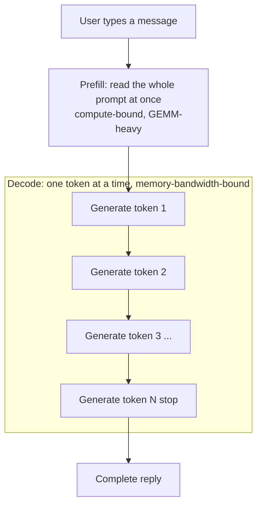
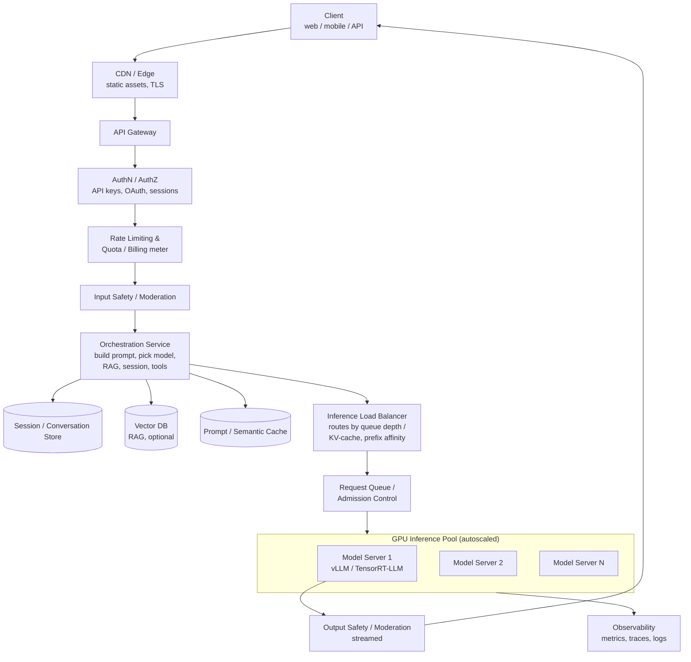
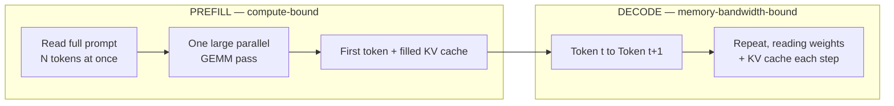
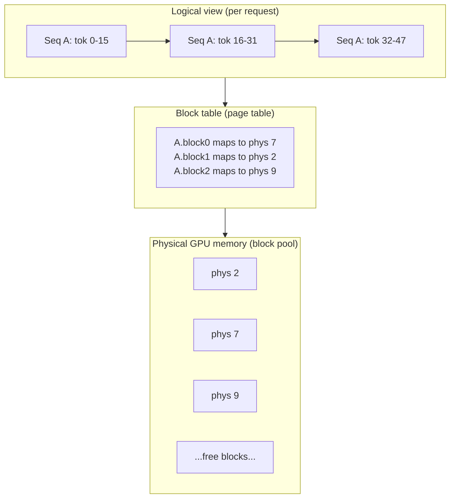
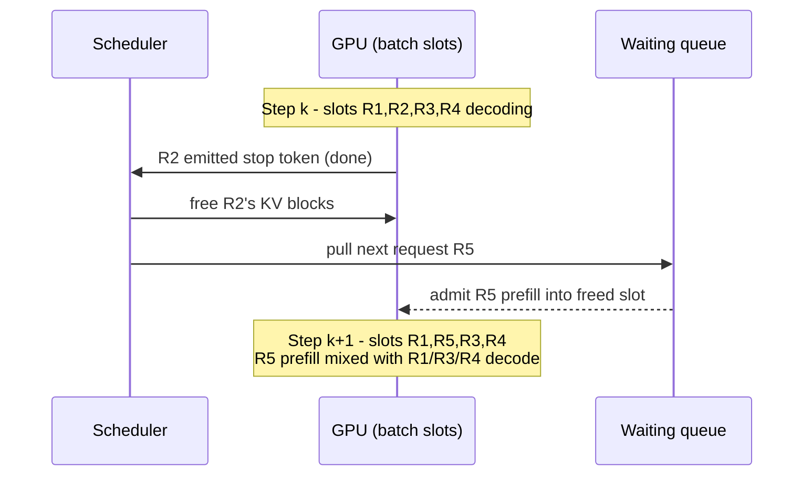
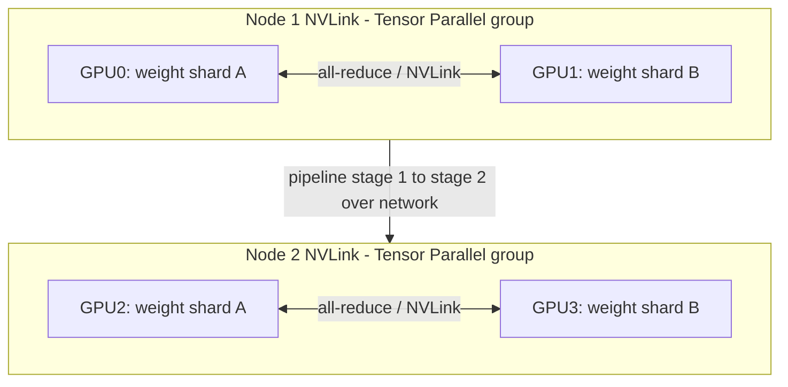
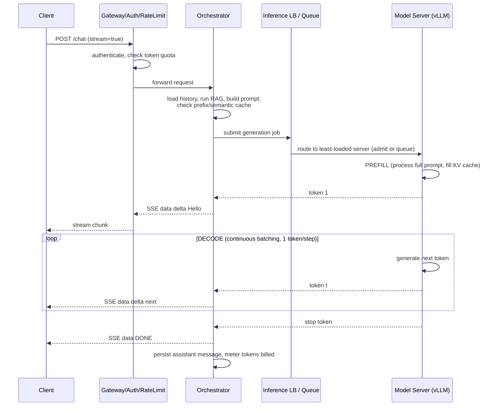
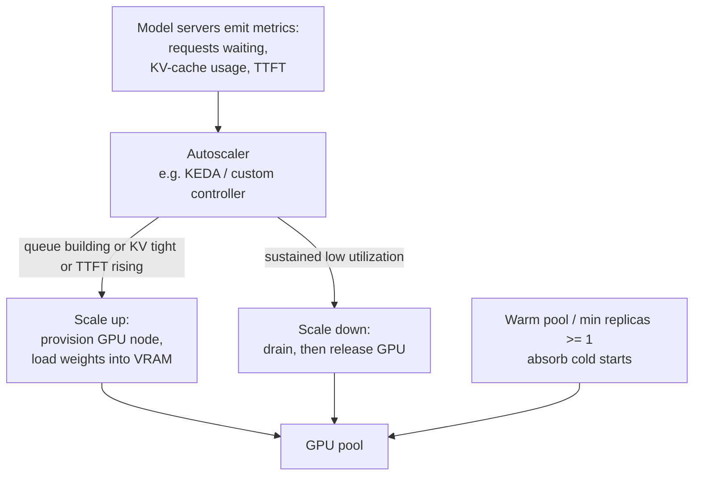
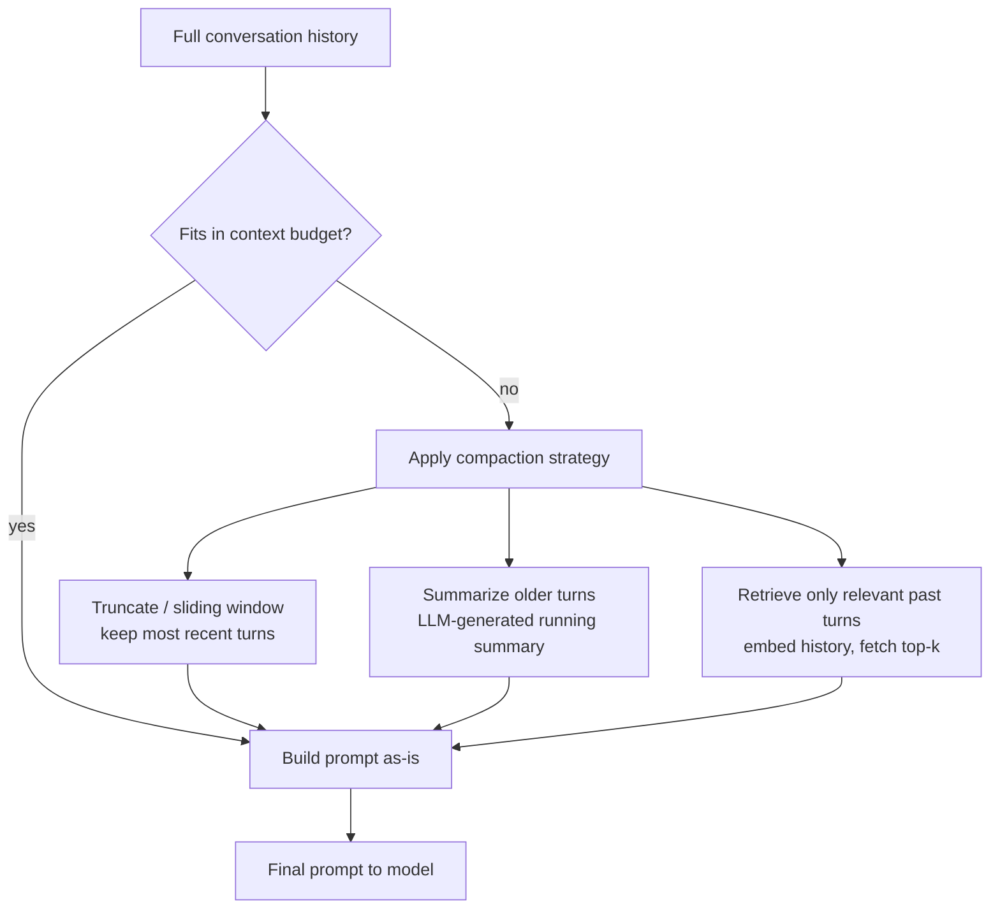
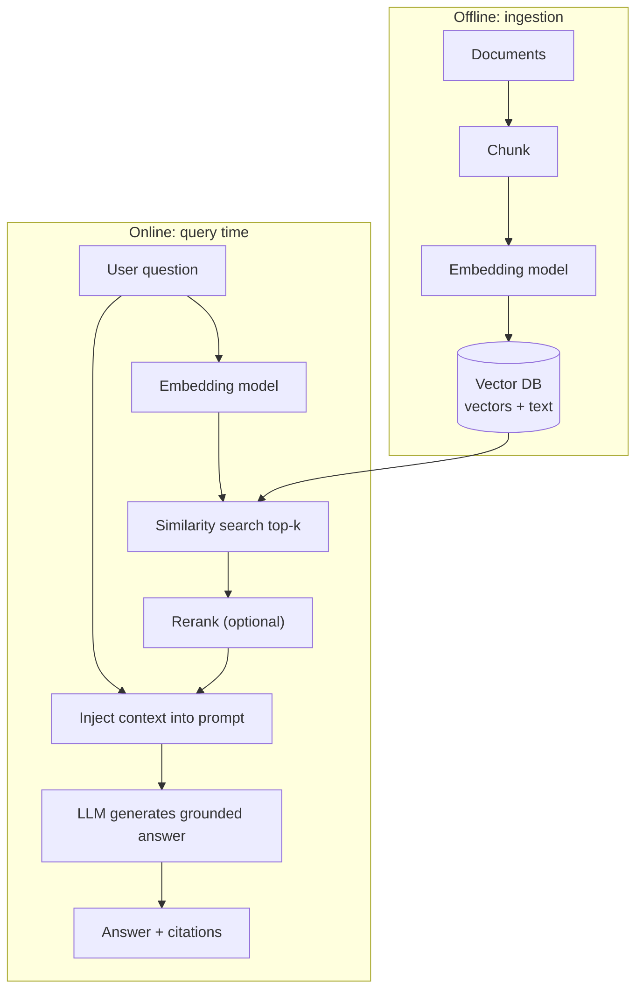

# How to Design an AI Chat Assistant like ChatGPT & Claude

> **A quick note before we start.** ChatGPT (OpenAI) and Claude (Anthropic) are the *same class of system*: a large language model (LLM) served behind an API, wrapped in a chat product. The serving architecture described in this article applies to **both**. The real differences are in the **model weights** (how each company trained its model) and **product details** (UI, tool integrations, safety policy) — *not* in the fundamental infrastructure of how tokens get generated and streamed to your screen. Throughout this article I'll refer to both systems where it's illustrative. When you understand how to serve one autoregressive transformer at scale, you understand how to serve all of them.

This is a beginner-to-advanced engineering walkthrough. We start from "what even is this" and end at GPU memory paging, continuous batching, and multi-region cost levers. Take your time.

---

## Table of Contents

1. [What we're building & why it's hard](#1-what-were-building--why-its-hard)
2. [Functional & non-functional requirements](#2-functional--non-functional-requirements)
3. [Back-of-the-envelope capacity estimation](#3-back-of-the-envelope-capacity-estimation)
4. [High-level architecture](#4-high-level-architecture)
5. [The inference serving layer, in depth](#5-the-inference-serving-layer-in-depth)
6. [Token-by-token streaming](#6-token-by-token-streaming-sse--chunked-responses)
7. [Queueing, admission control & GPU autoscaling](#7-queueing-admission-control--gpu-autoscaling)
8. [Conversation storage & context-window management](#8-conversation-storage--context-window-management)
9. [RAG: retrieval + vector databases](#9-rag-retrieval--vector-databases)
10. [Safety, caching, multi-region, observability & cost](#10-safety-caching-multi-region-observability--cost)
11. [Key trade-offs & bottlenecks](#11-key-trade-offs--bottlenecks)
12. [References / Sources](#12-references--sources)

---

## 1. What we're building & why it's hard

We're building a service that, given a conversation (a sequence of messages), produces a coherent reply **word by word**, in real time, for **millions of concurrent users**. That's ChatGPT. That's Claude. That's the product.

Underneath the chat bubble is an **autoregressive transformer**. "Autoregressive" means it generates one token at a time, and each new token depends on every token before it. A *token* is a chunk of text — very roughly ¾ of a word on average, though common words are a single token and rarer ones split into several (e.g., "unbelievable" might be 3-4 tokens). To produce a 500-token answer, the model first reads the prompt and emits the first token, then runs **hundreds of additional sequential forward passes** — one per remaining token — through tens of billions of parameters.

This is what makes the system hard, and it's worth internalizing the four reasons:

**It's GPU-bound.** A modern LLM has billions of parameters that must live in GPU memory (VRAM). You cannot run this on a CPU at usable speed. Every token generated requires reading those weights through the GPU's memory bus.

**It's expensive.** A single high-end inference GPU (think H100/H200-class) costs a fortune to buy and a meaningful hourly rate to rent. Big models don't even fit on one GPU and must be split across several (more on that later). At ChatGPT/Claude scale, you're running tens of thousands of GPUs continuously. **Compute, not storage or bandwidth, is the dominant cost.** This flips the usual web-scale intuition on its head.

**It's latency-sensitive in a specific way.** Users tolerate the answer *taking a few seconds to finish*, but they will not tolerate *staring at a blank screen*. So the metric that matters is **Time To First Token (TTFT)** — the gap between hitting send and seeing the first word — and then a smooth **Inter-Token Latency (ITL)** so the text flows like someone typing ([Anyscale](https://docs.anyscale.com/llm/serving/benchmarking/metrics), [BentoML](https://bentoml.com/llm/inference-optimization/llm-inference-metrics)). This is why both ChatGPT and Claude *stream* — it's not a gimmick, it's a latency-hiding strategy.

**The workload has two completely different phases.** As we'll see, processing your prompt ("prefill") and generating the answer ("decode") have *opposite* hardware bottlenecks. Optimizing one can hurt the other. Most of the cleverness in LLM serving comes from managing this tension.



If you remember one sentence from this section: **an LLM service is a real-time, GPU-bound, sequential token generator, and almost every design decision exists to keep those expensive GPUs busy without making users wait.**

---

## 2. Functional & non-functional requirements

Good system design starts by writing down what the system must *do* (functional) and the qualities it must *have* (non-functional).

### Functional requirements

- **Send a message, get a reply.** Accept a conversation and stream back a generated response.
- **Multi-turn conversations.** Remember earlier turns within a session so follow-ups make sense ("make it shorter" must know what "it" is).
- **Streaming output.** Tokens appear progressively, like typing.
- **Stop / cancel.** User can interrupt generation mid-stream and reclaim resources.
- **Model selection.** Offer multiple models (a fast/cheap one and a smart/slow one — Claude's Haiku vs. Opus, or GPT's mini vs. flagship tiers).
- **System prompt / persona.** A configurable instruction prefix that shapes behavior.
- **Authentication & quotas.** Know who the user is; meter and bill usage by token.
- **Safety.** Filter disallowed inputs and outputs.
- *(Advanced)* **Tool/function calling, file uploads, retrieval (RAG), long context.**

### Non-functional requirements

| Quality | Target / intent |
|---|---|
| **Low TTFT** | First token in roughly a few hundred ms to ~1–2 s, even under load. This is the #1 felt-latency metric ([Redis](https://redis.io/blog/llm-speed-benchmarks/)). |
| **Smooth ITL** | Steady inter-token gap so streaming doesn't stutter. |
| **High throughput** | Maximize total tokens/sec across all users per GPU — this is what controls cost. |
| **Scalability** | Scale from thousands to millions of concurrent sessions. |
| **Availability** | High availability; graceful degradation (shed load, fall back to smaller model) instead of hard failures. |
| **Cost efficiency** | GPUs are the bill. Keep utilization high; cache aggressively. |
| **Safety & compliance** | Moderation, data residency, privacy. |
| **Observability** | Per-stage latency, queue depth, GPU/KV-cache utilization, token accounting. |

There is a **fundamental tension** baked into these targets: **latency vs. throughput**. Packing more requests onto a GPU (bigger batches) raises throughput and lowers cost-per-token, but can raise each individual user's latency. The entire serving layer is an ongoing negotiation of this trade-off ([Anyscale](https://docs.anyscale.com/llm/serving/benchmarking/metrics)).

---

## 3. Back-of-the-envelope capacity estimation

Let's build numerical intuition. These are *illustrative round numbers* to teach the method, not leaked specs from any company.

### Step 1 — Users and request rate

Assume:
- **100 million** monthly active users.
- **10 million** daily active users.
- Each active user sends **~20 messages/day**.

That's **200 million messages/day** ≈ **2,300 messages/sec average**. Traffic is peaky, so assume a peak of **3–5×** average → **~10,000 new messages/sec at peak**. Each message kicks off a generation that takes several seconds to finish, so at any given instant there are far more than 10,000 generations *in flight*. That count of concurrent in-flight generations is the number that drives everything — let's pin it down next.

### Step 2 — Tokens, the real unit of work

GPUs don't care about "messages"; they care about **tokens**. Suppose an average exchange is:

- **Input (prompt + history + system prompt): ~1,000 tokens**
- **Output (the reply): ~500 tokens**

Output tokens are the expensive ones, because each requires its own sequential forward pass (decode). If a typical reply streams at ~30 tokens/sec, a 500-token answer takes roughly **17 seconds** to finish. So with **~10,000 new generations starting each second** and each one alive for ~17 seconds, the number of generations running **concurrently** at peak is on the order of:

```
10,000 new/sec  ×  ~17 sec each  ≈  ~170,000 concurrent generations
```

For round numbers, let's reason about a peak of **~150,000–170,000 concurrent generations**, each emitting ~30 output tokens/sec.

### Step 3 — From tokens/sec to GPU count

Peak output-token demand:

```
~170,000 concurrent generations  ×  ~30 tokens/sec each  ≈  ~5,000,000 output tokens/sec
```

A single modern inference GPU running an optimized server can output on the order of **a few thousand tokens/sec in aggregate** when many requests are **batched together** (the per-user speed might be 30–80 tokens/sec, but batching multiplexes dozens of users onto one GPU). Let's say, conservatively, **one GPU (or one small GPU group for a big model) sustains ~2,000 output tokens/sec aggregate.**

```
GPUs of decode capacity  ≈  5,000,000 / 2,000  ≈  ~2,500 GPUs (illustrative)
```

Now layer reality on top:
- **Redundancy / headroom:** ~1.5–2× → ~4,000–5,000 GPUs.
- **Multiple models** (fast + flagship), each needing its own pool.
- **Multi-region** deployment multiplies the footprint.
- **Big models need several GPUs each** (tensor parallelism), so "2,500 GPUs of capacity" can mean *many more physical cards*.

You land in the **thousands of GPUs** for a single popular model, **tens of thousands** for a full product portfolio. **This is why this system is fundamentally a GPU-fleet-management problem.** The web tier (gateways, auth, storage) is almost a rounding error on the bill by comparison.

> The exact figures swing wildly with your assumptions (output length, per-user token rate, batch efficiency). The point isn't the number — it's the *method*: messages → tokens → concurrent generations → tokens/sec → GPUs, then multiply for redundancy, model count, and regions.

### Step 4 — KV cache memory budget (the hidden constraint)

Every in-flight request holds a **KV cache** in GPU memory (Section 5 explains what this is). Its size scales with **sequence length × layers × hidden size**. A rough mental model:

```
KV cache per request ≈ (tens to a few hundred KB) per token of context
```

A long conversation (say tens of thousands of tokens) can consume **gigabytes of VRAM by itself**. Since a GPU only has so much VRAM after the model weights are loaded, the **KV cache — not raw compute — often caps how many users you can batch.** Remember this; it's the real bottleneck.

---

## 4. High-level architecture

Here's the journey of a request from a user's keyboard to a streamed reply.



Let's walk the layers:

- **Client / CDN / Edge.** Static UI assets served from the edge; TLS terminated close to the user. The chat payload itself goes to the API.
- **API Gateway.** Single entry point. Handles routing, TLS, request validation, and connects to cross-cutting concerns below.
- **Authentication & Authorization.** Validates API keys (developer API) or session tokens (chat product), resolves the user/org, and attaches their plan/tier.
- **Rate limiting & quota/billing.** This is *unusually important* here because each request consumes expensive GPU time. Limits are typically expressed in **tokens-per-minute and requests-per-minute**, not just requests. The meter that bills users by token lives here too.
- **Input moderation.** A fast classifier screens the incoming prompt (Section 10).
- **Orchestration service.** The brain of the product layer. It: loads conversation history from the **session store**, optionally runs **RAG** against the **vector DB**, assembles the final prompt (system prompt + history + retrieved context + user message), checks the **prompt/semantic cache**, chooses the model, and hands a well-formed request to the inference layer. It also enforces the **context window** budget.
- **Inference load balancer + queue + admission control.** Routes to the least-loaded model server — crucially, balancing on **GPU/queue signals**, not naive round-robin — and queues or rejects when the fleet is saturated (Section 7).
- **GPU inference pool.** The model servers (vLLM / TensorRT-LLM) that actually generate tokens. Autoscaled (Section 7).
- **Output moderation + streaming back to client.** Tokens are streamed out, optionally screened on the way (Sections 6 and 10).
- **Observability** wraps everything.

The mental split: the **product/web tier** (gateway → orchestration) is a fairly normal, horizontally-scalable, mostly-stateless microservice world. The **inference tier** (queue → GPU pool) is an exotic, stateful, GPU-bound beast. Most of this article's depth is about the second tier.

---

## 5. The inference serving layer, in depth

This is the heart of the system. We'll go bottom-up: the GPU's two phases, the KV cache, continuous batching, PagedAttention, and parallelism for giant models.

### 5.1 Prefill vs. decode — two phases, opposite bottlenecks

Generating a reply happens in two stages ([Redis](https://redis.io/blog/prefill-vs-decode/), [NVIDIA](https://developer.nvidia.com/blog/mastering-llm-techniques-inference-optimization/)):

**Prefill.** The model reads your *entire* prompt at once and computes the first output token. Because all prompt tokens are processed *in parallel*, this is one big matrix-matrix multiply (GEMM) that saturates the GPU's math units. **Prefill is compute-bound** — limited by how fast the GPU can do arithmetic. A long prompt makes prefill (and thus TTFT) slow.

**Decode.** The model then generates the rest of the answer **one token at a time**, autoregressively. Each step processes a *single* new token but must consult the entire history. Each decode step does relatively little math but must **stream the model's multi-gigabyte weights through memory** to do it. **Decode is memory-bandwidth-bound** — limited by how fast data moves, not by arithmetic ([Redis](https://redis.io/blog/prefill-vs-decode/)).



**Why this split matters:** the two phases want different things. Prefill wants big parallel work; decode wants to batch many requests' single tokens together to amortize the weight-loading cost. A naive server that does pure prefill, then pure decode, wastes the GPU during whichever phase doesn't match. Modern servers **interleave** them — and even split a long prefill into pieces ("**chunked prefill**") so one giant prompt doesn't stall everyone else's decode steps ([vLLM blog](https://vllm.ai/blog/2025-09-05-anatomy-of-vllm), [Sarathi paper](https://arxiv.org/pdf/2308.16369)).

### 5.2 The KV cache — why we don't recompute the past

During decode, generating each new token requires attention over **all previous tokens**. Recomputing the key/value vectors for the entire history at every step would be insanely wasteful. So we **cache** them: the **KV cache** stores the per-token key and value vectors once, then reuses them for every subsequent step ([NVIDIA](https://developer.nvidia.com/blog/mastering-llm-techniques-inference-optimization/)).

The KV cache is the single most important data structure in LLM serving:

- It lives in **GPU memory**, alongside the weights.
- It **grows with every token** generated and with prompt length.
- It is **per-request** (each conversation has its own).
- Its total size frequently **caps concurrency** before compute does (recall Section 3, Step 4).

So serving is, to a large degree, a **GPU-memory allocation problem**: how do we pack as many KV caches as possible into VRAM without wasting space?

### 5.3 The problem with naive KV cache, and PagedAttention

Early serving systems pre-allocated one big **contiguous** chunk of memory per request, sized for the *maximum* possible sequence length. This is wasteful: most requests are short, so you reserve gigabytes you never use (internal fragmentation), and you can't share memory between requests. The result is far fewer concurrent users than the GPU could actually handle.

**vLLM's PagedAttention** fixed this by borrowing the idea of **virtual memory paging** from operating systems ([vLLM](https://vllm.ai/blog/2025-09-05-anatomy-of-vllm), [Red Hat](https://www.redhat.com/en/blog/meet-vllm-faster-more-efficient-llm-inference-and-serving)):

- The KV cache is divided into **fixed-size blocks** (pages), e.g. **16 tokens per block**.
- A request's logical sequence maps to **non-contiguous physical blocks** via a **block table** (the page table).
- Blocks are allocated on demand from a **free-block pool** as a sequence grows, and returned when it finishes.
- Waste is limited to the **last partially-filled block** of each sequence — essentially zero fragmentation.



This unlocks two superpowers:

1. **Much higher concurrency** — you fit far more requests in the same VRAM.
2. **Prefix sharing** — if many requests share a common prefix (e.g., the *same system prompt*, which is true for nearly every request to a given product), they can **share the same physical KV blocks** instead of each storing a copy. This is the foundation of **prefix caching** ([vLLM](https://vllm.ai/blog/2025-09-05-anatomy-of-vllm)).

Together with continuous batching (next), PagedAttention delivers a large throughput improvement — often cited as roughly **2–4×** the throughput of naive serving (the exact factor depends on workload and model) ([Runpod](https://www.runpod.io/articles/guides/vllm-pagedattention-continuous-batching)).

### 5.4 Continuous (in-flight) batching — keeping the GPU full

To use a GPU efficiently you must process **many requests together** (a batch). The naive approach — **static batching** — gathers N requests, runs them all to completion, *then* starts the next batch. The problem: requests finish at different times. A batch of 8 where one request needs 1,000 tokens and the rest need 50 leaves **7 GPU slots idle** for most of the batch, waiting on the straggler.

**Continuous batching** (a.k.a. in-flight batching) fixes this ([Runpod](https://www.runpod.io/articles/guides/vllm-pagedattention-continuous-batching), [vLLM](https://vllm.ai/blog/2025-09-05-anatomy-of-vllm)):

- The scheduler operates **per decoding step**, not per batch.
- The moment a request **finishes**, its slot is freed and a **waiting request is admitted immediately**, mid-flight.
- New requests' **prefill** can be mixed into the same step as others' **decode** (vLLM's scheduler prioritizes running decodes, then pulls in waiting prefills).
- Internally, all active sequences are flattened into one long batch, with position indices and attention masks ensuring each sequence only attends to its own tokens — so there's **no wasteful right-padding** ([vLLM](https://vllm.ai/blog/2025-09-05-anatomy-of-vllm)).



The payoff: the GPU stays near-full continuously, which is exactly what you need when GPUs are the cost. This is *the* core technique behind cost-effective LLM serving, and both ChatGPT- and Claude-style backends rely on this family of ideas.

### 5.5 The model servers: vLLM and TensorRT-LLM

You don't build this from scratch; you stand on a serving engine:

- **vLLM** — open-source, originated PagedAttention, implements continuous batching, prefix caching, chunked prefill, speculative decoding, and tensor/pipeline parallelism. A reference design for modern serving ([vLLM blog](https://vllm.ai/blog/2025-09-05-anatomy-of-vllm)).
- **NVIDIA TensorRT-LLM** — NVIDIA's compiled, kernel-optimized engine with in-flight batching, tuned hardest for NVIDIA GPUs.
- Others: Hugging Face **TGI**, **SGLang**, **llm-d** (Kubernetes-native distributed serving).

Internally, a vLLM-style server runs a loop: **tokenize → scheduler allocates KV blocks (`ceil(new_tokens / block_size)`) and moves the request from waiting to running → forward pass (prefill or decode) → sample a token → if done, free blocks and return; else repeat** ([vLLM](https://vllm.ai/blog/2025-09-05-anatomy-of-vllm)).

Two extra throughput tricks worth knowing:
- **Speculative decoding:** a small, cheap "draft" model proposes several tokens; the big model **verifies** them in one pass, accepting multiple tokens per forward step when it agrees — more tokens per expensive pass, with *no change to output quality* since the big model validates every token ([vLLM](https://vllm.ai/blog/2025-09-05-anatomy-of-vllm)).
- **Quantization:** storing weights/activations in lower precision (e.g., 8- or 4-bit) shrinks memory and speeds up the memory-bound decode phase, trading a little accuracy for speed and density.

### 5.6 Splitting giant models across GPUs: tensor & pipeline parallelism

Flagship models (GPT-4-class, Claude Opus-class) are **too big to fit on a single GPU's VRAM**. You must shard them ([Will It Run AI](https://willitrunai.com/blog/multi-gpu-llm-inference-guide), [Red Hat](https://developers.redhat.com/articles/2025/02/06/distributed-inference-with-vllm)):

- **Tensor Parallelism (TP):** split each layer's **weight matrices** (and the KV cache) *across* multiple GPUs; every GPU does a slice of every layer. This requires **all-reduce communication within each layer**, so the GPUs must be connected by very fast interconnect (**NVLink**, hundreds of GB/s). Rule of thumb: **keep TP within a single node** so it rides NVLink, not the slower inter-node network ([Sarathi-Serve](https://arxiv.org/pdf/2403.02310)).
- **Pipeline Parallelism (PP):** split the model **by layers** into stages, each stage on a different GPU/node. GPU 1 runs layers 1–10, GPU 2 runs 11–20, etc. Less chatty than TP, so it's used to **span across nodes**. The cost is "pipeline bubbles" (stages idling) unless you keep many micro-batches in flight.



Common practice: **TP inside a node (fast NVLink), PP across nodes (slower network).** One physical "model server" for a flagship model might therefore be **8 GPUs acting as one** — which is exactly why the GPU counts in Section 3 balloon.

---

## 6. Token-by-token streaming (SSE / chunked responses)

We established that hiding latency requires showing tokens as they're produced. How does that actually travel over HTTP?

The dominant mechanism is **Server-Sent Events (SSE)** — the same protocol OpenAI and Anthropic expose on their public streaming APIs ([OpenAI streaming docs](https://developers.openai.com/api/docs/guides/streaming-responses), [Procedure](https://procedure.tech/blogs/the-streaming-backbone-of-llms-why-server-sent-events-(sse)-still-wins-in-2025)).

**Why SSE and not WebSockets?** The flow here is **one-directional** (server → client, a stream of tokens) over a single request. SSE is simple, runs over plain HTTP, supports automatic client reconnection, and needs no special protocol upgrade — a good fit. WebSockets are bidirectional and heavier than this use case needs. (Some products do use WebSockets — e.g., for voice or richer bidirectional control — but for plain token streaming SSE is the simpler default.)

**How it works on the wire:**

- The server responds with `Content-Type: text/event-stream` and (under HTTP/1.1) **chunked transfer encoding**, so it can start sending before it knows the total length ([Procedure](https://procedure.tech/blogs/the-streaming-backbone-of-llms-why-server-sent-events-(sse)-still-wins-in-2025)).
- Each event is plain text: a `data:` line with a payload (here, JSON), terminated by a **blank line**.
- A sentinel like `data: [DONE]` signals completion (this is a convention OpenAI uses, not part of the SSE spec itself).

```
HTTP/1.1 200 OK
Content-Type: text/event-stream
Transfer-Encoding: chunked

data: {"delta":"Hello"}

data: {"delta":" there"}

data: {"delta":"!"}

data: [DONE]
```

Here's the **end-to-end path of a single streaming request**, tying together everything so far:



**Things that bite you in production streaming:**
- **Proxy buffering.** CDNs, nginx, and load balancers love to *buffer* responses, which destroys streaming (the user waits for the whole answer, then it dumps at once). You must disable buffering / enable flush-through on every hop.
- **Backpressure & cancellation.** If the client disconnects (closes the tab, hits stop), you must **propagate the cancel** all the way to the model server so it **frees the KV blocks and stops decoding**. Otherwise you burn GPU on output nobody will read. Continuous batching makes this clean: drop the request, free its slot, admit the next.
- **Streamed moderation.** Output safety has to run *on the stream* (Section 10), buffering just enough to catch violations without killing the typing feel.

---

## 7. Queueing, admission control & GPU autoscaling

GPUs are finite and slow to add. So unlike a stateless web app where you just spin up more pods in seconds, the inference tier must **manage a queue** and **scale a scarce, slow-to-provision resource** intelligently.

### 7.1 Routing on the right signals

The inference load balancer should **not** use naive round-robin. The right signals are GPU-aware ([Kubenatives](https://www.kubenatives.com/p/autoscaling-gpu-inference-kubernetes-hpa-keda), [Markaicode](https://markaicode.com/scaling-llm-api-kubernetes-guide/)):

- **Queue depth** — number of requests waiting per server.
- **KV-cache utilization** — how full each server's KV cache is; a server near full KV cache can't admit more.
- **Prefix affinity** — route requests that share a prefix (e.g., same system prompt or same conversation) to the **same server** so they hit warm, shared KV blocks (prefix caching). Cross-region versions of this idea try to maximize KV-cache reuse while minimizing network hops.

### 7.2 Admission control: queue, degrade, or reject

When the fleet is saturated you have three honest options, in order of preference:

1. **Queue** the request briefly (acceptable if the wait is short — continuous batching drains queues fast).
2. **Degrade gracefully** — route to a smaller/faster model, shorten max output, or drop optional RAG.
3. **Reject** with a clear `429` and a `Retry-After` header rather than accepting work you can't serve and blowing everyone's latency.

The cardinal sin is **over-admitting**: stuffing too many requests onto GPUs so the KV cache thrashes and *every* user's TTFT and ITL degrade. Protecting the SLO of admitted requests is more valuable than admitting one more.

### 7.3 Autoscaling the GPU pool



Key realities that differ from normal web autoscaling ([Kubenatives](https://www.kubenatives.com/p/autoscaling-gpu-inference-kubernetes-hpa-keda), [ScaleOps](https://scaleops.com/blog/reducing-gpu-cold-start-times-in-kubernetes-patterns-and-solutions/), [Ace Cloud](https://acecloud.ai/blog/cold-start-latency-llm-inference/)):

- **Scale on LLM-native signals, not CPU%.** CPU utilization is meaningless for GPU work. Use queue depth (requests waiting), KV-cache utilization, and TTFT drift. Standard Kubernetes HPA can't see these out of the box, so teams use **KEDA** or custom controllers to scale on these external metrics.
- **Cold starts are brutal.** Adding a GPU pod isn't instant: you must **fetch multi-gigabyte (or multi-hundred-GB) model weights and load them into VRAM** before it serves a single token. That can take minutes and shows up as inflated TTFT for the unlucky first requests ([Ace Cloud](https://acecloud.ai/blog/cold-start-latency-llm-inference/)).
- **Mitigations:** keep a **warm pool** / `minReplicas ≥ 1` so requests hit a ready GPU while new ones spin up in the background; cache weights on fast local storage; use an **activator** that holds requests during provisioning instead of dropping them. In production you generally **do not scale to zero** unless you can tolerate cold-start latency ([ScaleOps](https://scaleops.com/blog/reducing-gpu-cold-start-times-in-kubernetes-patterns-and-solutions/)).
- **Provisioning lag means predictive scaling.** Because reacting takes minutes, you scale **ahead of demand** using traffic patterns (time-of-day, known spikes), not purely reactively.

---

## 8. Conversation storage & context-window management

The model itself is **stateless** — it has no memory between calls. The *illusion* of memory comes from us **re-sending the conversation** on every turn. That has two consequences: we must **store conversations**, and we must **fit them into a finite context window**.

### 8.1 Storing conversations

- **Conversation/session store.** A database (e.g., a document or NoSQL store, often fronted by Redis for the hot, active sessions) holding messages keyed by `conversation_id`. Each turn appends the user message and the assistant reply.
- **Why a cache layer?** The active conversation is read on *every* turn to rebuild the prompt; keeping recent turns in Redis avoids hammering the primary DB.
- **Metadata** alongside messages: model used, token counts (for billing), timestamps, system prompt/persona, tool-call records.
- **Privacy & retention** matter: deletion, encryption, and data-residency rules live here.

### 8.2 The context window is a hard budget

Every model has a maximum context length (the total tokens it can attend to at once — tens of thousands to hundreds of thousands, or even ~1M, tokens for modern models). The prompt you build must fit within it, and you must also leave room for the output the model will generate:

```
system prompt  +  retrieved RAG context  +  conversation history  +  new user message  +  reserved space for the output
                                            ─────────  must be <= context window  ─────────
```

As a conversation grows, history alone can blow the budget — and recall from Section 5.2 that **longer context means a bigger KV cache and slower/pricier inference**. So orchestration applies **context management** strategies:



- **Sliding window / truncation** — keep the system prompt + the most recent N turns, drop the oldest. Simple, but loses long-range memory.
- **Summarization** — periodically compress old turns into a short running summary that stays in context. Preserves gist, costs an extra LLM call.
- **Retrieval over history** — embed past turns and pull back only the relevant ones for the current question (this is RAG, applied to the conversation itself).

Most real products combine these: keep recent turns verbatim, summarize the middle, and retrieve specifics on demand.

---

## 9. RAG: retrieval + vector databases

Two problems the base model can't solve alone: it has a **knowledge cutoff** (it doesn't know recent or private facts) and it can **hallucinate**. **Retrieval-Augmented Generation (RAG)** addresses both by fetching relevant documents at query time and **injecting them into the prompt** as grounding context ([IBM](https://www.ibm.com/think/topics/retrieval-augmented-generation), [NVIDIA](https://blogs.nvidia.com/blog/what-is-retrieval-augmented-generation/)).

### When to use RAG

- The assistant must answer over **private/internal data** (your docs, your codebase, a user's uploaded files).
- It must reflect **fresh** information beyond the training cutoff.
- You need **citations / traceability**.
- *Don't* bolt on RAG for general chit-chat — it adds latency and complexity for no benefit.

### How RAG works — two phases

**Offline (ingestion / indexing):** chunk documents → run each chunk through an **embedding model** to get a vector → store vectors (plus the source text) in a **vector database** ([IBM: RAG vector DB](https://www.ibm.com/think/topics/rag-vector-database), [Databricks](https://www.databricks.com/glossary/retrieval-augmented-generation-rag)).

**Online (query time):** embed the user's question → run a **similarity search** in the vector DB to fetch the top-k most relevant chunks → optionally **rerank** them → stitch them into the prompt → the LLM answers **grounded in the retrieved text**.



The **vector database** (e.g., a dedicated vector store or a vector-capable general DB) is built for **approximate nearest-neighbor (ANN)** search over millions/billions of high-dimensional vectors — semantic similarity, not keyword match ([IBM](https://www.ibm.com/think/topics/rag-vector-database)). Production RAG also benefits from a **reranker** (to reorder candidates by relevance) and **scheduled re-indexing** so the knowledge stays current ([IBM](https://www.ibm.com/think/topics/retrieval-augmented-generation)). And remember: every retrieved chunk **spends context-window budget** and **enlarges the KV cache** — so retrieve precisely, not voluminously. (Caching retrieved-context KV across requests, e.g. RAGCache-style ideas, is an active optimization area — [RAGCache](https://arxiv.org/pdf/2404.12457).)

---

## 10. Safety, caching, multi-region, observability & cost

The last mile: the operational concerns that separate a demo from ChatGPT/Claude.

### 10.1 Safety & moderation

Safety typically runs at **two points** — input and output — often with **fast classifiers** running alongside the main model ([WitnessAI](https://witness.ai/blog/llm-guardrails/), [BudEcosystem](https://blog.budecosystem.com/a-survey-on-llm-guardrails-methods-best-practices-and-optimisations/)):

- **Input guardrails:** screen for disallowed content and **prompt-injection / jailbreak** attempts before the model sees the prompt.
- **Output guardrails:** screen generated text for policy violations *as it streams*, so you can stop a bad completion mid-flight.
- **Classifier-based filtering** is a common production approach — fast, low-latency risk classifiers (e.g., OpenAI's **Moderation API**, Azure AI Content Safety, Amazon Bedrock Guardrails, or open models like Meta's **Llama Guard**) ([digitalapplied](https://www.digitalapplied.com/blog/ai-content-moderation-2026-llm-trust-safety-guide)).
- **Two complementary philosophies.** OpenAI offers a **standalone Moderation API** you can call around generations. Anthropic emphasizes baking safety *into the model itself* through training techniques like **Constitutional AI**, plus system-prompt guidance — but this is a difference of *emphasis*, not an either/or: both companies also run external classifiers and safety filters around the model. Same goal, different weighting ([Anthropic — Constitutional AI](https://www.anthropic.com/research/constitutional-ai-harmlessness-from-ai-feedback)).

### 10.2 Caching — the biggest cost lever after batching

Because compute is the bill, **not recomputing** is the highest-leverage optimization:

- **Prefix / prompt caching.** Reuse the KV cache for a **stable prompt prefix** (system prompt, long shared instructions, a document everyone asks about). Anthropic exposes this explicitly via `cache_control` breakpoints, billing **cache reads at ~10% of the normal input-token price** (i.e., ~90% off the cached portion); both Anthropic and OpenAI offer prompt caching. Real deployments report large input-cost reductions (commonly cited in the **50–90%** range) by structuring prompts so the static part is cacheable and only the dynamic tail changes ([ProjectDiscovery](https://projectdiscovery.io/blog/how-we-cut-llm-cost-with-prompt-caching), [Anthropic — prompt caching](https://docs.claude.com/en/docs/build-with-claude/prompt-caching)). **Design tip from the field:** keep the static instructions at the front (cacheable) and push per-request "working memory" to the *end* — one team raised cache-hit rate from 7% to 84% this way ([ProjectDiscovery](https://projectdiscovery.io/blog/how-we-cut-llm-cost-with-prompt-caching)). Note: a cache *write* costs slightly more than a normal input token (~1.25× for short-TTL), so caching pays off only when the prefix is read more than once.
- **Semantic cache.** For *whole responses*: embed the incoming query, and if it's semantically near a previously answered one, return the cached answer and **skip the GPU entirely**. Big wins for FAQ-like traffic; needs care to avoid serving stale or subtly-wrong matches.
- **Exact-match cache.** Identical request → identical cached response. Cheapest of all.

### 10.3 Multi-region

Run the stack in **multiple regions** for lower latency (serve users from a nearby region) and resilience (survive a regional outage). Challenges unique to LLMs: **GPU availability differs by region**, model weights must be replicated to each region, and **session/conversation data may have residency constraints**. A subtle one: cross-region routing wants to **preserve prefix-cache locality**, which fights against "just route to the nearest GPU" — there's active work on balancing KV-cache reuse against network latency across regions.

### 10.4 Observability

You can't operate this blind. Track, at minimum ([Anyscale](https://docs.anyscale.com/llm/serving/benchmarking/metrics), [BentoML](https://bentoml.com/llm/inference-optimization/llm-inference-metrics)):

- **TTFT** and **ITL** (the user-felt latency metrics).
- **Throughput** (tokens/sec) and **RPS** per server and fleet-wide.
- **Queue depth** and **KV-cache utilization** — your saturation early-warning.
- **GPU utilization**, memory, temperature.
- **Token accounting** per user/org (billing + abuse detection).
- **Cache hit rates** (prefix and semantic) — directly tied to cost.
- **Distributed traces** across gateway → orchestrator → model server.

### 10.5 Cost levers, summarized

| Lever | Effect |
|---|---|
| Continuous batching + PagedAttention | Large throughput gain per GPU, often ~2–4× ([Runpod](https://www.runpod.io/articles/guides/vllm-pagedattention-continuous-batching)) |
| Prefix / prompt caching | Big input-cost reduction on shared prefixes, commonly 50–90% ([ProjectDiscovery](https://projectdiscovery.io/blog/how-we-cut-llm-cost-with-prompt-caching)) |
| Semantic / exact caching | Skip the GPU entirely on repeat queries |
| Quantization | Smaller weights, faster memory-bound decode, more concurrency |
| Speculative decoding | More tokens per expensive forward pass, no quality loss ([vLLM](https://vllm.ai/blog/2025-09-05-anatomy-of-vllm)) |
| Model tiering (small vs. flagship) | Route easy queries to cheap models |
| High GPU utilization (good autoscaling) | Don't pay for idle GPUs |
| Shorter outputs / tight context | Fewer decode steps, smaller KV cache |

---

## 11. Key trade-offs & bottlenecks

A senior design discussion is really a discussion of trade-offs. The big ones:

- **Latency vs. throughput (the master trade-off).** Bigger batches → higher throughput, lower cost/token, but higher per-user latency. Continuous batching softens this but never erases it. Every tuning knob (batch size, chunked-prefill size, admission threshold) is a point on this curve ([Anyscale](https://docs.anyscale.com/llm/serving/benchmarking/metrics)).
- **Prefill vs. decode interference.** A long prompt's prefill can stall everyone else's decode. **Chunked prefill** trades a little prefill latency to protect ITL fairness across users ([Sarathi](https://arxiv.org/pdf/2308.16369)).
- **KV cache is usually the real ceiling.** You typically run out of *memory for KV caches* before you run out of *compute*. Long contexts and many concurrent users fight over the same VRAM. PagedAttention buys headroom; it doesn't make the limit disappear.
- **TP vs. PP for big models.** Tensor parallelism is fast but communication-heavy (needs NVLink, stays in-node); pipeline parallelism spans nodes but risks idle "bubbles." You pick based on your interconnect ([Will It Run AI](https://willitrunai.com/blog/multi-gpu-llm-inference-guide)).
- **Cold starts vs. cost.** Warm pools and `minReplicas ≥ 1` kill cold-start latency but cost money for idle GPUs; scale-to-zero saves money but punishes the first user with minutes of weight loading ([Ace Cloud](https://acecloud.ai/blog/cold-start-latency-llm-inference/)).
- **Cache locality vs. load balancing.** Routing for prefix-cache reuse concentrates load; routing for even load scatters it and loses cache hits. You balance the two.
- **Context length vs. cost & speed.** Longer context = better memory/grounding, but more expensive prefill (attention cost grows fast with sequence length) and a bigger KV cache. Hence summarization and retrieval instead of "just send everything."
- **Safety latency vs. UX.** Output moderation on the stream protects users but adds delay; too aggressive and you stutter the typing effect.

The throughline: **GPUs are the scarce, expensive, slow-to-scale resource, and almost every bottleneck and trade-off in the system traces back to keeping them busy without making any single user wait.** Master that sentence and you understand both ChatGPT's and Claude's serving architecture.

---

## 12. References / Sources

**Serving internals — vLLM, batching, KV cache, parallelism**
- [Inside vLLM: Anatomy of a High-Throughput LLM Inference System — vLLM Blog](https://vllm.ai/blog/2025-09-05-anatomy-of-vllm)
- [vLLM Explained: PagedAttention and Continuous Batching — Runpod](https://www.runpod.io/articles/guides/vllm-pagedattention-continuous-batching)
- [Meet vLLM: Faster, More Efficient LLM Inference and Serving — Red Hat](https://www.redhat.com/en/blog/meet-vllm-faster-more-efficient-llm-inference-and-serving)
- [Distributed Inference with vLLM — Red Hat Developer](https://developers.redhat.com/articles/2025/02/06/distributed-inference-with-vllm)
- [Multi-GPU LLM Inference Guide — NVLink vs PCIe, Tensor Parallelism](https://willitrunai.com/blog/multi-gpu-llm-inference-guide)
- [Sarathi: Efficient LLM Inference by Piggybacking Decodes with Chunked Prefills (arXiv)](https://arxiv.org/pdf/2308.16369)
- [Taming the Throughput-Latency Tradeoff with Sarathi-Serve (arXiv)](https://arxiv.org/pdf/2403.02310)

**Prefill / decode, KV cache, inference optimization**
- [Prefill vs Decode: LLM Inference Phases Explained — Redis](https://redis.io/blog/prefill-vs-decode/)
- [Mastering LLM Techniques: Inference Optimization — NVIDIA](https://developer.nvidia.com/blog/mastering-llm-techniques-inference-optimization/)
- [RAGCache: Efficient Knowledge Caching for RAG (arXiv)](https://arxiv.org/pdf/2404.12457)

**Latency & throughput metrics**
- [Understand LLM Latency and Throughput Metrics — Anyscale](https://docs.anyscale.com/llm/serving/benchmarking/metrics)
- [Key Metrics for LLM Inference — BentoML](https://bentoml.com/llm/inference-optimization/llm-inference-metrics)
- [LLM Speed Benchmarks — Redis](https://redis.io/blog/llm-speed-benchmarks/)

**Streaming (SSE / chunked)**
- [Streaming API Responses — OpenAI](https://developers.openai.com/api/docs/guides/streaming-responses)
- [Why Server-Sent Events Still Win for LLM Streaming — Procedure](https://procedure.tech/blogs/the-streaming-backbone-of-llms-why-server-sent-events-(sse)-still-wins-in-2025)
- [Streaming LLM Responses: Make Your AI App Feel Fast — Redis](https://redis.io/blog/streaming-llm-responses/)

**Autoscaling & cold starts**
- [Autoscaling Inference Workloads: HPA and KEDA for GPU Pods — Kubenatives](https://www.kubenatives.com/p/autoscaling-gpu-inference-kubernetes-hpa-keda)
- [Reducing GPU Cold Start Times in Kubernetes — ScaleOps](https://scaleops.com/blog/reducing-gpu-cold-start-times-in-kubernetes-patterns-and-solutions/)
- [Cold Start Latency in LLM Inference: Causes, Metrics & Fixes — Ace Cloud](https://acecloud.ai/blog/cold-start-latency-llm-inference/)
- [How to Scale LLM APIs on Kubernetes — Markaicode](https://markaicode.com/scaling-llm-api-kubernetes-guide/)

**RAG & vector databases**
- [What is Retrieval-Augmented Generation (RAG)? — IBM](https://www.ibm.com/think/topics/retrieval-augmented-generation)
- [Vector Databases for RAG — IBM](https://www.ibm.com/think/topics/rag-vector-database)
- [What is RAG? — Databricks](https://www.databricks.com/glossary/retrieval-augmented-generation-rag)
- [What Is Retrieval-Augmented Generation, aka RAG — NVIDIA](https://blogs.nvidia.com/blog/what-is-retrieval-augmented-generation/)

**Safety / moderation**
- [LLM Guardrails: Securing LLMs for Safe AI Deployment — WitnessAI](https://witness.ai/blog/llm-guardrails/)
- [A Survey on LLM Guardrails — BudEcosystem](https://blog.budecosystem.com/a-survey-on-llm-guardrails-methods-best-practices-and-optimisations/)
- [AI Content Moderation 2026: An LLM Trust-Safety Guide — DigitalApplied](https://www.digitalapplied.com/blog/ai-content-moderation-2026-llm-trust-safety-guide)
- [Constitutional AI: Harmlessness from AI Feedback — Anthropic](https://www.anthropic.com/research/constitutional-ai-harmlessness-from-ai-feedback)

**Prompt / semantic caching & cost**
- [How We Cut LLM Costs With Prompt Caching — ProjectDiscovery](https://projectdiscovery.io/blog/how-we-cut-llm-cost-with-prompt-caching)
- [Prompt Caching — Anthropic Docs](https://docs.claude.com/en/docs/build-with-claude/prompt-caching)
- [Prompt Caching for Anthropic and OpenAI Models — DigitalOcean](https://www.digitalocean.com/blog/prompt-caching-with-digital-ocean)

---

*Written as a teaching reference. The architecture generalizes to any LLM-behind-an-API chat product — ChatGPT, Claude, and the open-source stacks (vLLM, TensorRT-LLM, SGLang, TGI, llm-d) you'd use to build your own. Capacity numbers are illustrative for teaching the estimation method, not measurements of any specific provider.*
