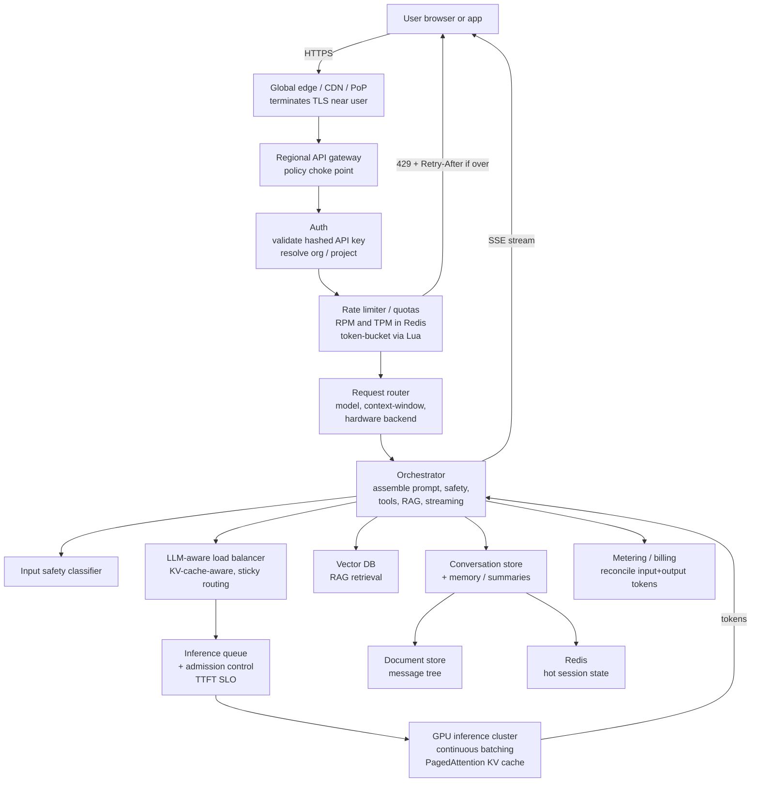
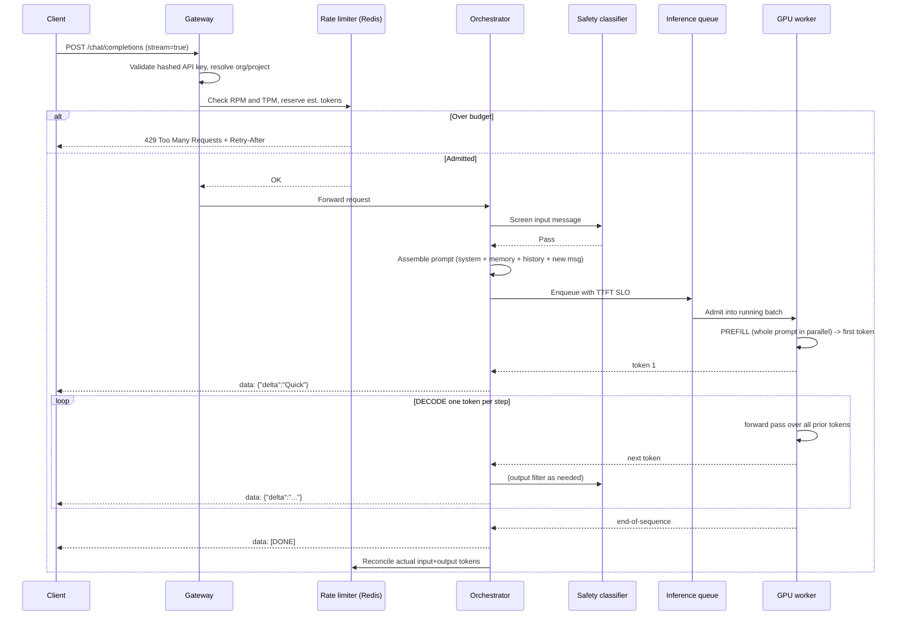
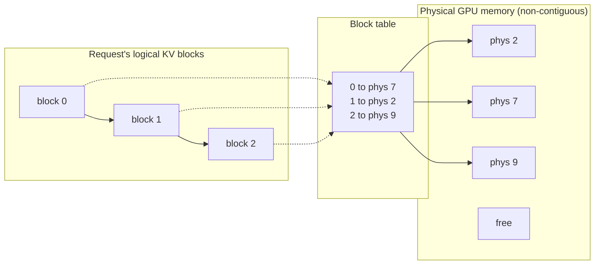
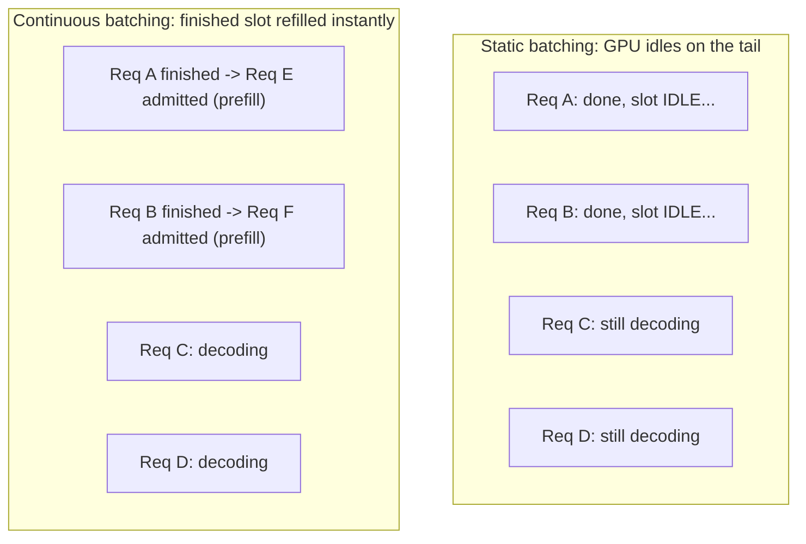
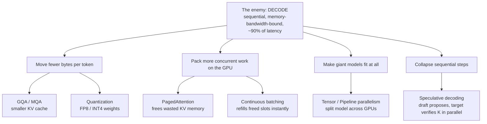
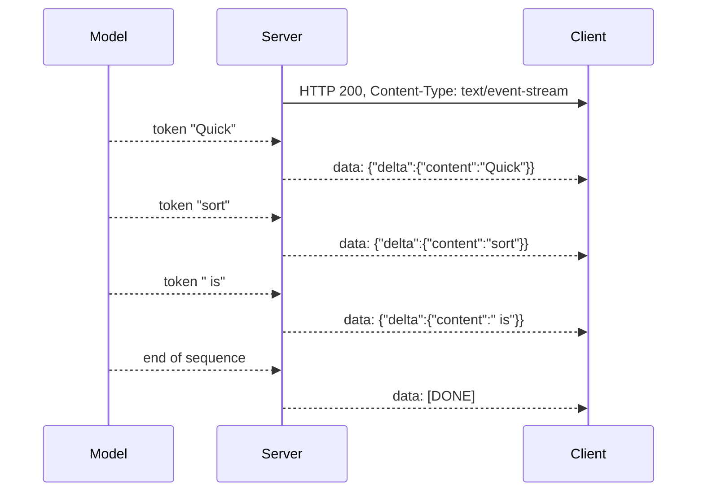
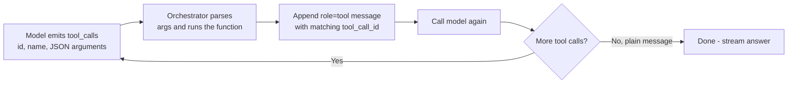

# How ChatGPT and Claude Actually Work — Designing a Large-Scale AI Chat Assistant

> A friendly, deep, and *honest* system-design walkthrough of the machine behind the blinking cursor. Beginner-friendly at the top, senior-engineer-grade by the bottom.

You type *"Explain quicksort,"* hit Enter, and the cursor blinks. Then words appear — one at a time, like the machine is typing live. It isn't a stylistic flourish. It isn't your network buffering. **The words appear one at a time because they literally do not exist yet.** Each one is computed on the spot by pushing billions of numbers through a chip, and the machine can only ever make *one at a time*.

Almost everything strange about **ChatGPT** (OpenAI) and **Claude** (Anthropic) — why they're slow, why they "forget" your conversation, why they sometimes make things up, why they cost a fortune to run — flows from that single fact. This article builds the machine that makes it happen, from the blinking cursor all the way down to the GPU's memory bus.

First, a piece of vocabulary you'll need throughout: a **token** is a chunk of text — roughly ¾ of an English word, or about 4 characters. *"Explain quicksort"* is about 3 tokens. The model reads and writes in these units, not letters or words. When you hear "the model generates a token," picture it emitting one small text fragment. Everything in this system — rate limits, memory, billing, GPU sizing — is measured in tokens.

---

## The Big Picture: Two Fleets in Tension

When you talk to ChatGPT or Claude, you're talking to the same *class* of system: a large, cheap, nearly-infinite **web tier** sitting in front of a small, expensive, painfully-scarce **GPU inference tier**. Everything interesting in this design comes from the tension between those two halves — the front is fast and almost limitless, the back is slow, sticky, and capital-intensive. The model itself (GPT-class, Claude-class) is interchangeable for our purposes. The *serving architecture* is what we're studying, and it is essentially identical across both companies: edge gateway, auth, token-based rate limiting, an orchestrator, a continuous-batching inference engine, KV caches, and a token stream back to your screen.

So when this article says "the assistant," read it as "ChatGPT **and** Claude **and** any large-scale LLM chat product." The blueprint is the same.

---

## Table of Contents

1. [Same Class of System](#1-same-class-of-system)
2. [The 3 Seconds After You Press Enter](#2-the-3-seconds-after-you-press-enter)
3. [Requirements](#3-requirements)
4. [Capacity and Cost Estimation](#4-capacity-and-cost-estimation)
5. [High-Level Architecture](#5-high-level-architecture)
6. [The Life of a Request](#6-the-life-of-a-request)
7. [Deep Dive: GPU Inference Serving](#7-deep-dive-gpu-inference-serving)
8. [Deep Dive: Token Streaming](#8-deep-dive-token-streaming)
9. [Deep Dive: Scaling the GPU Fleet](#9-deep-dive-scaling-the-gpu-fleet)
10. [Conversation Memory and the Context Window](#10-conversation-memory-and-the-context-window)
11. [Why It Hallucinates](#11-why-it-hallucinates)
12. [Retrieval, Tool Use, and Safety](#12-retrieval-rag-tool-use-and-safety)
13. [Bottlenecks and Trade-offs](#13-bottlenecks-and-trade-offs)
14. [Common Misconceptions](#14-common-misconceptions)
15. [Interview-Style Q&A](#15-interview-style-qa)
16. [30-Second Recap](#16-30-second-recap)
17. [References / Sources](#17-references--sources)

---

## 1. Same Class of System

Before any boxes and arrows: ChatGPT and Claude are not magic, and they are not as different from each other as marketing suggests. Both are **autoregressive transformer** models served behind a **two-fleet architecture**.

*Autoregressive* is the load-bearing word, so let's define it plainly: the model predicts the next token from everything written so far, then **feeds its own output back in** and predicts the next one, and the next, in a loop. It cannot leap ahead. Generation is *inherently* a sequential chain — which, as we'll see, is the root of almost every constraint downstream.

The two fleets:

- A **stateless web/API tier** — global edge, gateways, auth, rate limiting, routing, billing. Scales horizontally in seconds. Cheap.
- A **stateful GPU inference tier** — racks of accelerators running the model. Scales in *minutes*, costs a fortune, and is the bottleneck for everything.

| | Web/API tier | GPU inference tier |
|---|---|---|
| State | Stateless | Stateful (holds your KV cache) |
| Scale time | Seconds | Minutes |
| Cost | Cents | A fortune |
| Limit | Practically unbounded | Hard-bounded by physical GPUs |

Claude even spreads its inference across **AWS Trainium, NVIDIA GPUs, and Google TPUs**, exposed through its first-party API, Amazon Bedrock, and Google Vertex AI. ChatGPT runs an analogous fleet. The control-plane patterns we describe — token-bucket rate limiting in Redis, continuous batching, KV-cache-aware load balancing, queue-based autoscaling — are industry-standard and apply to **both**.

> **Scope note:** we focus on **text**. Images, audio, and video change the token economics dramatically (a single image can be hundreds to thousands of tokens), and we flag where that matters — but the worked numbers here are text-only.

---

## 2. The 3 Seconds After You Press Enter

You type *"Explain quicksort"* and hit Enter. For a beat, nothing. Then the cursor blinks — and words start appearing, **one at a time**. We've established *why*: the model can only ever produce one token at a time, and producing that single token requires reading billions of parameters out of GPU memory. The words appear one-by-one because *they literally do not exist yet* — each token is a full forward pass through the network, conditioned on every token before it. Streaming isn't a UX flourish bolted on for charm; it is a direct, unavoidable consequence of how the model works.

In those few seconds, your keystrokes traveled to an edge server near you, got authenticated, were checked against a *token* budget (not just a request count), were routed to a pool of GPUs that already might be holding your conversation's cached state, got slotted into a batch **alongside dozens of strangers' chats**, had their entire prompt processed in one parallel burst (**prefill**), and then entered a slow, sequential, memory-bound grind (**decode**) that emits one token per step and ships each one to your browser the instant it's born.

That's the whole story. Now let's build the machine that makes it happen.

---

## 3. Requirements

If you're here for the architecture and not interview prep, skim this — the one fact that matters is at the bottom of the section.

### Functional requirements

| # | Requirement | Notes |
|---|---|---|
| F1 | Accept a chat message and stream back a generated reply | Token-by-token, low time-to-first-token |
| F2 | Maintain multi-turn conversations | Full history re-assembled each turn |
| F3 | Support multiple models / sizes | e.g. a small fast model and a large frontier model |
| F4 | Authenticate clients and meter usage | API keys, org/project identity, billing |
| F5 | Enforce rate limits and quotas | On **tokens**, not just requests |
| F6 | Tool / function calling | Model emits a structured call; backend runs it |
| F7 | Retrieval-augmented generation (RAG) | Ground answers on external knowledge |
| F8 | Safety moderation | Input and output classifiers |
| F9 | Persist conversation history | Branching tree for edit/regenerate |
| F10 | Realtime voice (optional) | WebRTC/WebSocket audio streaming |

### Non-functional requirements

| # | Requirement | Target / Principle |
|---|---|---|
| N1 | Low time-to-first-token (TTFT) | ~100–300 ms for a ~1K-token prompt; scales up with prompt length |
| N2 | Smooth inter-token latency (TPOT/ITL) | ~10–30 ms per output token |
| N3 | High throughput per GPU | Maximize tokens/sec via batching |
| N4 | Horizontal scalability | Stateless front scales instantly; GPU fleet bounded |
| N5 | High availability + failover | Separate capacity pools across regions/providers |
| N6 | Cost efficiency | Internal cost ~$1–2 / M **generated** tokens; protect margin |
| N7 | Graceful degradation under load | Queue, shed (429), degrade — *not* "add boxes" |
| N8 | Privacy / isolation | Requests batched together but isolated via attention masks |

The defining non-functional fact: **you cannot scale the expensive tier on demand.** That single constraint shapes N5, N6, and N7.

---

## 4. Capacity and Cost Estimation

Let's walk from *"100 million weekly users"* to *"how many GPUs and how many dollars."* Every input is a stated assumption you can swap out — the value here is the **method**, not the exact digits. (These are illustrative, not OpenAI/Anthropic internals.)

### Assumptions

| Input | Value | Rationale |
|---|---|---|
| Weekly Active Users (WAU) | 100,000,000 | "Large but not frontier" assistant |
| Active days/week | 3.5 | Converts WAU → DAU |
| Messages per active user per active day | 12 | A back-and-forth session |
| Output tokens / request | 500 | Median assistant reply |
| Input tokens / request | 1,500 | Prompt + history + retrieved context (~3× output) |
| Peak-to-average ratio | 3.0× | Diurnal + timezone peak |
| Per-GPU sustained decode throughput | 2,500 tok/s | 70B model, H100, continuous batching (**not** the 23,000 marketing number) |
| Target GPU utilization | 70% | Headroom for bursts/failover |
| Blended H100 cost | $2.50 / GPU-hour | Market median |

### The chain: users → tokens/sec → GPUs → dollars

| Step | Quantity | Formula | Result |
|---|---|---|---|
| 1 | DAU (avg) | 100M × 3.5 ÷ 7 | **50,000,000** |
| 2 | Requests/day | 50M × 12 | **600,000,000** |
| 3a | Avg RPS | 600M ÷ 86,400 | **~6,944** |
| 3b | Peak RPS | 6,944 × 3.0 | **~20,833** |
| 4a | Avg concurrent chats | 6,944 × 10 s reply time | **~69,400 in-flight** |
| 4b | Peak concurrent chats | 20,833 × 10 s | **~208,300 in-flight** |
| 5a | Avg generated tok/s | 6,944 × 500 | **~3.47M/s** |
| 5b | Peak generated tok/s | 20,833 × 500 | **~10.4M/s** |
| 6a | GPUs (peak, raw) | 10.4M ÷ 2,500 | **~4,167** |
| 6b | GPUs (peak, +headroom) | 4,167 ÷ 0.70 | **~5,953** |
| 6c | Provisioned fleet (+redundancy) | round up | **~6,000–6,500 H100s** |
| 7a | Daily GPU cost | 6,000 × 24 × $2.50 | **$360,000/day** |
| 7b | Generated tokens/day | 3.47M × 86,400 | **~300 billion** |
| 7c | Cost / M generated tokens | $360k ÷ 300k | **~$1.20** |
| 7d | Cost / WAU / month | $360k × 30 ÷ 100M | **~$0.11** |

**The intuition to carry away:** *generated tokens per second is the master metric.* Everything funnels into it; GPUs are sized against that, not against user count directly. Note the gap between the **average** working set (~2,000 GPUs) and the **peak** provisioned fleet (~6,000) — that gap *is* your autoscaling and spot-capacity strategy.

And the punchline economics: your **internal** cost is ~**$1.20 / M generated tokens**, while **list API prices** for GPT-4-class models run **$10–15 / M output tokens**. That ~10× wedge is gross margin, R&D, safety, free-tier subsidy, and prefill/input costs. At text scale, inference is roughly **11¢ per weekly-active user per month** — which is exactly why a $20/month subscription clears the bar with room to spare. (Heavy reasoning, long-context, and multimodal usage can blow this up by 10–100×, and *that* is where capacity planning gets genuinely hard.)

> **Watch the number people fake:** per-GPU throughput. Vendors quote "23,000+ tok/s" — that's a *tiny model, short sequence, pure-throughput* figure. A real 70B model under production latency targets does ~**2,000–3,500 aggregate tok/s** across a full batch. Halve that assumption and you *double* your GPU bill. Always pin it with a benchmark of *your* model, *your* batch size, *your* SLO.

---

## 5. High-Level Architecture

Here's the full system, front to back.



> 🎨 **Polished / editable version:** the hand-drawn Excalidraw source for this diagram is [`assets/excalidraw/chatgpt-claude-hero.excalidraw`](../../assets/excalidraw/chatgpt-claude-hero.excalidraw), generated as code by [`tools/excalidraw_gen.py`](../../tools/excalidraw_gen.py). Open it at [excalidraw.com](https://excalidraw.com) (File ▸ Open), refine the look, and export a 2× transparent PNG into `assets/images/`. See also the [hero-diagram build spec](./hero-diagram-spec.md) and the [two-fleets concept diagram](../../assets/excalidraw/chatgpt-claude-two-fleets.excalidraw).

**Walk-through.** TLS terminates at a **global edge** near the user, then forwards to a **regional API gateway** — the stateless policy choke point that does auth, rate limiting, routing, and billing metadata. Roughly two-thirds of organizations now run this inference stack on Kubernetes, increasingly with **AI-aware gateways** (Envoy AI Gateway, the Gateway API *Inference Extension*) that understand model names, LoRA adapters, token counts, and KV-cache state instead of treating requests as opaque HTTP.

After auth (API keys are stored **hashed**, e.g. bcrypt, never plaintext; identity resolves to an **org/project**, not an individual), the request hits the **rate limiter** — and this is where an LLM API diverges sharply from a normal web API. A normal API meters *requests*. An LLM API must meter *work*, and work is dominated by **tokens**: *"a 50-token request and a 50,000-token request consume vastly different GPU resources."* So the limiter enforces **RPM** (requests/min) **and** **TPM** (tokens/min, input + output, over a rolling 60s) in parallel — **whichever exhausts first wins.** Because output length is unknown up front, the limiter *reserves* budget as `max(max_tokens, estimated_from_chars)` before the request runs, then reconciles after. Distributed limiting uses **Redis as the shared source of truth**, running token-bucket logic made atomic with **Lua `EVAL`** scripts so concurrent gateways can't double-spend. Over budget → **`429` with `Retry-After`**.

The **router** then picks a backend *pool* by model name, **context-window requirement** (Claude routes to distinct pools by context length, with **sticky sessions** so follow-ups return to the same infra), and hardware backend (Trainium / GPU / TPU). The **orchestrator** assembles the prompt, runs safety, fires off tools and RAG, and manages streaming. Behind it, the **LLM-aware load balancer** and **inference queue** feed the **GPU cluster**. Tokens flow back out through the orchestrator over **SSE** (Server-Sent Events — more in §8), and a **metering** subsystem reconciles the actual token counts for billing.

---

## 6. The Life of a Request

Here's a single streaming chat request, end to end, token by token.



Notice the two phases on the GPU: **prefill** happens *once* (the whole prompt in parallel, producing the first token fast), then **decode** loops *once per token*, sequentially. The decode loop is the slow part — and it's why your reply "types." Let's look inside.

---

## 7. Deep Dive: GPU Inference Serving

This is the part every other "design ChatGPT" article draws as a single black box labeled "GPU cluster." It's the part the *entire system exists to serve*. Let's open it.

### A 30-second primer on attention (so the rest makes sense)

The transformer's core trick is **attention**: when processing a token, the model lets it **look back at every prior token** and pull in whatever's relevant. The lookup works like a tiny search engine per token — each token forms a **Query** ("what am I looking for?"), every prior token exposes a **Key** ("what do I offer?"), and the match pulls in that token's **Value** ("here's my content"). Query·Key decides *how much* to attend; Value is *what* gets mixed in. Hold onto Key and Value — they're the "K" and "V" in KV cache, and they're about to explain almost everything.

### The two phases: prefill vs decode

A single request runs in **two completely different workloads** on the same hardware. Two terms first: **HBM** is the GPU's onboard **high-bandwidth memory** — fast, but reading from it is still the bottleneck. **GEMM** is a matrix-matrix multiply (fully parallel, the GPU's favorite); **GEMV** is a matrix-vector multiply (one skinny multiply that can't fill the chip).

| | **Prefill** | **Decode** |
|---|---|---|
| What happens | All N prompt tokens pushed through every layer **in parallel** | Generate **one token at a time**, sequentially |
| Core math | Matrix–matrix multiply (GEMM) | Matrix–vector multiply (GEMV) |
| Bottleneck | **Compute-bound** (tensor cores saturated) | **Memory-bandwidth-bound** (starved waiting on HBM) |
| Arithmetic intensity¹ | ~200–400 FLOPs/byte | ~60–80 FLOPs/byte (3–5× drop) |
| GPU utilization (H100) | ~90–95% (memory bus ~30%) | ~20–40% (memory bus **85–95%**) |
| Latency metric | **TTFT** (time to first token) | **TPOT / ITL** (per-token latency) |
| Typical time | ~100–300 ms for a ~1K-token prompt (grows with length) | ~10–30 ms **per token** |

¹ *Arithmetic intensity* = math done per byte read from memory. Low intensity means you're starved waiting on memory, not on compute.

Why does prefill also emit the *first* output token? Because the final position of the prefill pass already predicts the next token — that prediction *is* token 1, and it's the handoff into decode.

Here's the counterintuitive insight almost no popular explainer mentions: **decode is bottlenecked by memory bandwidth, not compute.** For every single token, the GPU must read **all the model weights** plus the **entire KV cache** out of HBM to produce one token's worth of math. The tensor cores finish in microseconds, then **sit idle waiting for the next memory read**.

And decode dominates wall-clock time. Prefill runs once (~200 ms); decode runs once per output token:

```mermaid
gantt
    title One reply on the wall clock, 300 output tokens
    dateFormat X
    axisFormat %Ss
    section GPU work
    PREFILL whole prompt once, about 0.2s :prefill, 0, 1
    DECODE token 1 :d1, after prefill, 1
    DECODE token 2 :d2, after d1, 1
    DECODE token 3 :d3, after d2, 1
    DECODE rest to 300 tokens, 3 to 9s :crit, d4, after d3, 6
```



A 300-token answer spends **~3–9 seconds in decode versus ~200 ms in prefill — decode is 90%+ of the time** even though it only uses 20–40% of the GPU. A roofline simulation drives it home: cutting memory bandwidth 40% raises prefill latency only 17%, while cutting compute 50% raises decode latency only 22%. *The two phases want opposite hardware.* This is why "just add more FLOPs" won't make your reply type faster — and why the 2024–2026 frontier is **prefill/decode disaggregation**: running prompt-processing GPUs and token-generation GPUs as *separate pools*, each optimized for its own bottleneck, shipping the KV state between them.

### The KV cache: the model's scratch work

During decode, each new token's Query must attend to the K and V of **all previous tokens**. Recomputing those every step would be quadratically expensive, so we **cache** them. The KV cache stores, **per token, per layer, both a K and a V**, and it grows **linearly** with sequence length — one new K/V per token, forever.

The memory math:

```
bytes_per_token = 2 × num_layers × num_kv_heads × head_dim × bytes_per_element
```

The leading `2` is K *and* V. Plug in real models:

| Model | Config | Per token | Per 1,000 tokens |
|---|---|---|---|
| **Llama-2 70B** (Multi-Head Attention) | 80 layers, 64 KV heads, dim 128, BF16 | ~2.5 MB | **~2.5 GB** |
| **Llama-3 70B** (Grouped-Query Attention) | 80 layers, **8** KV heads, dim 128, BF16 | ~0.31 MB | **~0.31 GB** |

That **8× reduction** comes purely from **Grouped-Query Attention (GQA)** collapsing 64 KV heads down to 8. Here's the mechanism a beginner needs: fewer KV heads means **fewer K/V vectors stored per token**, so a smaller cache — even though the model keeps its many quality-bearing *query* heads. This is the *whole reason* GQA (and its cousin **MQA**, Multi-Query Attention, which goes all the way to a single KV head) exist: not to save weights, but to shrink the **KV cache** — because the cache, not the weights, is what limits how many concurrent users and how long a context fit on a GPU. At **128K context, one user on Llama-3.1 70B BF16, the KV cache alone is ~42.9 GB** — comparable to a whole quantized model's weights.

### PagedAttention: stop wasting KV memory

Naive serving pre-allocates one **large contiguous** KV buffer per request, sized for the *maximum possible* length. Since real lengths vary, this wastes **60–80%** of KV memory to internal and external fragmentation.

**PagedAttention** (vLLM, SOSP 2023) borrows the operating system's **virtual-memory paging** trick: split the KV cache into **fixed-size blocks** that can live **anywhere in GPU memory, non-contiguously**, with a per-request **block table** mapping logical positions to physical blocks. Blocks are allocated **on demand** as the sequence grows.



This cuts KV waste to **under ~4%**, lets a common system prompt's blocks be **shared** across requests via copy-on-write, and yields **2–4× higher throughput at the same latency** versus older systems — purely by fitting more concurrent sequences on the GPU.

### Continuous batching: the load-bearing trick

Batching is mandatory because decode is memory-bound: reading the weights **once** to serve **B** requests amortizes that expensive HBM read across all of them. But *how* you batch is everything.

**Static batching** groups K requests, runs them together, and **waits for all to finish**. Two problems: requests finish at different times, so a slot that's done **sits idle** until the slowest sequence completes (the GPU processes "dead" rows), and varying prompt lengths force wasteful padding. Under high output-length variance, throughput plummets.

**Continuous (in-flight) batching** — pioneered by Orca, used by vLLM, TGI, SGLang, and TensorRT-LLM ("in-flight batching") — makes a scheduling decision **every single token step**. The moment a sequence emits its end-of-sequence token, **a new request takes its slot in the very next iteration**. New arrivals begin **prefill** while in-flight sequences continue **decode**, keeping both compute and bandwidth busy.



The measured gains on OPT-13B (A100-40GB) are dramatic and compounding:

| Technique | Throughput vs baseline |
|---|---|
| Optimized static batching (FasterTransformer) | ~4× |
| Plain continuous batching (Ray Serve + TGI) | ~8× |
| Continuous batching **+ PagedAttention** (vLLM) | **up to 23×** — *and lower p50 latency* |

The "23×" is the **compounding** of scheduling (continuous batching) **and** memory (PagedAttention), not one trick alone. Orca itself reported up to **36.9× over FasterTransformer** on GPT-3 175B.

> **The shareable truth:** your "private" chat is processed in the *same batch* as dozens of strangers' conversations. That's not a privacy hole — sequences are isolated by attention masks — it's the *only* way a GPU becomes economical. One user's request is cheap to you and ruinously expensive to run alone.

### Parallelism: when the model doesn't fit on one GPU

A 70B model in BF16 is ~140 GB — bigger than an 80 GB H100. You split it. Three strategies:

| Strategy | Splits | Pros | Cons | Use when |
|---|---|---|---|---|
| **Data Parallelism (DP)** | nothing — full model **replicated** per GPU, requests split across replicas | Simplest scale-out; linear throughput | Each replica must fit the whole model | Limited by **request volume**, model fits on one GPU |
| **Tensor Parallelism (TP)** | *within* each layer (shard weight matrices) | Best latency (~3× TTFT); balanced load | All-reduce **every layer** → needs NVLink/NVSwitch | Compute/latency-bound, within a node |
| **Pipeline Parallelism (PP)** | *across* layers (assembly line) | Low comms → works **across nodes**; bigger aggregate KV cache | Pipeline "bubbles" unless enough micro-batches | GPU-memory-bound or spanning nodes |

NVIDIA's rule of thumb: **DP** if limited by request volume, **PP** if limited by GPU memory, **TP** if limited by compute/latency. Big deployments **combine** them — TP within a node over NVLink, PP across nodes. And crucially, sharding isn't just for speed: it **frees HBM for the KV cache**. On a single GPU, a 70B model at ~70 GB leaves only ~10 GB for KV — and at GQA's ~0.31 MB/token, room for only **~30 concurrent sequences of ~1,000 tokens each** (32K total tokens). Spreading the model across 2–8 GPUs is as much about *making room for the cache* as raw throughput.

### Quantization: fewer bits, less memory, faster decode

Store weights (and sometimes activations and the KV cache) in fewer bits. Two wins: **less memory** (more model + bigger KV cache fits) and **faster memory-bound decode** (fewer bytes to move per token). The cost is **quality**.

| Format | Bits | Memory vs FP16 | Speed | Quality cost | Notes |
|---|---|---|---|---|---|
| **FP16 / BF16** | 16 | 1× | baseline | none | Standard precision |
| **FP8** (E4M3/E5M2) | 8 | ~0.5× | ~1.33–1.5× faster | near-zero (~0.6 pt) | **Native H100 support**; exponent bits handle outliers |
| **INT8** | 8 | ~0.5× | fast | small, outlier-sensitive | No exponent → larger error on outliers |
| **INT4** (AWQ/GPTQ) | 4 | ~0.25× | up to ~2.7×, ~12× concurrency | **noticeable** (~1.6 pt MMLU-Pro, ~8 pt HumanEval) | Best for small-batch memory-bound decode |

Concrete: **FP8 on H100** is ~33% faster output tokens/s and ~47% cheaper per million tokens than FP16 with negligible accuracy loss — the **default sweet spot on Hopper**. **INT4** delivers ~2.7× speed and ~12× concurrency but with real quality loss, and on Hopper it's actually *slower than FP8* because Hopper has no native INT4 tensor path. Standard production recipe: **train at FP16, deploy at FP8 (Hopper) or INT4 (memory-constrained/older GPUs).**

### Speculative decoding: collapse sequential steps

Decode is slow because it's **sequential and memory-bound** — one full-weights HBM read per token. The key insight: **verifying K tokens costs almost the same as generating 1**, because verification is a single parallel forward pass.

1. A small, fast **draft model** proposes **K** candidate tokens (cheap).
2. The large **target model** scores all K in **one parallel pass**.
3. **Accept the longest correct prefix**; resample at the first disagreement.

A modified rejection-sampling scheme guarantees the output distribution is **identical** to standard decoding — it's *faster, not approximate*. You amortize one expensive target read across multiple accepted tokens. Measured: **up to ~3×** on T5-XXL (Leviathan et al.), **2–2.5×** on a 70B Chinchilla (Chen et al., DeepMind), **2–5×** with EAGLE-class methods. The governing metric is **acceptance rate α**: at **α ≥ 0.6 and K ≥ 5** you see ~2–3× speedups, but **α below ~50% makes it counterproductive** — you pay for drafts that get rejected. Best suited to **single-stream, low-latency** scenarios where batch is small and decode is most memory-bound.

### The through-line: one enemy, many weapons

*Decode is the enemy — sequential, memory-bandwidth-bound, ~90% of latency.* Every technique in this section attacks it from one of four angles:



| Technique | What it attacks | Typical win | Cost |
|---|---|---|---|
| **Continuous batching** | Idle GPU on the batch tail | ~8× throughput | Adds queueing latency |
| **PagedAttention** | KV memory fragmentation | 2–4× (more concurrency) | Block-table overhead |
| **GQA / MQA** | Bytes moved per token | ~8× smaller KV cache | Slight quality trade |
| **Quantization** | Bytes moved + memory footprint | FP8 ~1.5×; INT4 ~2.7× | Quality loss (esp. INT4) |
| **TP / PP** | Model doesn't fit; latency | ~3× TTFT (TP); fits huge models | Comms / pipeline bubbles |
| **Speculative decoding** | Sequential decode steps | 2–5× single-stream | Wasted drafts if α low |

Production stacks layer **all of them at once**.

---

## 8. Deep Dive: Token Streaming

Now we can answer the hook properly. LLMs are **autoregressive** — they emit one token at a time, each conditioned on all prior tokens — so generation is *already* a stream. The transport just forwards each token the instant it's produced instead of buffering the whole answer. **Streaming is forced, not chosen: the tokens don't exist yet.**

### SSE: the de-facto standard

**Server-Sent Events (SSE)** is what OpenAI and Anthropic use natively for text:

1. Client opens a normal HTTP request; server responds `Content-Type: text/event-stream`.
2. The app server calls the model with `stream=true` and acts as a **proxy** — as each token is produced, it wraps it in a `data:` frame and **flushes immediately**.
3. Each frame is a JSON **delta**: `data: {"choices":[{"delta":{"content":"Quick"},"index":0}]}`.
4. The client appends each delta to the UI.
5. A terminal **`data: [DONE]`** sentinel signals completion.



The critical detail the diagram makes concrete: the server is a **flush-through proxy**. Each token is wrapped and pushed the instant the model emits it. If *any* hop in between buffers — an Nginx proxy, a CDN, a framework's response buffer — the chunks coalesce and the live-typing effect dies. **Buffering must be disabled end-to-end.**

**Why SSE over WebSockets?** SSE is **unidirectional, stateless, and rides plain HTTP** — perfect for server-push of small text chunks, with no handshake overhead. On HTTP/1.1 it uses **chunked transfer-encoding** (stream before you know total length); on HTTP/2+ it flows over native DATA frames (HTTP/2 forbids `Transfer-Encoding`). Clients consume via the browser `EventSource` API or `fetch` + `ReadableStream` for more control. The UX payoff is **perceived latency**: time-to-first-token drops dramatically even though *total* generation time is unchanged.

### Realtime voice: WebRTC and WebSockets

For voice-to-voice models that stream **audio** (no STT→LLM→TTS hop), the target is **~800 ms voice-to-voice** with ~500 ms time-to-first-byte. The transport shifts:

| Transport | Direction | Use case | Why here |
|---|---|---|---|
| **SSE** | Server → client | Streaming text | Simplest server-push over HTTP |
| **WebSocket** | Bidirectional | Server-side media pipelines | Full-duplex byte streams |
| **WebRTC** | Bidirectional, low-jitter | Browser/mobile voice | Built to minimize audio jitter |
| **SIP** | Bidirectional | Telephony | Phone-network integration |

OpenAI's production WebRTC design is a **thin stateless Go relay (built on Pion)** that reads just enough packet metadata to route — embedding routing info in the **ICE ufrag** so it can pick the owning cluster *without an external lookup* — fronting a separate **transceiver** that owns ICE/DTLS/SRTP. The stated principle: *"the best place to add complexity is in a thin routing layer, not in every backend service."*

---

## 9. Deep Dive: Scaling the GPU Fleet

A stateless web pod scales in seconds and costs cents. A GPU inference pod does **neither** — and understanding why is the heart of LLM operations.

### The inference queue is not a thread pool

Each step, the scheduler chooses between a **waiting queue** (prompts needing prefill) and a **running queue** (sequences in decode), making a binary admit/continue decision per **iteration**. Higher-level queue managers (e.g. **QLM**) estimate **Request Waiting Time** and admit/reorder to maximize **TTFT SLO attainment** — prioritizing decode iterations near a per-token deadline and reordering prefills by prompt length.

When resident KV cache **overflows** GPU memory, the scheduler **preempts** in-flight sequences via one of two strategies:

| Strategy | Mechanism | Cost |
|---|---|---|
| **Swapping** | Move KV cache to CPU/SSD and back | I/O cost, no recompute |
| **Recomputation** | Discard KV cache, re-run prefill on resume | Compute cost, no I/O |

### LLM-aware load balancing

Standard L4/L7 balancers are **wrong** for LLMs — they're blind to KV-cache state and the prefill/decode split. LLM-aware balancers use:

- **Consistent hashing / sticky routing** on session ID, so a conversation's follow-up turns land on the **same worker that already holds its KV cache** — the single biggest latency win for chat.
- **Power-of-two-choices** (sample two replicas, pick the less loaded) for new sessions.
- **Prefill/decode-aware dispatch** — new requests to prefill groups, then state handed to decode workers.

KV-cache-aware, SLO-driven balancing is reported to cut infra cost **30–50%**.

### Why GPU capacity is slow and expensive

| Reason | Detail |
|---|---|
| **Cold-start in minutes** | Fresh GPU node ~10 min; pulling a 5–15 GB model image 60–180 s; loading weights into VRAM — **3–7 minutes** total from "need capacity" to "serving" |
| **Scarce + capital-intensive** | You can't burst GPUs from a cloud pool like CPU. Anthropic's answer was a **$100B+, up-to-5 GW** multi-year compute commitment to AWS |
| **Scale on the right metric** | GPU% is misleading; trigger on **inference queue depth** (`vllm:num_requests_waiting`) and **P99/TTFT**, via **KEDA**, not vanilla HPA on CPU |

> **The runaway-cost cautionary tale:** one misconfigured scale-up to 40 GPU pods produced a **$12K bill in 6 hours**. This is why production GPU autoscaling needs **cost circuit breakers**, not just performance triggers.

Mitigations: **pre-warmed GPU pools** (sub-500 ms provisioning), weights on **PVC/shared storage** to skip image pulls, and *"never scale to zero in production unless you can tolerate cold start."*

**This asymmetry is the reason the front-end rate limiter, queue, and admission control exist.** When the GPU tier can't scale fast enough, the only safety valves are **queue + shed load (429) + degrade gracefully** — *not* "add more boxes."

> **Routing, not hardware, is the dominant failover risk.** A real lesson from Anthropic's postmortem: a single **load-balancer config change** pushed misrouted Sonnet 4 traffic from **0.8% to 16% at peak**. That's why providers keep **separate capacity pools** across regions and platforms that can fail over between one another.

---

## 10. Conversation Memory and the Context Window

Here's the fact that breaks most people's mental model: **the model has no memory between turns.** It is stateless. The "conversation" is an illusion the orchestrator **rebuilds from scratch on every single message** by re-sending the entire relevant history.

State lives in the *product's* datastores, not the model. Production systems use **polyglot persistence**:

| Store | Holds | Why |
|---|---|---|
| Document/NoSQL (Cassandra/DynamoDB-style) | The messages | Flexible schema for text, tool calls, attachments, multimodal |
| Redis | Live session / hot context | Low-latency reads on the active chat |
| Relational/metadata | Titles, timestamps, ownership, summaries | Structured queries |

Messages are stored as a **tree, not a flat list** — each node has an `id`, content, `author`, and `parent` pointer. That tree is what makes ChatGPT's **edit-message** and **regenerate** branching possible.

### Assembling the prompt each turn

The context window is a **hard token budget** that must hold *everything*: system prompt, tool schemas, retrieved docs, memory, the running conversation, **and** a reserved budget for the output. The orchestrator assembles, roughly in this order:

1. **System prompt** — always present, highest priority.
2. **Memory injection** — ChatGPT writes "saved memories" into a *Model Set Context* section that's always included; recent-chat recall uses a **rolling summary** of prior conversations — notably **summaries, not RAG**.
3. **Tool/function schemas.**
4. **Retrieved context** (RAG, if active).
5. **Conversation history** — recent turns verbatim, older turns truncated or summarized.
6. **Current user message.**

Picture the budget as a stacked bar that must fit inside one fixed width:

```
[ system | memory | tools | RAG docs | ...history... | new msg | reserved output ]
|<------------------------ hard context-window cap ------------------------------>|
```

As the conversation grows, the history block swells and pushes against the cap. Something has to give.

### Truncation vs summarization

| Strategy | How | Trade-off |
|---|---|---|
| **Truncation (FIFO)** | Drop oldest tokens first, no ranking | Cheap but silently forgets early context |
| **Summarization** | When ~70–80% of capacity is hit, an LLM summarizes the early span into a persisted anchored summary, keeping recent turns verbatim | Preserves gist at a compute cost |

**Why it "forgets" is a design constraint, not a bug.** Context is finite; every retained turn is **re-billed every turn**, and attention/KV-cache cost grows with length. Dropping old tokens is an *economic and architectural necessity*. Think of the context window as a **sliding glass tube**: old messages physically fall off the back as new ones enter the front.

### Prompt caching: where this connects to the GPU

Putting **static content first** (system prompt, tools, big docs) unlocks the cheapest cache. Provider **"prompt caching"** is *not* a text cache — it caches the **KV attention tensors** computed during prefill for a shared **prefix**, holding them in VRAM. On a matching prefix, the server hashes it, loads the cached KV tensors straight into the attention layers, and **skips the prefill forward pass** for those tokens.

| Provider | Mechanism | Discount | Notes |
|---|---|---|---|
| **Anthropic** | Explicit `cache_control` breakpoints (up to 4) | reads at 0.10× base (~90% off) | Min prefix 1,024 tokens (Sonnet/Opus); TTL 5 min (1.25× write premium) or 1 hr (2.0×); any change invalidates that block + everything after |
| **OpenAI** | **Automatic** prefix caching | ~90% read discount | ~1,024-token min, **no write premium** |

It requires **exact character-level prefix match** (fundamentally different from *semantic* caching), cuts latency up to ~85% on long prompts, and only ever discounts **input** tokens — never output. This is the direct payoff of ordering static content at the front: the stable prefix is reused turn-over-turn while only the new user message is freshly prefilled.

> **The three "caches" people conflate:** the **context window** = working memory re-sent each turn; the **KV cache** = the GPU-side numeric cache that makes decode fast; **persistent memory** = the stored-facts product feature. Plus two app-level caches — an **exact-prompt** cache (low hit rate) and a **semantic cache** like GPTCache that matches by cosine similarity above a threshold (~3–8 ms hits, but risks "close enough" wrong answers).

---

## 11. Why It Hallucinates

This is the question almost everyone actually has, and it falls straight out of the architecture we just built. **The model is not looking anything up. It is predicting the next token.**

A language model is, at its core, a function that — given everything written so far — outputs a probability distribution over the next token, then samples from it. It was trained to make text that is *plausible*, not text that is *true*. Most of the time plausible and true coincide, because the training data is mostly true and the patterns it learned are mostly real. But when the model hits a gap — a fact it never saw, a citation that doesn't exist, an API that was never built — it doesn't stop or say "I don't know." It does the only thing it can do: **emit the most plausible-sounding next token anyway.** A fake but well-formed citation is, statistically, exactly what "should" come next after "According to the paper..." That confident, fluent wrongness is the **hallucination**.

Three architectural facts from earlier sections explain *why this is intrinsic*, not a bug to be patched:

- **It's autoregressive (§1, §8).** Each token is committed before the next is chosen. Once the model starts down a wrong path, it conditions on its own mistake and keeps going — fluently.
- **It's stateless and has no ground truth inside (§10).** The "knowledge" is compressed into weights as statistical patterns, not a database it can query for a yes/no fact-check.
- **Sampling is probabilistic.** Temperature and sampling deliberately inject randomness, so the *same* prompt can yield a correct answer once and a fabricated one the next time.

This is also why the rest of the system exists the way it does. **RAG** (§12) fights hallucination by *injecting real documents into the context* so the most-plausible continuation is grounded in actual retrieved text rather than the model's fuzzy memory. **Tool calling** (§12) lets the model defer to a calculator, a search index, or a database instead of guessing. **"Reasoning" models** reduce certain errors by generating many intermediate tokens (a scratchpad) before the final answer — but note from §14 they aren't "thinking harder" per token; each token is still a fixed forward pass. They just give the model more room to check itself in token-space.

The honest takeaway for a system designer: you cannot make hallucination *zero* by improving the serving stack. You reduce it by **grounding** (RAG), **deferring** (tools), **filtering** (safety classifiers, §12), and **calibrating** the product's trust signals — never by assuming the model "knows."

---

## 12. Retrieval (RAG), Tool Use, and Safety

### RAG — grounding on external knowledge

RAG connects the model to knowledge it wasn't trained on, in two phases. First, a definition: an **embedding** is a numeric vector that captures meaning, so semantically similar text lands nearby in vector space. **Offline:** documents are chunked, embedded into vectors, and indexed in a **vector DB** (Milvus, FAISS, pgvector, Pinecone-style). **Online:** embed the user query → **vector similarity search** (usually cosine) returns the top-k relevant chunks → concatenate them with the query → the LLM generates an answer **grounded in the injected context**. Its job is to *express the provided information*, not to "know" everything. Important nuance: RAG is for *knowledge grounding* — it is **not** how ChatGPT's everyday conversational memory works (that's rolling summaries, §10).

### Tool / function calling — emit, run, feed back

The model **never executes code**; it emits a structured request and the orchestrator runs it.



Each tool call carries an `id` (e.g. `"call_12345xyz"`), `function.name`, and `function.arguments` (a JSON-encoded string). The result returns as a message with `role:"tool"`, the matching `tool_call_id`, and the output as `content`. The model is then re-invoked; this **loops** until it returns a plain message with no tool calls — that's the signal reasoning is finished. A turn may contain **parallel** tool calls (one `tool` message per `id`), and when streaming, argument JSON arrives progressively and must be **aggregated by `index`**.

### Safety — a dual-layer filter

Safety wraps the model: an **input classifier** screens the user message *before* the LLM, and an **output classifier** screens the generated text *before* it reaches you.

- **OpenAI's Moderation API** is a free multimodal classifier flagging hate/violence/self-harm for text and images, returning a boolean `flagged` plus per-category scores. It can run inline. Production stacks typically use a **cost-tiered waterfall** — keyword filter → lightweight classifier → LLM judge → human escalation — so the expensive LLM judge only runs on the small fraction of traffic that earlier, cheaper stages flag, keeping moderation cost to a fraction of putting a full LLM on every message.
- **Anthropic's Constitutional Classifiers** are input/output classifiers trained on synthetic data generated from a written **"constitution"** of allowed/disallowed content, designed to block **universal jailbreaks** with **minimal over-refusals**. The first-generation classifiers added only ~**0.38%** absolute increase in refusal rate on real production (Claude.ai) traffic; the next-generation version pushes robustness further at roughly ~1% added inference compute, with a constitution that can be rapidly updated for new attacks. The trade-off is real: some added refusals, latency, and deployment complexity.

---

## 13. Bottlenecks and Trade-offs

| Bottleneck | Root cause | Mitigation | Trade-off |
|---|---|---|---|
| **Decode latency** | Sequential, memory-bandwidth-bound; full weights read per token | Continuous batching, quantization, speculative decoding | Batching adds queueing; quantization costs quality |
| **KV-cache memory** | Grows linearly with context × concurrency | GQA/MQA, PagedAttention, sharding across GPUs | GQA slightly trades quality; sharding adds comms |
| **GPU scarcity** | Capital-intensive, minutes-long cold start | Pre-warmed pools, queue + 429, capacity pools | Can't burst on demand; pay for idle headroom |
| **Context cost** | Every retained turn re-billed every turn | Truncation, summarization, prompt caching | Truncation forgets; summarization costs compute |
| **Hallucination** | Model predicts plausible tokens, not facts | RAG grounding, tool calls, output filtering | Added latency/complexity; never reaches zero |
| **Routing/failover** | LB config errors swing huge traffic share | Separate capacity pools, sticky session routing | Config is the dominant risk, not hardware |
| **TTFT vs throughput** | Big batches raise throughput but delay first token | Admission control under TTFT SLO; prefill/decode disaggregation | Tuning is workload-specific |
| **Prefill vs decode on one GPU** | They want opposite hardware | Disaggregate onto separate pools | Adds KV-transfer complexity |

---

## 14. Common Misconceptions

| Myth | Reality |
|---|---|
| "Streaming is a UX choice to feel responsive." | Streaming is **forced** — the tokens don't exist yet; the model makes one at a time. |
| "More/faster GPUs (FLOPs) make replies type faster." | Decode is **memory-bandwidth-bound**; more FLOPs don't help. It's the *memory wall*. |
| "The model remembers our conversation." | It's **stateless** between turns; the *entire* history is re-fed every message. |
| "It forgets because of a bug." | Forgetting is an **economic/architectural necessity** — finite window, every token costs. |
| "My chat runs alone on a GPU." | It rides in a **batch with dozens of strangers**, isolated by attention masks. |
| "When it hallucinates, it's lying or broken." | It's **predicting the most plausible next token**, not retrieving facts — confident wrongness is intrinsic. |
| "Each query costs ~3 Wh." | Careful estimates put a typical 500-token query at **~0.3 Wh** — about 10× lower; the viral figure **overcounted tokens and assumed outdated (2023-era) hardware**. |
| "Prompt caching matches similar prompts." | Provider prompt caching needs an **exact prefix match** and reuses **KV tensors**, not text. |
| "It gets smarter while it types." | Each token is a **fixed forward pass**; 'reasoning' models just generate more hidden tokens. |
| "Same question → same answer." | Sampling/temperature (and batch effects) make it **non-deterministic** by design. |

---

## 15. Interview-Style Q&A

**Q1. Why is LLM decode slow even when the GPU looks underutilized?**
Decode is **memory-bandwidth-bound**, not compute-bound. Every token requires reading all model weights plus the entire KV cache out of HBM to do a tiny matrix–vector multiply. Tensor cores finish in microseconds and then **starve waiting on memory** — so the GPU sits at 20–40% compute utilization while the memory bus saturates at 85–95%. Adding FLOPs doesn't help; raising HBM bandwidth or moving fewer bytes (quantization, GQA) does.

**Q2. Why meter tokens instead of requests?**
Because work is dominated by tokens: a 50-token and a 50,000-token request hit the GPU *vastly* differently. APIs enforce **RPM and TPM in parallel** (whichever exhausts first wins), reserving estimated token budget before the request runs (output length is unknown), using Redis token-buckets made atomic with Lua scripts, returning `429 + Retry-After` on breach.

**Q3. What problem does PagedAttention solve, and how?**
Naive contiguous KV allocation wastes 60–80% of memory to fragmentation. PagedAttention applies **OS virtual-memory paging** — fixed-size KV blocks placed non-contiguously via a per-request block table, allocated on demand. Waste drops to under ~4%, blocks can be shared (common prefixes) via copy-on-write, and you fit far more concurrent sequences → 2–4× throughput at equal latency.

**Q4. Static vs continuous batching — why does continuous win?**
Static batching waits for the **slowest** sequence, leaving finished slots idle (the GPU runs "dead" rows) and padding mismatched lengths. Continuous batching schedules **every token step** — a finished slot is refilled in the next iteration, and new prefills run alongside in-flight decodes. On mixed-length traffic this gives ~8× over plain batching, **up to 23× combined with PagedAttention** while *lowering* p50 latency.

**Q5. When would you choose pipeline parallelism over tensor parallelism (and where does data parallelism fit)?**
**DP** replicates the whole model per GPU and splits requests — simplest, best when you're limited by request volume and the model fits on one GPU. **TP** shards within each layer and needs an all-reduce every layer — great latency, but demands NVLink, so it's best *within* a node when compute/latency-bound. **PP** splits across layers with only activations crossing boundaries — low comms, so it works **across nodes** and when GPU-memory-bound, at the cost of pipeline bubbles. Large deployments combine TP within a node and PP across nodes.

**Q6. How does speculative decoding speed things up without changing output?**
A small **draft** model proposes K tokens; the large **target** model verifies all K in **one parallel forward pass** (verification is nearly as cheap as generating one). You accept the longest correct prefix and resample at the first disagreement, under a rejection-sampling scheme that makes the distribution **provably identical** to normal decoding. It amortizes one expensive HBM read across multiple tokens — 2–5× when acceptance rate α ≥ 0.6, counterproductive below ~50%.

**Q7. Why can't you just autoscale GPUs like web servers during a spike?**
Cold start is **minutes** (node ~10 min; image pull 60–180 s; weights into VRAM) — total 3–7 min — and GPUs are scarce and capital-intensive, not burstable from a pool. So you scale on **queue depth / P99 latency** (KEDA), keep **pre-warmed pools**, and when capacity runs out the only valves are **queue, shed (429), and degrade** — never "add boxes instantly."

**Q8. Where does "memory" actually live, and what are the three caches people confuse?**
Conversation state lives in the **product's** datastores (document store + Redis + metadata), re-assembled into the prompt each turn — the model is stateless. The three caches: the **context window** (working memory re-sent every turn), the **KV cache** (GPU-side numeric cache that makes decode fast), and **persistent memory** (the stored-facts product feature). Provider *prompt caching* reuses KV tensors for an exact prefix — distinct from a *semantic* cache that matches by meaning.

**Q9. Why does it hallucinate, architecturally?**
The model outputs a probability distribution over the next token and samples it — it's optimized for *plausible*, not *true*, text and has no internal ground-truth database. At a knowledge gap it still emits the most plausible-sounding continuation, which is how confident fabrications appear. Because it's autoregressive it conditions on its own mistakes, and because sampling is probabilistic the same prompt can be right once and wrong next time. You mitigate with **RAG** (inject real docs), **tool calls** (defer to authoritative systems), and **output filtering** — never to zero.

---

## 16. 30-Second Recap

ChatGPT and Claude are the **same class of system**: a cheap, infinite **web tier** in front of a scarce, expensive **GPU tier**. The model is **autoregressive** — it makes **one token at a time**, and each token requires reading billions of parameters out of memory, which is why replies **stream word-by-word** and why **decode is memory-bandwidth-bound** (and ~90% of latency). The whole serving stack exists to hide that inefficiency: **continuous batching** packs your request into a batch with strangers, **PagedAttention** stops the KV cache from wasting memory, **GQA + quantization** move fewer bytes per token, **tensor/pipeline parallelism** makes huge models fit, and **speculative decoding** collapses sequential steps. Up front, a **token-based rate limiter** meters *work*, a **KV-cache-aware router** keeps your conversation sticky, and a **queue + admission control** protects a GPU fleet that **can't scale on demand**. The model has **no memory** — your history is rebuilt every turn — and it doesn't *know* facts, it predicts plausible tokens, which is why it **hallucinates** and why RAG and tools exist to ground it. At scale this pencils out to roughly **$1–2 per million generated tokens internally**, about **11¢ per user per month** for text. Every weird thing about these assistants flows from one fact: *one token at a time.*

---

## 17. References / Sources

### Inference internals
- [Efficient Memory Management for LLM Serving with PagedAttention — Kwon et al., SOSP 2023 (arXiv:2309.06180)](https://arxiv.org/abs/2309.06180)
- [How PagedAttention resolves memory waste of LLM systems — Red Hat Developer](https://developers.redhat.com/articles/2025/07/24/how-pagedattention-resolves-memory-waste-llm-systems)
- [KV Cache Optimization: Memory Efficiency for Production LLMs — Introl](https://introl.com/blog/kv-cache-optimization-memory-efficiency-production-llms-guide)
- [Prefill Is Compute-Bound, Decode Is Memory-Bound — Towards Data Science](https://towardsdatascience.com/prefill-is-compute-bound-decode-is-memory-bound-why-your-gpu-shouldnt-do-both/)
- [Prefill vs Decode in LLM Inference — WEKA](https://www.weka.io/learn/ai-ml/prefill-and-decode/)
- [SARATHI: Piggybacking Decodes with Chunked Prefills (arXiv:2308.16369)](https://arxiv.org/pdf/2308.16369)
- [How continuous batching improves throughput (23x) — Anyscale](https://www.anyscale.com/blog/continuous-batching-llm-inference)
- [LLM Batching: Static vs Continuous — PremAI](https://blog.premai.io/llm-batching-static-vs-continuous-and-why-it-matters-for-throughput/)
- [Continuous Batching and PagedAttention — insujang](https://insujang.github.io/2024-01-07/llm-inference-continuous-batching-and-pagedattention/)
- [TensorRT-LLM Parallelism Strategy (TP vs PP vs DP) — NVIDIA](https://github.com/NVIDIA/TensorRT-LLM/blob/main/docs/source/features/parallel-strategy.md)
- [vLLM vs TensorRT-LLM #9: Parallelism Strategies — SqueezeBits](https://blog.squeezebits.com/vllm-vs-tensorrtllm-9-parallelism-strategies-36310)
- [KV cache memory calculator — dev.to (Jag Marques)](https://dev.to/jagmarques/kv-cache-memory-calculator-how-much-does-your-llm-actually-use-85n)
- [KV Cache Memory Calculation for LLMs — Lyceum Technology](https://lyceum.technology/magazine/kv-cache-memory-calculation-llm/)
- [LLM Quantization: BF16 vs FP8 vs INT4 — AIMultiple](https://aimultiple.com/llm-quantization)
- [Serving Quantized LLMs on NVIDIA H100 — Databricks](https://www.databricks.com/blog/serving-quantized-llms-nvidia-h100-tensor-core-gpus)
- [LLM Quantization INT8 vs INT4 — BuildMVPFast](https://www.buildmvpfast.com/blog/model-quantization-int8-int4-inference-speed-tradeoffs-2026)
- [Fast Inference via Speculative Decoding — Leviathan et al., ICML 2023](https://proceedings.mlr.press/v202/leviathan23a.html)
- [Accelerating Large Language Model Decoding with Speculative Sampling — Chen et al., DeepMind (arXiv:2302.01318)](https://arxiv.org/abs/2302.01318)
- [A Survey of Speculative Decoding — arXiv:2401.07851](https://arxiv.org/pdf/2401.07851)
- [3x Faster LLM Inference with Speculative Decoding — BentoML](https://www.bentoml.com/blog/3x-faster-llm-inference-with-speculative-decoding)
- [H100 vs A100 — NVIDIA TensorRT-LLM](https://nvidia.github.io/TensorRT-LLM/blogs/H100vsA100.html)
- [Benchmarking vLLM vs SGLang vs TensorRT-LLM — Cerebrium](https://cerebrium.ai/blog/benchmarking-vllm-sglang-tensorrt-for-llama-3-1-api)
- [Continuous batching from first principles — Hugging Face](https://huggingface.co/blog/continuous_batching)
- [Mastering LLM Techniques: Inference Optimization — NVIDIA](https://developer.nvidia.com/blog/mastering-llm-techniques-inference-optimization/)
- [Prefill-decode disaggregation — BentoML](https://bentoml.com/llm/inference-optimization/prefill-decode-disaggregation)
- [AI's Memory Wall Problem — Spheron](https://www.spheron.network/blog/ai-memory-wall-inference-latency-guide-2026/)

### API / platform architecture
- [Production-Grade LLM Inference at Scale (KServe, llm-d, vLLM) — llm-d](https://llm-d.ai/blog/production-grade-llm-inference-at-scale-kserve-llm-d-vllm)
- [Rate Limiting in an AI Gateway — TrueFoundry](https://www.truefoundry.com/blog/rate-limiting-in-llm-gateway)
- [Rate limits (API docs) — OpenAI](https://developers.openai.com/api/docs/guides/rate-limits)
- [OpenAI Rate Limits Guide (TPM/RPM/Tiers) — Inference.net](https://inference.net/content/openai-rate-limits-guide/)
- [Rate limiter use case — Redis](https://redis.io/docs/latest/develop/use-cases/rate-limiter/)
- [Design a Rate Limiter — ByteByteGo](https://bytebytego.com/courses/system-design-interview/design-a-rate-limiter)
- [Distributed Rate Limiter — Hello Interview](https://www.hellointerview.com/learn/system-design/problem-breakdowns/distributed-rate-limiter)
- [Azure APIM llm-token-limit policy — Microsoft Learn](https://learn.microsoft.com/en-us/azure/api-management/llm-token-limit-policy)
- [vLLM: PagedAttention & Continuous Batching — RunPod](https://www.runpod.io/articles/guides/vllm-pagedattention-continuous-batching)
- [Inside vLLM: Anatomy of a High-Throughput Inference System — Aleksa Gordić](https://www.aleksagordic.com/blog/vllm)
- [QLM — Queue Management for SLO-Oriented LLM Serving (SoCC'24)](https://haoran-qiu.com/pdf/socc24-qlm.pdf)
- [Mitigating KV Cache Competition in LLM Inference — arXiv:2503.13773](https://arxiv.org/pdf/2503.13773)
- [FastSwitch — Context Switching in Fairness-aware LLM Serving — arXiv:2411.18424](https://arxiv.org/pdf/2411.18424)
- [vLLM Router (prefill/decode-aware load balancer) — vLLM Blog](https://vllm.ai/blog/2025-12-13-vllm-router-release)
- [Deploying Disaggregated LLM Inference on Kubernetes — NVIDIA](https://developer.nvidia.com/blog/deploying-disaggregated-llm-inference-workloads-on-kubernetes/)
- [Autoscaling GPU Inference: HPA and KEDA — Kubenatives](https://www.kubenatives.com/p/autoscaling-gpu-inference-kubernetes-hpa-keda)
- [Auto-Scaling GPU Inference Pods (KEDA, cost guards) — Markaicode](https://markaicode.com/auto-scaling-gpu-inference-kubernetes/)
- [GPU autoscaling on Kubernetes with KEDA — CNCF](https://www.cncf.io/blog/2026/05/27/gpu-autoscaling-on-kubernetes-with-keda-building-an-external-scaler/)
- [Scaling LLM Workloads on Kubernetes — Zartis](https://www.zartis.com/scaling-llm-workloads-on-kubernetes-a-production-engineers-guide/)
- [Inference at Enterprise Scale: a Capital Allocation Problem — Microsoft](https://techcommunity.microsoft.com/blog/appsonazureblog/inference-at-enterprise-scale-why-llm-inference-is-a-capital-allocation-problem/4498754)
- [A postmortem of three recent issues — Anthropic](https://www.anthropic.com/engineering/a-postmortem-of-three-recent-issues)
- [Powering the next generation of AI with AWS (Trainium) — Anthropic](https://www.anthropic.com/news/anthropic-amazon-trainium)
- [Amazon collaboration, up to 5 GW compute — Anthropic](https://www.anthropic.com/news/anthropic-amazon-compute)
- [Claude Platform on AWS (separate capacity pool / failover)](https://platform.claude.com/docs/en/build-with-claude/claude-platform-on-aws)
- [How OpenAI delivers low-latency voice AI at scale — OpenAI](https://openai.com/index/delivering-low-latency-voice-ai-at-scale/)
- [OpenAI Outlines WebRTC Architecture for Low-Latency Voice AI — InfoQ](https://www.infoq.com/news/2026/05/openai-voice-ai-scale/)
- [Realtime and audio (API guide) — OpenAI](https://developers.openai.com/api/docs/guides/realtime)

### Product / application layer
- [System Design Case Study: How to Design ChatGPT — DesignGurus](https://designgurus.substack.com/p/system-design-case-study-how-to-design-c3d)
- [How ChatGPT Works Under the Hood — Atharva Naik](https://atharvanaik.me/posts/chatgpt-system-design-architecture)
- [How to Store ChatGPT Conversations in a Database — Toolify](https://www.toolify.ai/ai-news/how-to-store-chatgpt-conversations-in-a-database-841546)
- [Context Window Management Strategies — getmaxim](https://www.getmaxim.ai/articles/context-window-management-strategies-for-long-context-ai-agents-and-chatbots/)
- [Techniques to Manage Context Lengths in LLMs — agenta](https://agenta.ai/blog/top-6-techniques-to-manage-context-length-in-llms)
- [How ChatGPT Remembers You — Embrace The Red](https://embracethered.com/blog/posts/2025/chatgpt-how-does-chat-history-memory-preferences-work/)
- [ChatGPT's new memory — Simon Willison](https://simonwillison.net/2025/May/21/chatgpt-new-memory/)
- [The Streaming Backbone of LLMs: Why SSE Still Wins — Procedure](https://procedure.tech/blogs/the-streaming-backbone-of-llms-why-server-sent-events-(sse)-still-wins-in-2025)
- [How streaming LLM APIs work — Simon Willison's TILs](https://til.simonwillison.net/llms/streaming-llm-apis)
- [LLM Streaming — Vellum](https://www.vellum.ai/llm-parameters/llm-streaming)
- [Function calling — OpenAI API](https://developers.openai.com/api/docs/guides/function-calling)
- [Vector Databases for RAG — IBM](https://www.ibm.com/think/topics/rag-vector-database)
- [Retrieval-Augmented Generation — Wikipedia](https://en.wikipedia.org/wiki/Retrieval-augmented_generation)
- [Moderation — OpenAI API](https://developers.openai.com/api/docs/guides/moderation)
- [Constitutional Classifiers — Anthropic](https://www.anthropic.com/research/constitutional-classifiers)
- [Next-generation Constitutional Classifiers — Anthropic](https://www.anthropic.com/research/next-generation-constitutional-classifiers)
- [GPTCache documentation](https://gptcache.readthedocs.io/en/latest/)
- [Semantic Caching for LLM Inference — Spheron](https://www.spheron.network/blog/semantic-cache-llm-inference-gpu-cloud/)
- [Prompt Caching in 2026: Cut LLM Costs — digitalapplied](https://www.digitalapplied.com/blog/prompt-caching-2026-cut-llm-costs-engineering-guide)
- [Prefix caching — BentoML](https://bentoml.com/llm/inference-optimization/prefix-caching)
- [How prompt caching works — sankalp](https://sankalp.bearblog.dev/how-prompt-caching-works/)

### Capacity, cost, and energy
- [OpenAI's ChatGPT to hit 700 million weekly users — CNBC](https://www.cnbc.com/2025/08/04/openai-chatgpt-700-million-users.html)
- [ChatGPT Statistics (2026) — DemandSage](https://www.demandsage.com/chatgpt-statistics/)
- [How people are using ChatGPT — OpenAI](https://openai.com/index/how-people-are-using-chatgpt/)
- [Real-world GPU benchmarks (H100 vs A100 vs L40S) — Cudo Compute](https://www.cudocompute.com/blog/real-world-gpu-benchmarks)
- [Evaluating Llama 3.3 70B Inference on H100 and A100 — Silex Data](https://blog.silexdata.com/blog/evaluating-llama-33-70b-inference-h100-a100/)
- [Top inference performance with H100 + TensorRT-LLM — NVIDIA](https://developer.nvidia.com/blog/achieving-top-inference-performance-with-the-nvidia-h100-tensor-core-gpu-and-nvidia-tensorrt-llm/)
- [H100 rental prices compared (2026) — IntuitionLabs](https://intuitionlabs.ai/articles/h100-rental-prices-cloud-comparison)
- [GPU cloud pricing comparison (2026) — Spheron](https://www.spheron.network/blog/gpu-cloud-pricing-comparison-2026/)
- [LLM API pricing comparison (2026) — CloudZero](https://www.cloudzero.com/blog/llm-api-pricing-comparison/)
- [How much energy does ChatGPT use? — Epoch AI](https://epoch.ai/gradient-updates/how-much-energy-does-chatgpt-use)
- [The Inference Cost of Search Disruption — SemiAnalysis](https://newsletter.semianalysis.com/p/the-inference-cost-of-search-disruption)


---

<sub>📚 Part of the <a href="../../README.md">System Design — Beginner to Advanced</a> series &middot; 🎥 <a href="https://youtube.com/@codewithmuh">@codewithmuh</a> &middot; 🛠️ <a href="../../TOOLS.md">Tools</a></sub>
