# Hero Diagram — Build Spec (ChatGPT & Claude)

A precise, ready-to-build specification for an Excalidraw "hero" architecture diagram of a large-scale AI chat assistant (ChatGPT / Claude class). Build it left→right, group each stage into a labeled container, export at 2× scale as PNG (raster for social) and SVG (crisp for the README).

---

## 1. Layout — Left→Right Lanes

Five vertical lanes, each a rounded container. Data flows left→right on the request path; the **token stream** flows back right→left to the client. Keep the canvas ~1920×1080 (16:9) so the PNG drops cleanly into a blog hero / README banner.

```
LANE 1            LANE 2                 LANE 3                       LANE 4                        LANE 5
CLIENT            EDGE / GATEWAY         CONTROL / ORCHESTRATION      INFERENCE CLUSTER             DATA STORES
(blue)            (teal)                 (amber)                      (red — the bottleneck)        (green)
```

### Lane 1 — Client
| ID | Short label |
|----|-------------|
| C1 | User browser / app |

### Lane 2 — Edge / Gateway (stateless, scales in seconds)
| ID | Short label |
|----|-------------|
| E1 | Global edge / CDN (TLS) |
| E2 | Regional API gateway |
| E3 | Auth (hashed API key → org/project) |
| E4 | Rate limiter (RPM + TPM, Redis) |

### Lane 3 — Control / Orchestration
| ID | Short label |
|----|-------------|
| O1 | Request router (model / ctx / HW) |
| O2 | Orchestrator (prompt assembly + stream) |
| O3 | Input safety classifier |
| O4 | LLM-aware load balancer (KV-aware) |
| O5 | Inference queue + admission control |
| O6 | Metering / billing |

### Lane 4 — Inference Cluster (stateful, scales in minutes — the bottleneck)
| ID | Short label |
|----|-------------|
| G1 | GPU worker — Prefill (compute-bound) |
| G2 | GPU worker — Decode (memory-bound) |
| G3 | KV cache (PagedAttention) |
| G4 | Continuous batching scheduler |

### Lane 5 — Data Stores
| ID | Short label |
|----|-------------|
| D1 | Conversation store (message tree, NoSQL) |
| D2 | Redis (hot session state) |
| D3 | Vector DB (RAG) |

---

## 2. Per-Node Icon + Library Source

All libraries are from **libraries.excalidraw.com** unless noted. Recommended packs: **"System Design"** (generic boxes/db/queue), **"AWS Architecture Icons"** (cloud + GPU/compute), **"GCP icons"**, **"Cloud / Network"**, **"Tech logos"**. Where no library icon fits, drag in a logo PNG (transparent background, ~128px).

| ID | Node | Icon | Source |
|----|------|------|--------|
| C1 | User browser / app | Browser window / user-with-laptop | System Design pack ("User"/"Client") |
| E1 | Global edge / CDN | Globe + shield (CloudFront-style) | AWS pack → "CloudFront"; or Cloud/Network pack "CDN/Globe" |
| E2 | API gateway | Gateway / API door | AWS pack → "API Gateway"; or System Design "Gateway" |
| E3 | Auth | Key + ID badge | System Design "Auth/Lock"; or Tech logos (drag **bcrypt**/key PNG) |
| E4 | Rate limiter | Token-bucket / throttle valve + Redis cube | System Design "Rate limiter"; **Redis logo PNG** for the store |
| O1 | Request router | Branching arrows / switch | System Design "Router/Load Balancer (split)" |
| O2 | Orchestrator | Gears / conductor / control panel | System Design "Service/Worker"; or Cloud "Orchestrator" |
| O3 | Input safety classifier | Shield + filter funnel | System Design "Firewall/Shield" |
| O4 | LLM-aware load balancer | Scales / distributor with cache tag | System Design "Load Balancer" |
| O5 | Inference queue | Stacked-bars queue / FIFO pipe | System Design "Queue/SQS"; or AWS "SQS" |
| O6 | Metering / billing | Gauge + receipt / coins | System Design "Metrics"; or drag a **meter/receipt PNG** |
| G1 | GPU — Prefill | GPU chip (label "PREFILL") | AWS pack → "EC2 GPU/Trainium"; or **NVIDIA GPU PNG** |
| G2 | GPU — Decode | GPU chip (label "DECODE") | Same GPU icon, second instance |
| G3 | KV cache | Memory module / paged blocks grid | System Design "Cache/Memory"; or draw a 3×2 block grid |
| G4 | Continuous batching scheduler | Conveyor / scheduler clock | System Design "Scheduler"; or Cloud "Batch" |
| D1 | Conversation store | Cylinder DB (tree glyph) | System Design "Database (NoSQL)"; or AWS "DynamoDB" |
| D2 | Redis | Cube DB | **Redis logo PNG** (drag in) |
| D3 | Vector DB | DB cylinder + dot-cluster (vectors) | System Design "Database"; or drag **Milvus/pgvector/Pinecone PNG** |

> Tip: keep all GPU nodes the **same icon** so the duplicated chip visually reads as "a fleet." Put PREFILL/DECODE as text under each.

---

## 3. Connections (Arrows + Labels)

Solid arrows = request path. **Dashed bold arrow = the token stream** (make it visually distinct — it's the hero's punchline). Dotted thin = data-store reads/writes.

| # | From → To | Label | Style |
|---|-----------|-------|-------|
| 1 | C1 → E1 | `HTTPS` | solid |
| 2 | E1 → E2 | `forward (TLS terminated)` | solid |
| 3 | E2 → E3 | `validate key` | solid |
| 4 | E3 → E4 | `resolve org/project` | solid |
| 5 | E4 → C1 | `429 + Retry-After (if over)` | solid, red |
| 6 | E4 → O1 | `admitted` | solid |
| 7 | O1 → O2 | `route to pool (model/ctx)` | solid |
| 8 | O2 → O3 | `screen input` | solid |
| 9 | O2 ↔ D1 | `load/persist message tree` | dotted |
| 10 | O2 ↔ D2 | `hot session state` | dotted |
| 11 | O2 ↔ D3 | `RAG top-k retrieval` | dotted |
| 12 | O2 → O4 | `assembled prompt` | solid |
| 13 | O4 → O5 | `enqueue (TTFT SLO)` | solid |
| 14 | O5 → G4 | `admit into batch` | solid |
| 15 | G4 → G1 | `prefill (whole prompt, parallel)` | solid |
| 16 | G1 → G2 | `first token → decode handoff` | solid |
| 17 | G2 ↔ G3 | `read/write KV cache` | dotted |
| 18 | G2 → O2 | `tokens (one at a time)` | **dashed bold** |
| 19 | O2 ⇒ C1 | `SSE token stream → [DONE]` | **dashed bold, full width back to client** |
| 20 | O2 → O6 | `reconcile input+output tokens` | solid |
| 21 | O4 → G2 | `KV-cache-aware sticky routing` | solid, thin (annotation) |

Routing note to add as a small caption near Lane 4: *"Your chat rides in a batch with dozens of strangers — isolated by attention masks."*

---

## 4. Color Scheme + Containers

Each lane = a rounded rectangle container with a tinted fill (low opacity ~15%) and a solid same-hue border. Nodes inside use the **solid** hue as stroke, white/near-white fill.

| Lane / Element | Role | Border / Stroke (hex) | Fill tint (hex, ~15%) |
|----------------|------|------------------------|------------------------|
| Lane 1 — Client | entry | `#1971C2` (blue) | `#E7F1FB` |
| Lane 2 — Edge/Gateway | stateless front | `#0CA678` (teal) | `#E3FAF3` |
| Lane 3 — Control/Orchestration | brains | `#F08C00` (amber) | `#FFF4E0` |
| Lane 4 — Inference Cluster | **bottleneck** | `#E03131` (red) | `#FCEBEA` |
| Lane 5 — Data Stores | persistence | `#2F9E44` (green) | `#EAF7ED` |
| Token-stream arrows | the punchline | `#7048E8` (violet), bold dashed | — |
| 429 / error arrow | degrade signal | `#E03131` (red) | — |
| Dotted data arrows | store I/O | `#868E96` (gray) | — |

Conventions:
- Canvas background: `#FFFFFF` (or `#F8F9FA` for a soft hero).
- Font: Excalidraw "Normal" (hand-drawn) for charm, or "Code" for a serious-engineer feel. Title in 28–32px, node labels 14–16px.
- Add a top title bar: **"How ChatGPT & Claude Actually Work — Serving Architecture"** in dark slate `#212529`.
- Add a legend box (bottom-right): solid = request path, **dashed violet = token stream (SSE)**, dotted gray = datastore I/O, red = shed/degrade.
- Make Lane 4's container border slightly thicker (e.g., 2–3px) and add a small label *"scales in minutes · the bottleneck"* to reinforce the core tension.

---

## 5. Ready-to-Paste Mermaid (ships in the README now)

```mermaid
graph LR
    %% ---------- styles ----------
    classDef client fill:#E7F1FB,stroke:#1971C2,stroke-width:1px,color:#0B3D66;
    classDef edge fill:#E3FAF3,stroke:#0CA678,stroke-width:1px,color:#0B4D3A;
    classDef ctrl fill:#FFF4E0,stroke:#F08C00,stroke-width:1px,color:#7A4A00;
    classDef infra fill:#FCEBEA,stroke:#E03131,stroke-width:2px,color:#7A1212;
    classDef data fill:#EAF7ED,stroke:#2F9E44,stroke-width:1px,color:#14532D;

    C1["User browser / app"]:::client

    subgraph EDGE["Edge / Gateway — stateless, scales in seconds"]
        direction TB
        E1["Global edge / CDN<br/>(TLS terminate)"]:::edge
        E2["Regional API gateway"]:::edge
        E3["Auth<br/>hashed key to org/project"]:::edge
        E4["Rate limiter<br/>RPM + TPM (Redis)"]:::edge
    end

    subgraph CTRL["Control / Orchestration"]
        direction TB
        O1["Request router<br/>model / ctx / HW"]:::ctrl
        O2["Orchestrator<br/>prompt assembly + stream"]:::ctrl
        O3["Input safety classifier"]:::ctrl
        O4["LLM-aware load balancer<br/>KV-cache-aware, sticky"]:::ctrl
        O5["Inference queue<br/>+ admission (TTFT SLO)"]:::ctrl
        O6["Metering / billing"]:::ctrl
    end

    subgraph INFRA["Inference Cluster — stateful, scales in minutes · THE BOTTLENECK"]
        direction TB
        G4["Continuous batching<br/>scheduler"]:::infra
        G1["GPU worker — PREFILL<br/>compute-bound"]:::infra
        G2["GPU worker — DECODE<br/>memory-bound"]:::infra
        G3["KV cache<br/>PagedAttention"]:::infra
    end

    subgraph DATA["Data Stores"]
        direction TB
        D1["Conversation store<br/>message tree (NoSQL)"]:::data
        D2["Redis<br/>hot session state"]:::data
        D3["Vector DB<br/>RAG"]:::data
    end

    %% ---------- request path ----------
    C1 -->|HTTPS| E1
    E1 -->|forward, TLS terminated| E2
    E2 -->|validate key| E3
    E3 -->|resolve org/project| E4
    E4 -. "429 + Retry-After (if over)" .-> C1
    E4 -->|admitted| O1
    O1 -->|route to pool| O2
    O2 -->|screen input| O3
    O2 -->|assembled prompt| O4
    O4 -->|enqueue| O5
    O4 -. "KV-aware sticky routing" .-> G2
    O5 -->|admit into batch| G4
    G4 -->|prefill, parallel| G1
    G1 -->|first token to decode| G2
    G2 <-. "read/write KV cache" .-> G3
    O2 -->|reconcile input+output tokens| O6

    %% ---------- datastore I/O ----------
    O2 <-. "message tree" .-> D1
    O2 <-. "hot session" .-> D2
    O2 <-. "RAG top-k" .-> D3

    %% ---------- token stream (the punchline) ----------
    G2 ==>|"tokens, one at a time"| O2
    O2 ==>|"SSE token stream → [DONE]"| C1

    linkStyle 19 stroke:#7048E8,stroke-width:3px;
    linkStyle 20 stroke:#7048E8,stroke-width:3px;
```



Notes for the README: the two `==>` links at the end are the token stream — `linkStyle 22/23` color them violet to match the Excalidraw legend. If you add/remove edges above them, update the `linkStyle` indices (they must point at the last two edges). Mermaid renders this on GitHub as-is; the Excalidraw export is the polished hero, this Mermaid block is the always-in-sync fallback.
