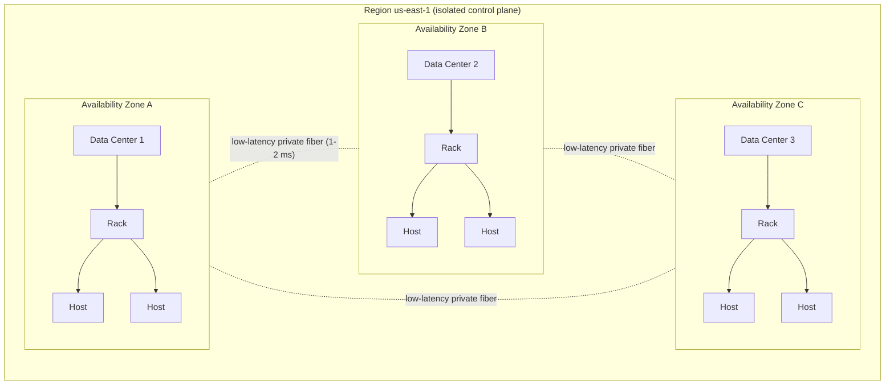
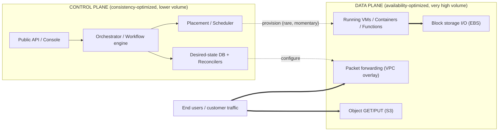
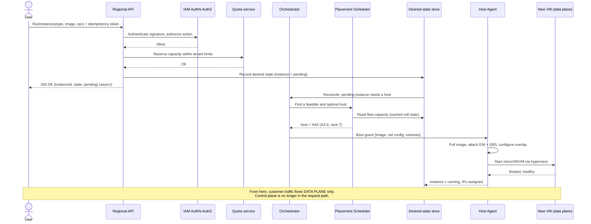

# How to Design a Cloud Computing Platform like AWS / Google Cloud / Azure

*A beginner-to-advanced system design walkthrough of building an Infrastructure-as-a-Service (IaaS) platform.*

---

## Table of Contents

1. [What We're Building & Why It's Genuinely Hard](#1-what-were-building--why-its-genuinely-hard)
2. [Requirements (Functional + Non-Functional)](#2-requirements)
3. [Capacity, Scale & the Physical Hierarchy](#3-capacity-scale--the-physical-hierarchy)
4. [The Core Mental Model: Control Plane vs Data Plane](#4-the-core-mental-model-control-plane-vs-data-plane)
5. [Compute: Hypervisors, VMs, Containers, Functions & the Scheduler](#5-compute-hypervisors-vms-containers-functions--the-scheduler)
6. [The Control Plane in Depth](#6-the-control-plane-in-depth)
7. [Storage: Object, Block & Local Instance Store](#7-storage-object-block--local-instance-store)
8. [Networking: SDN, VPC, Overlays & Isolation](#8-networking-sdn-vpc-overlays--isolation)
9. [Identity & Access Management (IAM)](#9-identity--access-management-iam)
10. [Multi-Tenancy, Isolation & Security](#10-multi-tenancy-isolation--security)
11. [Metering, Billing & Quotas](#11-metering-billing--quotas)
12. [Availability & Resilience](#12-availability--resilience)
13. [Observability & Operations at Hyperscale](#13-observability--operations-at-hyperscale)
14. [Trade-offs & Bottlenecks](#14-trade-offs--bottlenecks)
15. [References / Sources](#15-references--sources)

---

## 1. What We're Building & Why It's Genuinely Hard

We are building **the cloud** — a platform where customers (tenants) press a button (or call an API) and, seconds later, a real virtual machine boots, a virtual disk attaches, a private network exists, and traffic flows. They pay per second for what they use, and they share the same physical hardware as thousands of strangers without ever knowing it.

Most system-design problems ask: *"design a service that runs on the cloud."* This one is the inverse: **design the cloud that other services run on.** That flip is what makes it hard.

### Why it's genuinely hard

| Hard thing | Why |
|---|---|
| **You provision real, physical machines on demand** | When a user calls `RunInstances`, you must find an actual server in an actual data center, carve out CPU/RAM, boot a guest OS, wire it to a virtual network, attach storage, and return an IP — typically in **seconds**. There is no "fake it" layer; the bytes are real. |
| **Hard multi-tenant isolation** | Tenant A and Tenant B run on the same physical CPU. A must *never* read B's memory, see B's packets, or starve B of resources. A security bug here is catastrophic and global. |
| **Massive scale** | Hyperscalers run **millions** of physical servers across dozens of regions, hosting tens of millions of customer instances. Your control systems must manage fleets no human can enumerate. |
| **Reliability of the substrate** | If your application crashes, a few users are sad. If *the cloud* crashes, thousands of companies go down simultaneously. The platform is a dependency-of-dependencies. |
| **The control plane is itself a massively distributed system** | Provisioning, placement, reconciliation, quota, billing, identity — each is its own large-scale service, and they must coordinate. |
| **Durability promises that defy intuition** | Object storage advertises **eleven nines** (99.999999999%) of durability. You can't test that; you have to *engineer* it with replication, erasure coding, and continuous self-healing. |

The mantra throughout: **the customer's running workload (the data plane) must survive even when your management systems (the control plane) are on fire.**

---

## 2. Requirements

### 2.1 Functional Requirements

The platform must let tenants, via API/CLI/console:

- **Compute** — provision and terminate **VMs** (instances), run **containers** (managed Kubernetes/orchestrator), and run **serverless functions** (event-driven, scale-to-zero).
- **Storage** — create **object storage** (S3-like buckets), attach **network block storage** (EBS-like volumes), and use ephemeral **local instance storage**.
- **Networking** — define **virtual private clouds (VPCs)** / virtual networks, subnets, route tables, **security groups**, **load balancers**, and public IP assignment.
- **Identity** — create users/roles, attach **IAM policies**, authenticate API calls, and authorize every action.
- **Billing** — meter per-second usage, aggregate it, and produce invoices.
- **Lifecycle & state** — describe, tag, snapshot, resize, and reconcile resources to a declared desired state.

### 2.2 Non-Functional Requirements

| Property | Target / meaning |
|---|---|
| **Tenant isolation** | Cryptographic / hardware-enforced separation of compute, memory, network, and storage between tenants. |
| **Elasticity** | Launch an instance in seconds; scale to thousands of instances in minutes. |
| **Regional high availability** | Survive the loss of an entire data center (Availability Zone) with no data loss for properly architected workloads. |
| **Durability** | Object storage: ~**11 nines** designed durability. Block storage (io2): ~**5 nines** (99.999%) durability within an AZ. |
| **Security** | Hardware root of trust, encryption at rest and in transit, default-deny authorization, minimized attack surface. |
| **Static stability** | The data plane keeps running even if the control plane is degraded. |
| **Low blast radius** | A single failure must not cascade region-wide or globally. |
| **Cost efficiency** | High bin-packing utilization of physical hardware (this is the business model). |
| **API consistency & idempotency** | Retried calls don't double-provision; APIs are predictable. |

---

## 3. Capacity, Scale & the Physical Hierarchy

The cloud is software, but it sits on a strict **physical hierarchy of failure domains**. Understanding this hierarchy *is* understanding the resilience model.

```text
Planet
 └─ Region (e.g. us-east-1)            — independent geography, own control plane
     └─ Availability Zone (AZ)          — 1+ data centers, isolated power/cooling/network
         └─ Data Center                 — building
             └─ Room / Hall
                 └─ Rack                 — ~20-40 servers, shared top-of-rack switch + PDU
                     └─ Physical Host    — a server: CPUs, RAM, NICs, NVMe, offload cards
                         └─ Guest        — customer VM / container / function microVM
```

### Region / AZ topology



### Key concepts

- **Region** — A large geographic area (e.g. `us-east-1`, `europe-west1`). Regions are **independent**: each has its own control plane, and a healthy region should not fail because another region failed. This is the **strongest fault-isolation boundary** the platform exposes.
- **Availability Zone (AZ)** — One or more discrete data centers within a region, with **independent power, cooling, and physical networking**, far enough apart to not share a single disaster, but close enough (typically ~1–2 ms round-trip) for **synchronous replication**. AZs are the unit you replicate across for HA.
- **Failure domain / blast radius** — The set of things that fail together. A bad PDU takes down a *rack*. A flood takes down a *data center / AZ*. A bad global config push can take down a *region* — or worse. **The entire architecture is a campaign to keep blast radius small** (see §12).

### Capacity intuition (back-of-envelope)

- A hyperscale region: **tens of data centers**, **millions of vCPUs**.
- A modern host: 64–192 physical cores, 1–4 TB RAM, multiple 100–400 Gbps NICs, dozens of TB of NVMe — hosting tens to low-hundreds of VMs, or **hundreds of microVMs** for serverless (Firecracker can launch ~150 microVMs/sec/host).
- Control-plane request volume: **millions of API calls/sec** globally for describe/launch/auth operations.

---

## 4. The Core Mental Model: Control Plane vs Data Plane

This is the single most important idea in the entire design. Everything else hangs off it.

> **Control plane** = the machinery that **makes changes** to the system: create, modify, delete resources, place workloads, configure networks.
>
> **Data plane** = the machinery that delivers the **primary function** of those resources: running your EC2 instance, serving GET/PUT to an object, forwarding your packets, reading/writing your block volume.

When you call `RunInstances`, that's the **control plane**. Once your VM is booted and serving your website, every HTTP request to it flows entirely through the **data plane** — and never touches the control plane again.

### Control-plane vs data-plane diagram



### Why the control plane is the hard part

1. **It's optimized for consistency, not availability.** You cannot have two schedulers place two VMs on the same CPU slice, or hand the same IP to two tenants. The control plane needs strongly-consistent state — which makes it **more complex and statistically more failure-prone** than the data plane.
2. **It has far more moving parts.** Quota checks, placement, image distribution, network programming, billing hooks, IAM checks — all orchestrated, often asynchronously, with retries.
3. **It must be idempotent and reconciling.** Networks drop, hosts die mid-provision; the control plane must converge to the desired state without duplicating resources.
4. **The golden rule:** the **data plane is deliberately simpler** (fewer parts → fewer failure modes → higher availability). A well-built platform ensures **the data plane keeps running even when the control plane is impaired.** Your website doesn't go down just because `RunInstances` is temporarily failing. This property is called **static stability** (§12).

---

## 5. Compute: Hypervisors, VMs, Containers, Functions & the Scheduler

Compute is the flagship product. There are three abstraction levels, each with different isolation / density / cold-start trade-offs.

### 5.1 Virtualization & Hypervisors

A **hypervisor (VMM)** lets one physical host run many isolated guest OSes by virtualizing CPU, memory, and devices.

- **Type-1 (bare-metal) hypervisors** run directly on hardware: **KVM** (a Linux kernel module that turns Linux into a hypervisor) and **Xen** (the original EC2 hypervisor). They use hardware virtualization extensions (Intel VT-x / AMD-V) so guests run at near-native speed.
- The hypervisor's job: trap privileged instructions, partition RAM (via the MMU and nested/extended page tables), schedule vCPUs onto physical cores, and emulate or pass through devices.

> **Note on KVM's classification:** KVM is sometimes called a "Type-1.5" hypervisor because it lives *inside* a general-purpose Linux kernel rather than being a thin standalone layer. Functionally it is bare-metal: the guest runs directly on hardware virtualization extensions.

#### The AWS Nitro approach: offload everything off the CPU

Traditional hypervisors are "fat" — they handle networking, storage, monitoring, and management, **stealing CPU cycles from customer instances**. AWS **Nitro** re-architects this by **offloading those functions onto dedicated hardware cards**:

- **Nitro Cards** — purpose-built PCIe cards that implement **VPC networking**, **EBS block storage**, **local NVMe instance storage**, and host coordination. They do hardware-offloaded encryption (at line rate, for both local and remote storage) with keys held in secure storage.
- **Nitro Security Chip** — provides a **hardware root of trust** and **secure boot**, and locks down the host so that *no one* — including operators — has interactive administrative (SSH) access. This eliminates a large class of human-error and insider-tampering risks.
- **Nitro Hypervisor** — a **deliberately minimized, KVM-based hypervisor**. Because the cards do networking/storage, the hypervisor mainly allocates memory and CPU and stays largely passive unless a guest explicitly needs it. The result: performance "nearly indistinguishable from bare metal" plus strong isolation and a tiny attack surface.

> **Design takeaway:** offloading the data-plane heavy lifting (network, storage, crypto) to dedicated silicon both improves performance *and* shrinks the security-critical software footprint.

### 5.2 Containers

Containers share the host kernel and use **namespaces** (isolate process/network/mount views) and **cgroups** (limit CPU/RAM/IO). They are lighter and faster than VMs but offer **weaker isolation** (a kernel exploit can cross the boundary). At hyperscale, containers are managed by an orchestrator:

- **Borg** (Google's internal cluster manager, the inspiration for Kubernetes) and **Kubernetes** (its open-source successor) schedule containerized "tasks/pods" onto a fleet.
- Borg's shape: a centralized **Borgmaster** (the control brain, replicated for HA) plus a **Borglet** agent on every machine that actually starts/stops/monitors tasks. The **scheduler is decoupled** from the master and works off a *cached* copy of cell state, which is key to its scalability.

### 5.3 Serverless Functions

Functions (Lambda-style) are event-driven, scale-to-zero, and billed per millisecond. The platform must isolate **untrusted code from millions of tenants on shared hosts** with **near-instant cold starts**. The answer is the **microVM**:

- **Firecracker** — an AWS-built **VMM written in Rust on top of KVM** that boots a stripped-down microVM in **as little as ~125 ms**, with **~5 MiB of memory overhead per microVM**, and can launch **~150 microVMs/sec on a single host**.
- It exposes only a minimal set of **virtio** devices (small attack surface) and adds a **Jailer** wrapper (seccomp-bpf, cgroups, chroot) around the VMM process itself.
- This gives **VM-grade hardware isolation at container-grade density and speed** — the sweet spot for serverless (Lambda) and managed containers (Fargate).

### 5.4 The Placement / Scheduler Engine (the heart of compute)

When a launch request arrives, **something must decide which physical host runs it.** This is a constrained **bin-packing** optimization, and it's one of the most valuable pieces of IP in the company (utilization = profit).

**Two-pass scheduling (Borg-style):**

1. **Feasibility pass** — filter to hosts that *can* run this guest: enough free vCPU/RAM/disk/bandwidth, correct hardware (GPU? local NVMe?), correct AZ/placement-group, anti-affinity rules satisfied (don't co-locate a tenant's HA replicas), and capacity-pool/quota available.
2. **Scoring pass** — among feasible hosts, pick the *best*: minimize fragmentation (pack tightly to keep big contiguous slots free), spread for resilience where required, prefer warm images, balance power/thermal, and respect spread/spillover rules to limit per-rack blast radius.

Additional techniques: **over-commitment** (sell slightly more than physical, betting not everyone peaks at once), **admission control** (enforce quotas), and **machine sharing with performance isolation** to drive utilization up.

### 5.5 Host Agent & Boot

Every physical host runs a **host agent** (Borglet-equivalent / Nitro controller) that receives "boot guest X with this image, network config, and volumes," then:

- pulls and validates the machine image, sets up the guest's virtual devices, attaches the network (programs the VPC mapping) and block volumes, boots the guest, and **reports health back** to the control plane.

### 5.6 Live Migration

To patch a host, evacuate failing hardware, or rebalance load, the platform can **live-migrate** a running VM to another host: it iteratively copies the VM's memory pages while it keeps running, then pauses briefly to copy the final "dirty" pages and switch over — moving the workload with **sub-second, often imperceptible** downtime.

### Launch-an-instance sequence



Note that the API returns **immediately** with `pending`; the heavy work is **asynchronous** and **reconciled** toward the desired state. That's the next section.

---

## 6. The Control Plane in Depth

The control plane is itself a large distributed system. Layers, outermost first:

### 6.1 Public API layer

- A **regional** front door (e.g. `ec2.us-east-1.amazonaws.com`) behind global DNS and load balancers.
- Handles **request signing/authentication**, **throttling/rate-limiting**, **request validation**, **idempotency**, and routing to the right regional service.
- APIs are **declarative and resource-oriented**: you describe *what you want*, not *how to build it*.

### 6.2 Idempotency & async job processing

- Mutating calls carry an **idempotency token / client token**. If a retry arrives with the same token, the platform returns the *original* result instead of provisioning twice. This is essential because networks fail and clients retry.
- Long-running work (boot a VM, build a network) is turned into an **asynchronous job/workflow**, so the API can return fast and the system can retry steps independently.

### 6.3 Declarative desired state + reconciliation loops

The control plane is a **state machine / reconciler**, not a one-shot script:

```text
desired_state (what the tenant asked for) ── stored durably ──┐
                                                              ▼
            ┌───────────────  RECONCILER  ──────────────┐
            │  loop forever:                             │
            │    observed = read actual world            │
            │    diff = desired - observed               │
            │    for each diff: take corrective action   │
            │      (place, boot, attach, reprogram net)  │
            │    write back observed = actual            │
            └────────────────────────────────────────────┘
```

This is exactly the Kubernetes / Borg model: store *desired state*, then run **controllers that continuously drive reality toward it**. Benefits:

- **Self-healing**: if a host dies, the diff reappears and the reconciler re-launches the workload.
- **Crash-safe**: the workflow can be interrupted and resumed; the desired state is the source of truth.
- **Idempotent steps**: each reconcile is safe to repeat.

### 6.4 Provisioning workflow / orchestration

A robust pattern is a **durable workflow engine** (a distributed state machine) that walks each step: *authorize → reserve quota → place → allocate IP/ENI → attach volumes → boot → health-check → mark running*, with **retries, timeouts, and compensation** (roll back partial work on failure). Each step is idempotent and recorded so the workflow survives process crashes.

### 6.5 Quotas

- Per-tenant, per-region **limits** (e.g. "max 500 vCPUs of this family") protect *the platform* from a single tenant exhausting capacity and protect *tenants* from runaway costs.
- Quota is checked **synchronously at admission** and reserved atomically to prevent oversubscription races.

> **Why the control plane is the hard part, restated:** it must be strongly consistent (no double-allocation), highly idempotent (retries everywhere), and self-healing (reconcilers) — and yet it must *not* sit in the data path, because if it goes down, running workloads must keep running.

---

## 7. Storage: Object, Block & Local Instance Store

Three storage products, three very different designs.

### 7.1 Object Storage (S3-like)

A flat **bucket → key → object** namespace accessed over HTTP (PUT/GET/DELETE). There is no real filesystem hierarchy — just keys with optional `/`-delimited prefixes that *look* like folders. It targets **~11 nines of durability** at exabyte scale (S3 famously stores hundreds of trillions of objects).

**How durability is engineered:**

1. **Multi-AZ redundancy** — every object is redundantly stored across **multiple (typically ≥3) Availability Zones** in the region. Losing one (or even two) AZs loses *no* data.
2. **Erasure coding** — instead of naive N-copy replication (expensive), split each object into **k data shards + m parity shards** and spread the `k+m` shards across many disks/AZs. Any **k of the k+m** shards reconstruct the object. This gives high durability at far lower storage overhead than full replication.
3. **Continuous integrity scanning** — every shard carries a stored **checksum**; background processes constantly re-verify shards across the whole fleet to catch **bit rot / silent corruption**.
4. **Automated self-healing** — when a disk dies or a shard fails its checksum, the system **reconstructs** the missing shard from surviving shards and re-places it, **without human intervention**. Durability is a *continuous repair process*, not a one-time copy.

**Architecture sketch:** a stateless **front-end fleet** (auth, request routing) → an **index/metadata service** (key → shard locations; must scale to trillions of keys, and is itself partitioned/sharded) → a **storage-node fleet** holding the erasure-coded shards on disks.

### 7.2 Network Block Storage (EBS-like volumes)

A **virtual disk** that looks like a local SSD to the VM but actually lives on the network, so it **outlives the instance** and can be re-attached elsewhere.

- **Replication for durability** — volume data is **synchronously replicated across multiple storage servers within an AZ** so the failure of any single server doesn't lose data (io2 targets ~**5 nines**, i.e. 99.999%, durability).
- **Data-plane offload** — on Nitro, the **Nitro EBS card** terminates the storage protocol, so neither the hypervisor nor the customer's CPU is spent driving I/O. Modern designs (EBS Block Express) use a custom low-latency network transport (**SRD**) for sub-millisecond latency.
- **Snapshots** — incremental, copied to **object storage** (which is cross-AZ-durable) for backup and volume cloning.
- It is **AZ-scoped**: a volume and its replicas live in a single AZ, which is why an instance and its volume must be in the same AZ.

### 7.3 Local Instance Store

Disks **physically attached to the host** (local NVMe). **Fastest** (no network hop) but **ephemeral** — data is lost when the instance stops/terminates or the host fails. Use it for caches/scratch/temp, never as the system of record.

| | Object (S3) | Block (EBS) | Local (instance store) |
|---|---|---|---|
| Abstraction | Bucket/key over HTTP | Virtual disk | Physical NVMe |
| Scope | Region (multi-AZ) | AZ | Single host |
| Durability | ~11 nines | ~5 nines (in-AZ, io2) | none (ephemeral) |
| Latency | higher | low (ms / sub-ms) | lowest |
| Survives instance loss? | yes | yes | **no** |

---

## 8. Networking: SDN, VPC, Overlays & Isolation

Networking is where the "virtual" in "virtual private cloud" gets real. The physical network is shared by everyone, yet each tenant must believe they own a **private, isolated network with their own IP space** — and Tenant A's `10.0.0.5` must never collide with Tenant B's `10.0.0.5`.

### 8.1 Software-Defined Networking (SDN)

The platform separates the network **control plane** (decides routes and policy) from the network **data plane** (forwards packets), and implements forwarding in software / offload hardware rather than in fixed-function switches. This makes the network **programmable**: a VPC is just configuration, created in seconds.

### 8.2 The VPC / Virtual Network

A **VPC** is a tenant's isolated virtual network: a CIDR block, **subnets** (each pinned to an AZ), **route tables**, **internet/NAT gateways**, and **gateways/peering** to other networks. Each VM gets a virtual NIC — an **ENI** (elastic network interface) — inside the VPC.

### 8.3 The overlay network (the magic trick)

Tenant networks are implemented as an **overlay** on top of the provider's physical **underlay** network using **encapsulation** (a VXLAN/Geneve-style tunnel):

```text
Guest A (10.0.0.5)  ──>  packet to 10.0.0.9
        │
        ▼  [virtualization layer / Nitro card]
  Look up destination in the MAPPING SERVICE:
     "VPC-123, ENI 10.0.0.9 lives on physical host 192.168.44.7"
        │
        ▼  ENCAPSULATE: wrap the original packet inside an outer packet
  [outer: src host IP -> dst host IP | VPC-ID | inner: 10.0.0.5 -> 10.0.0.9]
        │
        ▼  send across the real physical (underlay) network
  Destination host DECAPSULATES, delivers inner packet to Guest B
```

The crucial component is the **mapping service** — a distributed lookup of *(VPC, virtual IP) → (physical host, encryption context)*. The **VPC identifier is carried in the encapsulation**, so even if two tenants both use `10.0.0.5`, the overlay keeps them in **completely separate address spaces** — this is the heart of tenant network isolation. On Nitro, the **Nitro VPC card** performs this encapsulation/decapsulation and encryption at line rate, off the customer CPU.

### 8.4 Instance Metadata Service (IMDS)

Each instance can query a **link-local** magic address — **`169.254.169.254`** — to fetch its own metadata (instance ID, AZ, IAM role **temporary credentials**, user-data). The address is link-local and **non-routable**, so the data never leaves the host. Modern **IMDSv2** is **session-oriented**: you `PUT` to obtain a short-lived **token** (with a configurable TTL), then send that token on subsequent `GET`s. Two properties make it a strong SSRF mitigation:

- The session token is **instance-specific** — it is rejected on any other instance.
- `PUT` responses default to an IP **hop limit of 1**, so the token request can't traverse an SSRF-prone reverse proxy or be reached from outside the host. (`PUT`s carrying an `X-Forwarded-For` header are also rejected.)

This directly mitigates the server-side request forgery attacks that plagued the original (IMDSv1) request/response service.

### 8.5 Load Balancers

Managed **load balancers** are themselves a horizontally-scaled **data-plane** fleet that spreads incoming connections across a tenant's instances, performs health checks, and terminates TLS. They must scale elastically with traffic and survive AZ loss.

### 8.6 Security Groups

A **security group** is a stateful, default-deny **virtual firewall** attached to ENIs. Rules (e.g. "allow TCP 443 from `0.0.0.0/0`", "allow 5432 from this other security group") are programmed into **distributed enforcement points at every host** (again offloaded on Nitro), so filtering happens right at the source/destination NIC — not at a central choke point. Being *stateful* means return traffic for an allowed connection is automatically permitted.

---

## 9. Identity & Access Management (IAM)

Every single API call — `RunInstances`, `GetObject`, all of them — must be **authenticated** (who are you?) and **authorized** (are you allowed?). IAM is the gatekeeper for the entire platform.

### 9.1 What IAM provides

- **Principals/identities**: users, **roles** (assumable by humans, services, or other accounts/clouds), and **federated** identities via SAML/OIDC from an external identity provider.
- **Authentication**: requests are **cryptographically signed**; the platform verifies the signature against the principal's credentials (or temporary STS credentials).
- **Authorization via policies**: JSON documents listing `Effect` (Allow/Deny), `Action`, `Resource`, and optional `Condition`. Both **identity-based** policies (attached to the principal) and **resource-based** policies (attached to, e.g., a bucket) are evaluated together.

### 9.2 Policy evaluation logic (default-deny)

```text
1. Start: implicit DENY (default-deny — nothing is allowed unless granted)
2. Evaluate ALL applicable policies (identity + resource + permission boundaries / SCPs)
3. If ANY policy has an explicit DENY for this action  -> DENY (always wins)
4. Else if at least one explicit ALLOW applies          -> ALLOW
5. Else (no applicable allow)                            -> DENY
```

**Explicit deny always wins.** This makes IAM safe-by-default: you cannot accidentally grant access by forgetting a rule — only by explicitly allowing.

### 9.3 Why IAM is a global, low-latency, statically-stable service

- It sits in the **hot path of every request** across every service and region, so it must be **extremely low-latency and highly available** — IAM data is replicated broadly and reads are served locally / cached.
- It is **architected with its own separated control plane and data plane**: writes (create role/policy) are consistency-sensitive control-plane operations, while **authentication/authorization at request time is a data-plane operation** engineered to keep working even during failures. If IAM's *write* plane is degraded, existing principals must still authenticate and be authorized — otherwise the whole cloud would be unusable.

> IAM is the textbook case for control/data-plane separation: you'd rather be unable to *create* a new role for an hour than have *every existing app* fail authorization for a second.

---

## 10. Multi-Tenancy, Isolation & Security

Isolation is the promise that makes a shared platform acceptable. It is enforced at **every layer**.

| Layer | Isolation mechanism |
|---|---|
| **CPU / Memory** | Hardware-virtualization (KVM/Xen) page tables + a minimized hypervisor; **microVMs (Firecracker)** for untrusted/serverless code; on Nitro, a locked-down host with **no operator shell** and a hardware root of trust. |
| **Devices / I/O** | Offload cards (Nitro) terminate network & storage so guests never touch shared device firmware directly; per-tenant hardware-offloaded encryption. |
| **Network** | VPC overlay with per-VPC encapsulation + mapping service → tenants can reuse the same private IPs with zero crosstalk; security groups enforced per-NIC. |
| **Storage** | Per-volume/-object encryption with distinct keys; access mediated by IAM. |
| **Identity** | Default-deny IAM on every call. |

### The noisy-neighbor problem

Because tenants **share** physical CPU, cache, memory bandwidth, network, and disk, one tenant's spike can degrade another's performance. Mitigations:

- **Resource limits** via cgroups / hypervisor scheduling caps and, for some instance types, **dedicated vCPU pinning**.
- **I/O and network rate-limiting / QoS** (offloaded to Nitro cards so it's enforced in hardware).
- **Bin-packing that reserves headroom** and avoids over-committing latency-sensitive instance types.
- Offering **dedicated / bare-metal** instance options for tenants who can't tolerate any sharing.

### Side-channel concerns

Shared CPUs raise **microarchitectural side-channel** risks (Spectre/Meltdown-class, cache-timing, hyperthread leakage). Defenses include **CPU microcode patches, disabling hyperthreading or co-scheduling sibling threads within a single tenant (core scheduling), cache partitioning, and keeping the security-critical hypervisor surface minimal** — the Nitro philosophy: less privileged software means fewer places for a side channel to matter.

---

## 11. Metering, Billing & Quotas

The business model is **pay-per-use**, so accurate metering is a first-class system, not an afterthought.

**Pipeline:**

1. **Emit usage events at the source.** Host agents, storage nodes, network gateways, and load balancers emit fine-grained usage records: *instance X ran from t0→t1 (per-second granularity)*, *Y GB-months stored*, *Z GB transferred*, *N requests*.
2. **Collect & aggregate.** A high-throughput ingestion pipeline (think a durable event log + stream processors) **deduplicates and aggregates per tenant / resource / time-window**, tolerating late and duplicate events (because hosts retry).
3. **Rate & price.** Apply the pricing catalog (instance-type rates, tiered storage, egress pricing, regional differences, discounts/commitments).
4. **Invoice.** Roll up into bills; expose near-real-time cost APIs.

**Design challenges:**

- **Per-second metering at fleet scale** generates an enormous event volume; it must be **effectively exactly-once** (no double-billing, no under-billing).
- **Trustworthy** — billing disputes are existential, so records are auditable and reconciled.
- **Quotas** (§6.5) are the *preventive* sibling of billing: enforce per-tenant ceilings at admission to cap both capacity exhaustion and runaway spend.

---

## 12. Availability & Resilience

Now the payoff: how do you keep "the cloud" up when individual parts inevitably fail?

### 12.1 Failure domains as design primitives

You design *around* the physical hierarchy (§3): replicate across **AZs** for HA within a region, and across **regions** for disaster recovery. AZs are independent enough to fail separately, yet close enough to replicate synchronously.

### 12.2 Static stability — *the* resilience principle

> **Static stability**: a system continues to operate in its **steady state even when its control plane is unavailable.**

Concretely: a well-architected service **over-provisions** so that, if an AZ fails, the surviving AZs already have enough capacity to carry the load **without needing to launch new instances** — because launching needs the control plane, which is exactly what you can't rely on during a big failure.

The rule (AWS Well-Architected, REL11-BP04): **rely on the data plane, not the control plane, during recovery.** Failover should be a data-plane action (shift traffic to already-running, already-provisioned capacity), not a control-plane action (provision new capacity at the worst possible moment).

This is why **the data plane is engineered to keep running when the control plane is degraded**: a control-plane outage might mean you *can't launch new VMs for a while*, but your *running* VMs, *existing* networks, and *stored* data all keep working.

### 12.3 Cell-based architecture — bounding the blast radius

Even a perfect service has bugs and bad deploys. **Cell-based architecture** caps how far any single failure can spread:

- A **cell** is a **complete, isolated copy of the stack** (its own compute, storage, control logic, observability) serving a **subset of tenants**.
- Cells **don't share fate**: a bug, overload, or bad deploy in one cell is **contained to that cell's customers** — others keep working. (The ship analogy: watertight bulkheads, so one breach floods one compartment, not the whole hull.)
- **Deploy cell-by-cell** so a bad change is caught in cell 1 before it ever reaches cell 50.
- **Shuffle sharding** maps each tenant to a *random combination* of cells/resources, so that even a cell failure affects few tenants — and rarely the *same* pair of tenants together — dramatically reducing the chance any one customer is fully knocked out.

### 12.4 Avoiding the global blast radius

The worst failures are **correlated, global** ones — usually a bad **config or software push** that rolls out everywhere at once, or a hidden cross-region dependency. Defenses:

- **Keep regions independent**; avoid hard cross-region dependencies in critical paths.
- **Staggered, cellular, region-by-region deployments** with automatic rollback.
- **Minimize control-plane dependencies** so a single global service (DNS, IAM, a metadata store) can't take everything down.
- Make the **data plane statically stable** so even a control-plane "brownout" doesn't surface to customers.

> **Control-plane vs data-plane availability, restated for resilience:** the control plane is *consistency-optimized* and more failure-prone; the data plane is *availability-optimized* and simpler. Architect so the data plane's availability **does not depend on** the control plane's. That single decision is what lets the cloud post high data-plane availability SLAs while its control plane is allowed to occasionally hiccup.

---

## 13. Observability & Operations at Hyperscale

You cannot operate millions of machines by hand. Observability is itself a massive platform.

- **Metrics** — every host/service emits time-series (CPU, memory, I/O, error rates, latency, queue depth) into a horizontally-scaled metrics store; **automated alarms** drive auto-remediation and paging.
- **Logging & tracing** — structured logs and **distributed traces** (a request flowing API → orchestrator → scheduler → host) to debug across services.
- **Health checking & auto-remediation** — host agents heartbeat; unhealthy hosts are automatically **cordoned, drained (live-migrate guests off), and pulled** for repair; the reconciler re-launches affected workloads elsewhere.
- **Capacity management** — forecast demand per region/AZ/instance-family; pre-provision hardware (lead times run to months); manage **capacity pools** so the scheduler never runs dry.
- **Safe deployment** — automated, **staged/cellular** rollouts with health gates and **fast automatic rollback**; treat every deploy as the most likely cause of an outage.
- **Chaos / game days** — deliberately fail AZs and dependencies in test (and sometimes prod) to verify static stability actually holds.
- **Operational guardrails** — because operators have *no* shell on Nitro hosts, operations happen through **audited, automated, least-privilege APIs**, not interactive logins.

---

## 14. Trade-offs & Bottlenecks

| Decision | Trade-off |
|---|---|
| **Hard isolation (microVMs/Nitro) vs density** | Stronger isolation costs some overhead, but offload hardware + Firecracker recover most of it. VMs isolate best, containers pack densest, microVMs aim for both. |
| **Replication vs erasure coding (storage)** | Full N-copy = simple, fast recovery, high cost. Erasure coding = far cheaper at high durability, but reconstruction is CPU/network-heavy. Hyperscalers lean on erasure coding for bulk/cold data and replication where low latency matters most. |
| **Strong consistency (control plane) vs availability** | The control plane needs consistency (no double-allocation), which caps its availability — hence push it *out* of the data path and make the data plane statically stable. |
| **Over-commit / over-provision** | Over-committing raises utilization (profit) but risks noisy neighbors and contention. Over-provisioning enables static stability but costs idle capacity. Tune per instance class. |
| **Bin-packing tightness** | Tight packing = high utilization but fragmentation and less headroom for bursts/HA spread. Loose packing = resilient but wasteful. |
| **Cell granularity** | More, smaller cells = smaller blast radius but more operational overhead and lower per-cell efficiency. Fewer, bigger cells = efficient but bigger blast radius. |
| **Centralized vs decentralized control plane** | A centralized brain (Borgmaster) is simpler and consistent but a scaling/blast-radius bottleneck → mitigated by per-cell masters and cached, decoupled schedulers. |

### Where the bottlenecks actually bite

- **The scheduler / placement engine** — a global view, low latency, and high throughput are in tension; addressed with cached cell state and decoupled, optimistic scheduling.
- **The metadata/index services** (S3 key index, VPC mapping service, IAM store) — must scale to *trillions* of entries with low-latency lookups; these are the unsung hard parts.
- **The control-plane state store** — strongly consistent, hence the natural single point of contention; partitioned per-region/per-cell to avoid a global bottleneck.
- **Capacity itself** — you can't conjure servers; **physical capacity planning with months of lead time** is a real, hard, business-critical constraint.
- **Global config/deploy pipelines** — the most common cause of *correlated, wide-blast-radius* outages; the thing you most aggressively cell-ize and stagger.

---

## 15. References / Sources

**Compute, virtualization & Nitro**
- [The Security Design of the AWS Nitro System (AWS whitepaper)](https://docs.aws.amazon.com/whitepapers/latest/security-design-of-aws-nitro-system/security-design-of-aws-nitro-system.html) and [The components of the Nitro System](https://docs.aws.amazon.com/whitepapers/latest/security-design-of-aws-nitro-system/the-components-of-the-nitro-system.html)
- [AWS Nitro System (product page)](https://aws.amazon.com/ec2/nitro/)
- [Firecracker: Lightweight Virtualization for Serverless Computing (AWS blog)](https://aws.amazon.com/blogs/aws/firecracker-lightweight-virtualization-for-serverless-computing/) and the [Firecracker NSDI '20 paper](https://www.usenix.org/conference/nsdi20/presentation/agache)
- [Large-scale cluster management at Google with Borg (research.google)](https://research.google/pubs/large-scale-cluster-management-at-google-with-borg/)

**Control plane / data plane & resilience**
- [Control planes and data planes — AWS Fault Isolation Boundaries](https://docs.aws.amazon.com/whitepapers/latest/aws-fault-isolation-boundaries/control-planes-and-data-planes.html)
- [Static stability using Availability Zones (AWS Builders' Library)](https://aws.amazon.com/builders-library/static-stability-using-availability-zones/)
- [REL11-BP04: Rely on the data plane and not the control plane during recovery](https://docs.aws.amazon.com/wellarchitected/latest/framework/rel_withstand_component_failures_avoid_control_plane.html)
- [Reducing the Scope of Impact with Cell-Based Architecture — control plane and data plane](https://docs.aws.amazon.com/wellarchitected/latest/reducing-scope-of-impact-with-cell-based-architecture/control-plane-and-data-plane.html)
- [REL10-BP03: Use bulkhead architectures to limit scope of impact](https://docs.aws.amazon.com/wellarchitected/latest/reliability-pillar/rel_fault_isolation_use_bulkhead.html)

**Storage**
- [How Amazon S3 stores 350 trillion objects with 11 nines of durability (ByteByteGo)](https://blog.bytebytego.com/p/how-amazon-s3-stores-350-trillion)
- [How Amazon S3 achieves 99.999999999% durability (System Design One)](https://newsletter.systemdesign.one/p/amazon-s3-durability)
- [A brief history of block storage at AWS (Werner Vogels)](https://www.allthingsdistributed.com/2024/08/continuous-reinvention-a-brief-history-of-block-storage-at-aws.html)
- [Amazon EBS (product page)](https://aws.amazon.com/ebs/)

**Networking**
- [Understanding Amazon VPC from a VMware NSX Engineer's Perspective (mapping service + encapsulation)](https://aws.amazon.com/blogs/apn/understanding-amazon-vpc-from-a-vmware-nsx-engineers-perspective/)
- [AWS Networking 101 (ipSpace — overlay/encapsulation discussion)](https://blog.ipspace.net/2020/05/aws-networking-101/)
- [Use the Instance Metadata Service / IMDSv2 (AWS docs)](https://docs.aws.amazon.com/AWSEC2/latest/UserGuide/configuring-instance-metadata-service.html) and [Add defense in depth against SSRF with IMDSv2 (AWS Security blog)](https://aws.amazon.com/blogs/security/defense-in-depth-open-firewalls-reverse-proxies-ssrf-vulnerabilities-ec2-instance-metadata-service/)

**IAM**
- [Resilience in AWS IAM — separated control plane and data plane (AWS docs)](https://docs.aws.amazon.com/IAM/latest/UserGuide/disaster-recovery-resiliency.html)
- [Policy evaluation logic (AWS IAM docs)](https://docs.aws.amazon.com/IAM/latest/UserGuide/reference_policies_evaluation-logic.html)
- [IAM JSON policy elements: Condition (AWS docs)](https://docs.aws.amazon.com/IAM/latest/UserGuide/reference_policies_elements_condition.html)

---

*This is a teaching model of how hyperscale IaaS platforms are built; real implementations at AWS, Google Cloud, and Azure differ in internal detail, and much remains proprietary. The principles — control/data-plane separation, declarative reconciliation, hardware-offloaded isolation, erasure-coded durability, overlay networking, default-deny IAM, static stability, and cell-based blast-radius reduction — are well-documented and broadly shared across all three.*
