# System Design Fundamentals

> A beginner-to-advanced primer that anchors this learning repo and its companion YouTube series.
> Read it top-to-bottom the first time. After that, treat it as a reference you jump around in.

No prior distributed-systems experience is assumed. Every concept comes with a **short explanation**, a **when to use it**, and the **trade-offs** that bite you in production. Diagrams are written in [Mermaid](https://mermaid.js.org/) so they render directly on GitHub.

---

## Table of Contents

1. [What Is System Design?](#1-what-is-system-design)
2. [The Framework: How to Approach Any Problem](#2-the-framework-how-to-approach-any-problem)
3. [Client–Server Model](#3-clientserver-model)
4. [Networking Basics](#4-networking-basics)
5. [Scaling: Vertical vs Horizontal](#5-scaling-vertical-vs-horizontal)
6. [Load Balancing](#6-load-balancing)
7. [Caching](#7-caching)
8. [CDNs](#8-cdns)
9. [Databases: SQL vs NoSQL](#9-databases-sql-vs-nosql)
10. [Replication](#10-replication)
11. [Sharding / Partitioning](#11-sharding--partitioning)
12. [Indexing](#12-indexing)
13. [CAP Theorem & Consistency Models](#13-cap-theorem--consistency-models)
14. [Message Queues & Async Processing](#14-message-queues--async-processing)
15. [Monolith vs Microservices](#15-monolith-vs-microservices)
16. [API Design: REST vs gRPC vs GraphQL](#16-api-design-rest-vs-grpc-vs-graphql)
17. [Rate Limiting](#17-rate-limiting)
18. [Consistent Hashing](#18-consistent-hashing)
19. [Availability, Redundancy, Failover & SPOFs](#19-availability-redundancy-failover--spofs)
20. [Observability](#20-observability)
21. [Suggested Reading Order](#21-suggested-reading-order)
22. [Sources](#22-sources)

---

## 1. What Is System Design?

**System design** is the process of defining the architecture, components, data flow, and trade-offs of a software system so it meets its goals at the required **scale**, **reliability**, and **cost**. Writing a feature is about correctness on one machine; system design is about keeping that feature correct, fast, and available when millions of users, network failures, and bad data hit it at once.

Two kinds of requirements drive every design:

- **Functional requirements** — *what the system does.* "Users can post a tweet." "Shorten a URL." "Stream a video."
- **Non-functional requirements (NFRs)** — *how well it does it.* Scale (users/QPS), latency, availability, consistency, durability, cost. These are what force the interesting decisions.

> **Mental model:** functional requirements tell you the *boxes*; non-functional requirements tell you *how many of each box, where, and how they talk*.

**When to think in "system design" terms:** the moment a single server, a single database, or a single region can no longer satisfy your NFRs — or the moment a failure of any one component would take the whole product down.

**The core trade-off you will make over and over:** almost nothing is free. More consistency usually costs latency or availability. More speed usually costs money or complexity. Good design is not "the best architecture" — it is *the cheapest architecture that still meets the requirements*.

---

## 2. The Framework: How to Approach Any Problem

Whether you are designing a real system or answering an interview question, follow the **same repeatable framework**. It keeps you from jumping to a database choice before you understand the load.

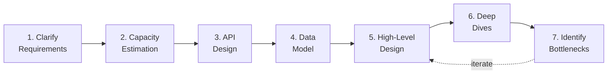

### Step 1 — Clarify Requirements
Separate **functional** from **non-functional**. Ask: How many users? Read-heavy or write-heavy? What latency is acceptable? Strong or eventual consistency? What must never be lost? Nail the scope before designing — building the wrong thing well is still failure.

### Step 2 — Capacity (Back-of-the-Envelope) Estimation
Turn requirements into **numbers** that drive architecture. The most important number is usually **QPS** (queries per second), because it dictates server count, DB load, and caching needs.

A worked example — a URL shortener with 100M new URLs/day, read:write ratio of 100:1:

| Quantity | Calculation | Result |
|---|---|---|
| Write QPS | 100M / 86,400s | ~1,160 writes/s |
| Read QPS | 1,160 × 100 | ~116,000 reads/s |
| Storage / yr | 100M/day × 365 × ~500 bytes | ~18 TB/yr |

Memorize a few latency anchors: memory read ~100 ns, SSD read ~100 µs, cross-region round trip ~tens of ms. They tell you instantly whether a design can hit a latency target.

### Step 3 — API Design
Define the **contract** between clients and your system before internals. List the endpoints/methods, their inputs, and outputs (e.g. `POST /urls {long_url} -> {short_url}`, `GET /{short_url} -> 302 redirect`). This forces clarity on what the system actually promises.

### Step 4 — Data Model
Define entities, relationships, and access patterns. The **access patterns** (how you read/write) often matter more than the entities — they decide SQL vs NoSQL, what to index, and how to shard.

### Step 5 — High-Level Design
Draw 5–8 boxes and the arrows between them: clients → load balancer → app servers → cache/database, plus queues and CDNs where needed. Show the **happy-path data flow** end to end.

### Step 6 — Deep Dives
Zoom into the 1–2 components that carry the most risk or load and justify your choices: how does the cache stay consistent, how is the DB sharded, how do you handle a hot key? This is where senior-level thinking shows.

### Step 7 — Identify Bottlenecks & Iterate
Hunt for **single points of failure**, hot spots, and the component that breaks first under 10× load. Add redundancy, caching, queues, or replicas — then loop back to the high-level design and refine.

> **When to use this framework:** *always*. Even a 10-minute napkin design benefits from "requirements → numbers → boxes → risks."
> **Trade-off:** it is sequential on paper but iterative in practice — expect to revisit earlier steps as deep dives expose problems.

---

## 3. Client–Server Model

**Explanation.** Most systems are split into a **client** (browser, mobile app, another service) that *requests* work, and a **server** that *holds resources / does the work* and responds. The client initiates; the server listens. The same machine can be a server to one party and a client to another (e.g. your web server is a client of your database).

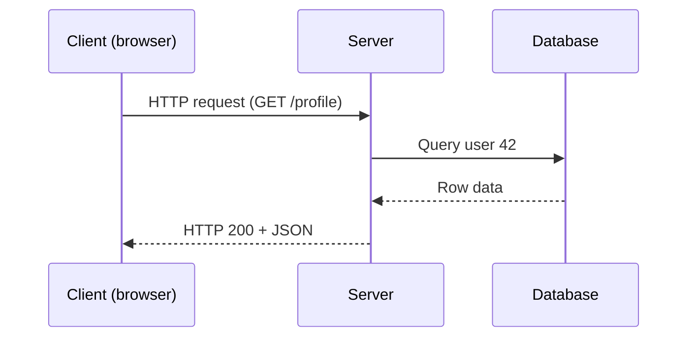

**When to use.** It is the default for virtually all web and mobile apps. Alternatives like peer-to-peer (no central server) suit file sharing or blockchains but are far harder to coordinate.

**Trade-offs.** Centralized servers are simple to reason about and secure, but become a **bottleneck and a single point of failure** — which is exactly what the rest of this document exists to fix (load balancing, replication, redundancy).

---

## 4. Networking Basics

You can't reason about latency, caching, or load balancing without a working picture of the network.

### DNS (Domain Name System)
The internet's phone book: it translates a human name like `api.example.com` into an **IP address**. A client asks a DNS resolver, which walks the DNS hierarchy and returns the IP (cached with a **TTL**). DNS itself can do simple geographic / round-robin load balancing.
**Trade-off:** DNS changes propagate slowly because of caching/TTLs, so it is a *coarse* tool — not for instant failover.

### IP Address
The numeric address of a machine on a network (IPv4 like `93.184.216.34`, or IPv6). Packets are routed hop-by-hop using IP addresses.

### HTTP / HTTPS
**HTTP** is the request/response protocol of the web (methods `GET`, `POST`, `PUT`, `DELETE`, status codes `200`, `404`, `500`). **HTTPS** is HTTP wrapped in **TLS** encryption — it protects data in transit and authenticates the server. **Use HTTPS for everything**; the performance cost of TLS is negligible today and browsers/SEO require it.

### TCP vs UDP
These are the two main **transport** protocols beneath HTTP.

| | **TCP** | **UDP** |
|---|---|---|
| Connection | Connection-oriented (handshake) | Connectionless |
| Reliability | Ordered, guaranteed delivery, retransmits | Best-effort, no guarantees |
| Overhead | Higher (acks, ordering) | Very low |
| Use when | Correctness matters: web, APIs, DBs, file transfer | Speed > completeness: live video/voice, gaming, DNS |

> **Rule of thumb:** if a dropped packet must be re-sent, use **TCP**. If a dropped packet is better skipped than waited for (a stale video frame is useless), use **UDP**.

### Latency vs Throughput
- **Latency** = *time for one operation* (how long a single request takes). Lower is better.
- **Throughput** = *operations per unit time* (how many requests/sec or bytes/sec). Higher is better.

They are **different and can trade off**: batching requests usually *raises* throughput but *adds* latency to any single request. A highway analogy — latency is how long your car takes to drive the road; throughput is how many cars cross per minute. Adding lanes (parallelism) boosts throughput without making any single trip faster.

---

## 5. Scaling: Vertical vs Horizontal

**Explanation.** When one machine can't keep up, you scale.

- **Vertical scaling (scale up):** make the machine bigger — more CPU, RAM, faster disks.
- **Horizontal scaling (scale out):** add more machines and spread the load across them.

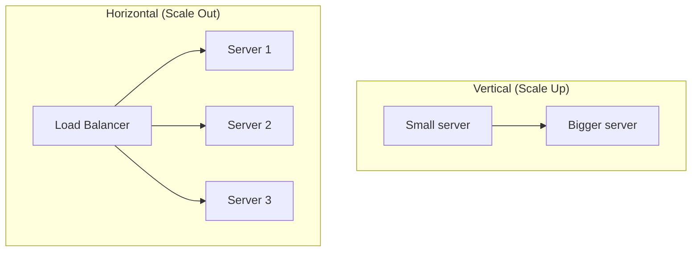

| | **Vertical** | **Horizontal** |
|---|---|---|
| Complexity | Low — no code changes | Higher — needs load balancing, statelessness |
| Ceiling | Hard hardware limit | Effectively unlimited |
| Failure | One big SPOF | One node dies, others survive |
| Cost curve | Gets expensive fast at the top end | More linear; commodity hardware |

**When to use which.** Start by scaling **up** — it's the simplest path and often enough for a long time. Move to scaling **out** when you hit a hardware ceiling, need high availability (no single box can take you down), or your cost per unit of compute is exploding at the high end.

**Trade-off / key requirement.** Horizontal scaling pushes you toward **stateless** application servers (any server can handle any request) and toward solving *where state lives* — which is why caching, replication, and sharding all follow from this decision.

---

## 6. Load Balancing

**Explanation.** A **load balancer (LB)** sits in front of a pool of servers and distributes incoming requests across them. It is the thing that makes horizontal scaling usable, and it also performs **health checks**, removing dead servers from rotation.

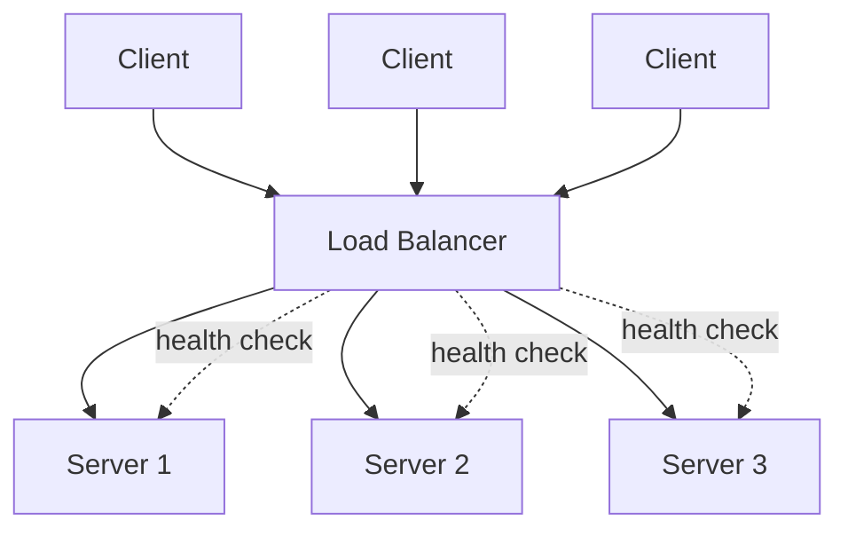

### Common Algorithms
| Algorithm | How it works | Best for |
|---|---|---|
| **Round Robin** | Each server in turn, in order | Homogeneous servers, uniform requests; zero overhead |
| **Weighted Round Robin** | Round robin biased by server capacity | Mixed-size servers |
| **Least Connections** | Send to the server with fewest active connections | Long-lived / variable-duration requests |
| **Least Response Time** | Fewest connections *and* fastest responses | Latency-sensitive heterogeneous fleets |
| **IP Hash** | Hash client IP → always same server | Sticky sessions when state lives on the server |

### L4 vs L7 Load Balancers
| | **Layer 4 (Transport)** | **Layer 7 (Application)** |
|---|---|---|
| Sees | IP address + port only; never reads payload | Full HTTP — URLs, headers, cookies, gRPC methods |
| Speed | Very fast, low CPU, predictable latency | Slower (parses requests) but smarter |
| Capabilities | Raw forwarding | Content-based routing, TLS termination, path/header routing, WAF |
| Use when | Max throughput, long-lived connections, video | Web apps, API gateways, microservice routing |

> **In practice**, big systems are **hybrid**: an L4 layer absorbs raw traffic and DDoS at the edge, then forwards to an L7 layer that does intelligent, content-aware routing.

**Trade-offs.** A load balancer can itself become a **single point of failure** — so you run it redundantly (active-passive or active-active, often with multiple IPs in DNS). **Sticky sessions** (pinning a user to one server) simplify in-memory state but hurt even distribution and resilience; prefer **stateless** servers with shared session storage instead.

---

## 7. Caching

**Explanation.** A **cache** stores the result of expensive work (a DB query, a computed page, a remote call) in fast storage so future requests skip the work. It is the single highest-leverage tool for cutting latency and load. Caches show up at every layer:

- **Client cache** — browser memory/disk, app local cache. Closest to the user, zero network cost.
- **CDN cache** — edge servers near users hold static assets (see §8).
- **Server/application cache** — an in-memory store (Redis, Memcached) between app and DB.
- **Database cache** — the DB's own buffer pool / query cache.

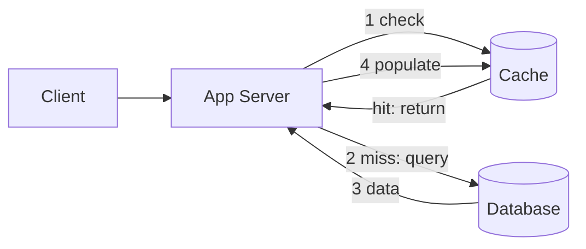

### Eviction Policies (what to drop when the cache is full)
| Policy | Drops… | Best for |
|---|---|---|
| **LRU** (Least Recently Used) | Item not accessed for longest | General purpose; recency predicts future use (sessions, catalogs) |
| **LFU** (Least Frequently Used) | Item accessed least often | Stable hot keys (popular content, recommendations) |
| **FIFO** | Oldest inserted item | Streaming/log-like data where age = irrelevance |
| **TTL** | Anything past its expiry time | Data that goes stale on a known schedule |

### Write Policies (how writes interact with the cache)
| Policy | Behaviour | Trade-off |
|---|---|---|
| **Write-through** | Write to cache **and** DB synchronously | Cache always consistent; adds write latency. Great for read-heavy data |
| **Write-back (write-behind)** | Write to cache now, flush to DB **async** later | Fastest writes; **risks data loss** if cache dies before flush |
| **Write-around** | Write straight to DB, skip the cache | Avoids polluting cache with write-only data; first read is a miss |

### Cache Invalidation
> "There are only two hard things in Computer Science: cache invalidation and naming things." — Phil Karlton

Keeping cache and source of truth in sync is the hard part. Common strategies: **TTL expiry** (simple, allows brief staleness), **event-driven invalidation** (publish a change event — often via a message queue — to evict/refresh), and **versioned keys** (change the key when data changes so stale entries are never read).

**When to use caching.** Read-heavy workloads, expensive computations, and data that tolerates *some* staleness. **Trade-offs:** every cache introduces a **consistency window** (the cache may be stale), and three classic failure modes to design against — **cache stampede** (many misses hit the DB at once), **hot keys** (one key overwhelms one node), and **thundering herd** on expiry.

---

## 8. CDNs

**Explanation.** A **Content Delivery Network** is a globally distributed network of **edge servers** that cache content close to users. When a user in Tokyo requests an image, the CDN serves it from a nearby Tokyo edge instead of your origin server in Virginia — slashing latency and offloading your origin.

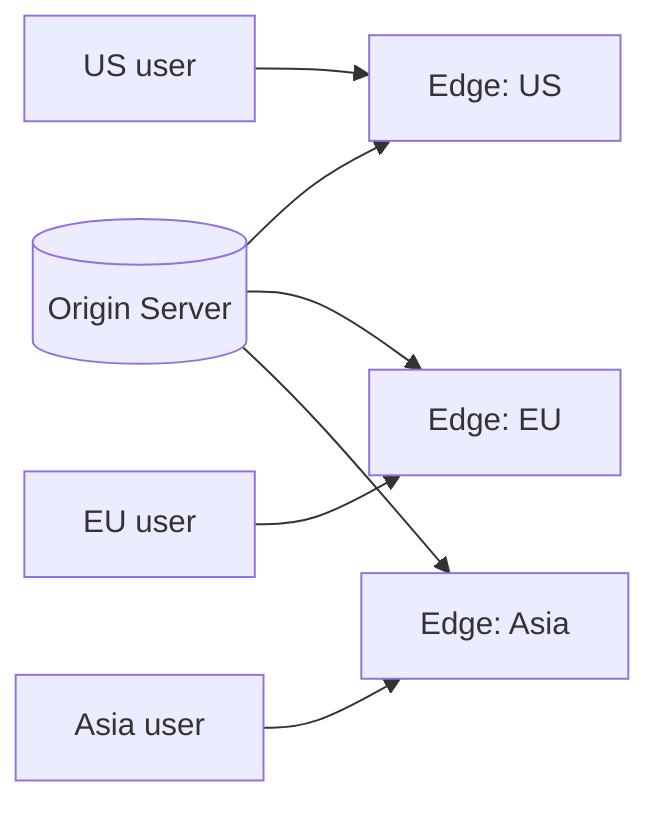

**When to use.** Static and semi-static content — images, CSS/JS, video, fonts, downloads. Modern CDNs also cache API responses and run logic at the edge.

**Trade-offs.** CDNs add a layer to **invalidate** (purge an edge when content changes — TTLs and explicit purges). They shine for **read-heavy, geographically spread, cacheable** content and do little for highly dynamic, per-user responses. **Push vs pull:** *pull* CDNs fetch from origin on first miss (simple, self-managing); *push* CDNs require you to upload content ahead of time (more control, more work).

---

## 9. Databases: SQL vs NoSQL

**Explanation.** The storage engine where your source-of-truth data lives. The big fork is **relational (SQL)** vs **non-relational (NoSQL)**.

| | **SQL (Relational)** | **NoSQL (Non-relational)** |
|---|---|---|
| Examples | PostgreSQL, MySQL | MongoDB (document), Cassandra/DynamoDB (wide-column/key-value), Redis (KV), Neo4j (graph) |
| Schema | Fixed, predefined | Flexible / schema-on-read |
| Data shape | Tables, rows, relationships | Documents, key-value, wide-column, graph |
| Transactions | Strong **ACID** guarantees | Often **BASE** / eventual; varies by engine |
| Scaling | Traditionally vertical; sharding is harder | Built for horizontal scale-out |
| Query | Rich joins via SQL | Optimized for specific access patterns; joins limited |

**ACID** (SQL strength): **A**tomicity, **C**onsistency, **I**solation, **D**urability — transactions are all-or-nothing and correct even under concurrency/crashes.
**BASE** (many NoSQL): **B**asically **A**vailable, **S**oft state, **E**ventual consistency — trade strict guarantees for availability and scale.

### When to use which
- **Choose SQL** when you have **structured data with relationships**, need **multi-row transactions** and strong consistency (payments, orders, inventory), and your query patterns are varied/ad-hoc. Default here unless you have a concrete reason not to.
- **Choose NoSQL** when you need **massive horizontal scale**, **flexible/evolving schemas**, very high write throughput, or your access pattern is a simple, known key lookup (sessions, feeds, time-series, caching). Pick the *sub-type* by access pattern: document for nested objects, key-value for lookups, wide-column for huge write volume, graph for relationship-heavy traversal.

**Trade-off.** "NoSQL = scalable, SQL = not" is a myth — modern SQL (with replication, partitioning, and managed services) scales very far, and modern NoSQL can offer tunable consistency. Choose based on **data shape, access patterns, and consistency needs**, not hype.

---

## 10. Replication

**Explanation.** **Replication** keeps copies of the same data on multiple machines for **availability** (survive a node failure), **read scaling** (serve reads from many replicas), and **geographic locality** (read from a nearby copy). The most common pattern is **leader–follower** (a.k.a. primary–replica / master–slave).

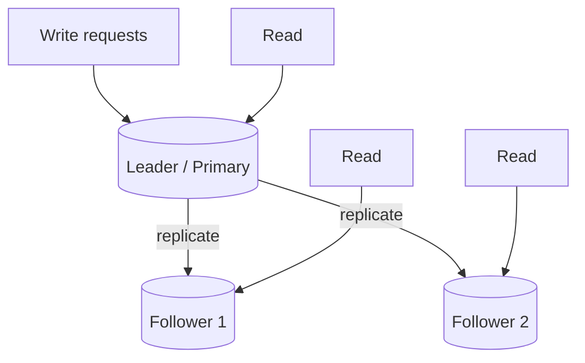

- **Writes** go to the **leader** only.
- The leader streams its changelog to **followers**.
- **Reads** can be served by followers (scaling read-heavy workloads).
- If the leader dies, a follower is promoted (**failover**).

### Sync vs Async replication
- **Synchronous:** leader waits for follower(s) to confirm before acking the write. **No data loss on failover**, but higher write latency and a stalled write if a follower is slow.
- **Asynchronous:** leader acks immediately, replicates in the background. **Fast**, but a leader crash can lose the last unreplicated writes, and followers can serve **stale reads** (replication lag).

**When to use.** Almost every production database uses replication — it's table stakes for availability and read scaling. **Multi-leader** and **leaderless** (e.g. Dynamo-style quorum) setups exist for multi-region writes but add conflict-resolution complexity.

**Trade-offs.** Replication scales **reads, not writes** (all writes still funnel through the leader — that's what sharding solves). It introduces **replication lag** → eventual consistency on followers. Mitigate stale-read surprises with **read-your-writes** (route a user's reads to the leader right after they write).

---

## 11. Sharding / Partitioning

**Explanation.** **Sharding** (horizontal partitioning) splits one large dataset across multiple databases/nodes, each holding a **subset** of the data. Where replication copies the *whole* dataset, sharding **divides** it — so it scales **writes and storage**, not just reads.

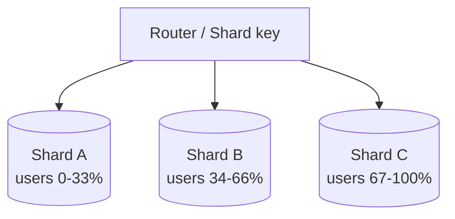

### Choosing a partitioning strategy
- **Range-based:** split by ranges of the key (e.g. user IDs A–M, N–Z). Great for range scans; **risks hot spots** if data is skewed (everyone in one range).
- **Hash-based:** `hash(key) % N` decides the shard. Even distribution; **kills range queries** and reshuffles almost everything when `N` changes (→ use **consistent hashing**, §18).
- **Directory/lookup-based:** a lookup table maps keys → shards. Flexible, but the lookup table is itself a component to scale and protect.

**The shard key is the most important decision.** A good key spreads load evenly and keeps data that's read together on the same shard.

**When to use.** When a single database can no longer hold the data or absorb the write volume — i.e. you've exhausted vertical scaling, caching, and read replicas.

**Trade-offs.** Sharding adds real complexity: **cross-shard queries and joins** become slow or impossible; **transactions across shards** are hard; **hot shards** (a celebrity user, a viral key) can overwhelm one node; and **rebalancing** is operationally painful. Shard **late**, only when you must.

---

## 12. Indexing

**Explanation.** An **index** is an auxiliary data structure (usually a **B-tree**, or a hash/LSM-tree) that lets the database find rows by a column value **without scanning the whole table** — turning an O(n) full-table scan into an O(log n) lookup. It's the database equivalent of a book's index.

**When to use.** Index the columns you **filter, join, or sort on** frequently (e.g. `WHERE email = ?`, foreign keys). Use **composite indexes** for multi-column queries and **covering indexes** to answer a query entirely from the index.

**Trade-offs.** Indexes **speed up reads but slow down writes** (every `INSERT`/`UPDATE`/`DELETE` must also update the index) and consume extra storage. Over-indexing is a real anti-pattern — each index is paid for on every write. Index deliberately, based on actual query patterns.

---

## 13. CAP Theorem & Consistency Models

**Explanation.** The **CAP theorem** says a **distributed** system can guarantee at most **two of three** properties when a network partition occurs:

- **C — Consistency:** every read sees the most recent write (here, *linearizability* — the strongest form).
- **A — Availability:** every request gets a (non-error) response.
- **P — Partition tolerance:** the system keeps working despite dropped/delayed messages between nodes.

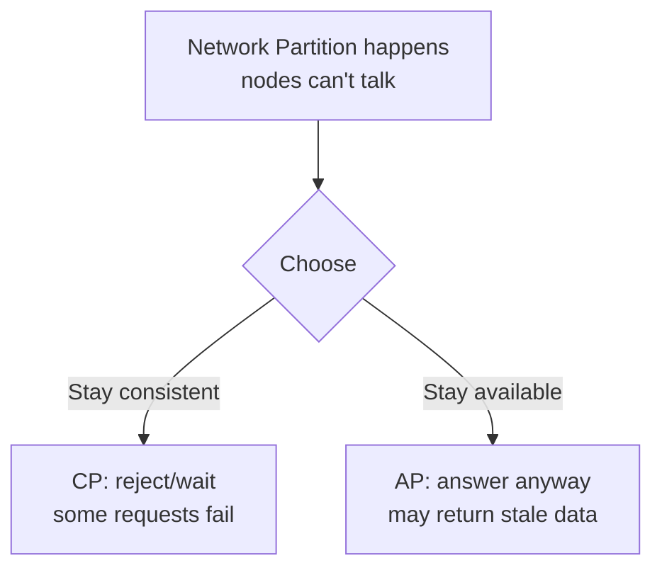

**The catch:** in any real network, **partitions will happen**, so **P is non-negotiable**. The real choice during a partition is **C vs A**:
- **CP systems** (e.g. traditional RDBMS configs, ZooKeeper, HBase) refuse or block requests to avoid returning wrong data.
- **AP systems** (e.g. Cassandra, DynamoDB, classic Dynamo) keep answering, accepting temporary staleness.

### PACELC — the more complete picture
CAP only describes behaviour *during* a partition. **PACELC** extends it: **if Partition (P), choose A or C; Else (E)** — even in normal operation — choose **Latency (L) or Consistency (C)**. This captures the everyday truth that strong consistency costs latency even when nothing is broken.

### Consistency models (a spectrum, not a binary)
- **Strong consistency (linearizability):** every client sees the latest write immediately. Easiest to reason about; costs latency and availability. Use for money, inventory, unique-username checks.
- **Causal consistency:** operations that are causally related are seen in order by everyone; unrelated ones may differ. Good middle ground (e.g. comment threads).
- **Eventual consistency:** replicas **converge** over time; reads may be briefly stale. Cheapest and most available. Use for likes, view counts, feeds, DNS.

**When to use which.** Match the model to the **business cost of staleness**: a stale like count is fine (eventual); a double-spent balance is not (strong). Most real systems **mix** models — strong on the critical path, eventual on the rest.

---

## 14. Message Queues & Async Processing

**Explanation.** A **message queue / broker** lets services communicate **asynchronously**: a **producer** drops a message and moves on; a **consumer** processes it later. This **decouples** services, **absorbs traffic spikes** (buffering), and lets slow work happen off the request path.

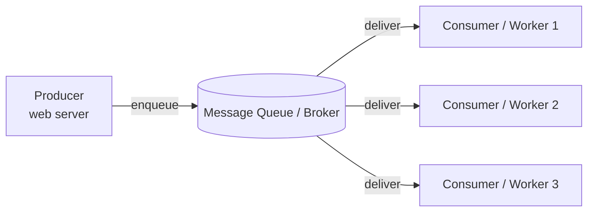

**Classic use cases:** sending emails/notifications, image/video processing, order fulfillment, event fan-out, smoothing bursty load, and decoupling microservices so a downstream outage doesn't fail the user's request.

### RabbitMQ vs Kafka — two different tools
| | **RabbitMQ** (message broker / queue) | **Kafka** (distributed event log / stream) |
|---|---|---|
| Core model | A **queue** that empties as messages are consumed | A **durable log** you can re-read |
| Delivery | Broker **pushes** to consumers; rich routing | Consumers **pull** and track their own **offset** |
| Replay | No (gone once acked) | Yes — replay within the retention window |
| Throughput | High, but tuned for routing/guarantees | Extremely high (millions/s via sequential disk I/O) |
| Multiple consumers | Competing consumers per queue | Many independent consumer groups read the same stream |
| Best for | Task distribution, flexible routing, per-message acks | High-volume event streams, replay, fan-out, analytics |

> **Heuristic:** need **replay** or **many independent consumers** of the same data? → **Kafka.** Need **flexible task routing with acknowledgments** for discrete jobs? → **RabbitMQ.** A common architecture uses **both**: Kafka for high-volume event streams, RabbitMQ for internal task dispatch.

**Trade-offs.** Async buys decoupling and resilience but adds complexity: you must handle **at-least-once delivery** (so make consumers **idempotent**), **ordering** guarantees (or lack thereof), **dead-letter queues** for poison messages, and the broker becoming critical infrastructure to run and scale.

---

## 15. Monolith vs Microservices

**Explanation.**
- A **monolith** ships all functionality as one deployable unit (one codebase, one process, usually one database).
- **Microservices** split the system into small, independently deployable services, each owning its domain and (ideally) its own data store, communicating over the network.

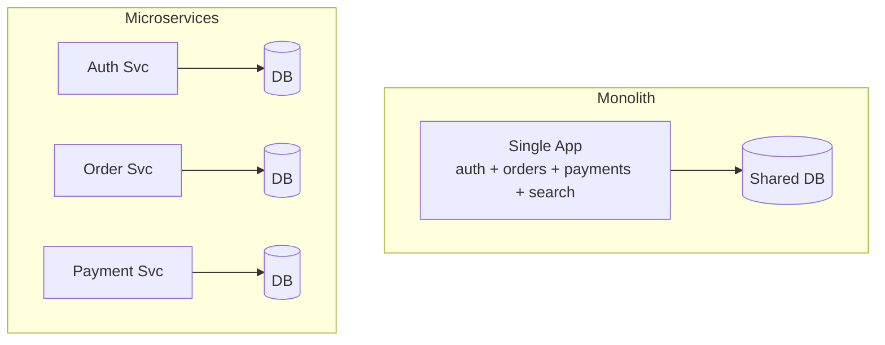

| | **Monolith** | **Microservices** |
|---|---|---|
| Deploy | One unit | Independent per service |
| Early speed | Fast — no network, simple ops | Slower — lots of moving parts |
| Scaling | Scale the whole app | Scale hot services independently |
| Team fit | Small teams | Many teams owning clear boundaries |
| Failure blast radius | One bug can take down everything | Isolated (if designed well) |
| New costs | — | Network latency, distributed transactions, service discovery, observability |

**When to use which.** **Start with a (well-structured) monolith** — it is faster to build, easier to debug, and most products never outgrow it. Move to microservices when you have **multiple teams stepping on each other**, **components with very different scaling needs**, or independent release cadences. Splitting too early is one of the most common and expensive mistakes; a "modular monolith" captures much of the benefit with little of the cost.

**Trade-offs.** Microservices trade *in-process simplicity* for *operational and distributed-systems complexity*: every call is now a network call that can fail, transactions span services (sagas), and you **must** invest in observability (§20) just to understand what's happening.

---

## 16. API Design: REST vs gRPC vs GraphQL

**Explanation.** Three dominant styles for how clients talk to servers.

| | **REST** | **gRPC** | **GraphQL** |
|---|---|---|---|
| Style | Resources over HTTP (`GET /users/1`) | RPC: call remote methods like local functions | Query language; client asks for exact fields |
| Payload | JSON (human-readable) | Protocol Buffers (binary, compact) | JSON over a typed schema |
| Transport | HTTP/1.1 or 2 | HTTP/2 (supports streaming) | Usually HTTP POST |
| Contract | Loose (OpenAPI optional) | Strict `.proto` contract, codegen, multi-language | Strong typed schema |
| Caching | **Easy** — native HTTP caching on GET | Harder | Harder (POST, varied queries) |
| Speed | Good | **Fastest** (binary, can be 5–10× over JSON) | Good; wins by fetching only needed data |

### When to use which
- **REST** — public/external APIs, simple CRUD, broad client compatibility, and when **HTTP caching** matters. The safe default for web-facing APIs.
- **gRPC** — **internal service-to-service** calls where you control both ends and want low latency, strong contracts, streaming, and multi-language typed clients. The default for east-west microservice traffic.
- **GraphQL** — **client-driven** data needs where over-/under-fetching hurts: rich mobile/web UIs that pull from many sources, where one flexible query beats many round trips.

**Trade-offs.** REST can cause **over-fetching** (too much data) or **under-fetching** (many round trips). gRPC's binary format isn't browser-friendly without a proxy and is harder to debug by hand. GraphQL pushes complexity to the server (resolver performance, the **N+1 query** problem) and complicates **caching** and **rate limiting** because every query is different. These styles **coexist** — many systems run REST at the edge, gRPC between services, and a GraphQL gateway for flexible clients.

---

## 17. Rate Limiting

**Explanation.** **Rate limiting** caps how many requests a client may make in a time window. It protects systems from abuse, accidental floods, and the **thundering herd**, and enforces fair usage and API tiers.

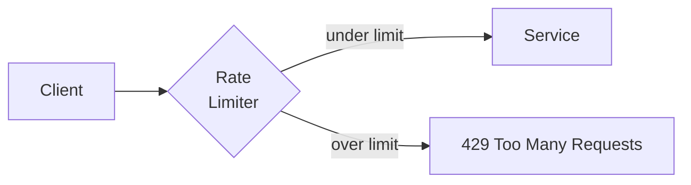

| Algorithm | How it works | Trade-off |
|---|---|---|
| **Token Bucket** | Bucket refills tokens at a steady rate; each request spends one; empty → reject | **Allows bursts** up to bucket size while capping the long-run average. The strong default for public APIs |
| **Leaky Bucket** | Requests queue and drain at a fixed rate | **Smooth, constant output** regardless of input shape (good for SMS/payment downstreams); no bursts |
| **Fixed Window** | Count requests per fixed clock window (e.g. per minute) | Simplest, but the **boundary exploit** allows up to **2× the rate** straddling two windows |
| **Sliding Window Log** | Store timestamp of every request, count those in the trailing window | **Exact**, but O(n) memory per client |
| **Sliding Window Counter** | Weighted blend of current + previous fixed windows | O(1) memory, ~small drift; **best accuracy/cost balance** for most APIs |

**When to use which.** **Token bucket** for most public APIs (predictable average + controlled bursts). **Leaky bucket** when downstream needs a *smooth* rate. **Sliding window counter** when you want fixed-window simplicity without the boundary exploit. Avoid plain **fixed window** unless paired with a finer-grained check.

**Trade-offs.** In a distributed fleet, limits must be **shared across nodes** — typically via a centralized store like **Redis** — which adds a network hop and a dependency. Always return a clear **`429 Too Many Requests`** with `Retry-After` so well-behaved clients back off.

---

## 18. Consistent Hashing

**Explanation.** When you spread keys across `N` nodes with plain **`hash(key) % N`**, changing `N` (adding/removing a node) **remaps almost every key** — catastrophic for caches (mass cache misses) and painful for sharded databases (mass data movement). **Consistent hashing** fixes this by mapping **both keys and nodes onto a circular hash ring**; a key is owned by the **next node clockwise**. Adding or removing a node only moves the keys in **one arc** — roughly `1/N` of them — instead of nearly all.

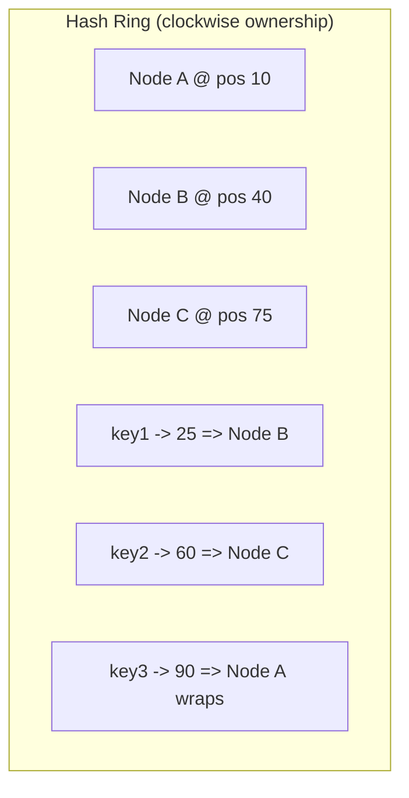

### Virtual nodes (the practical refinement)
With one position per node, the ring splits into uneven arcs, so some nodes own far more keyspace than others (**load skew**), and a single node failing dumps all its load onto **one** neighbor. The fix: give each physical node **many positions** on the ring (**virtual nodes / vnodes**, often ~100–200 each). This evens out distribution and, on failure, **spreads the dead node's load across many** survivors rather than one.

**When to use.** Distributed **caches** (Memcached client sharding), **databases** (Cassandra, DynamoDB, ScyllaDB — descended from Amazon's Dynamo paper), and any **L7 load balancer** doing sticky hashing where the node set changes over time.

**Trade-offs.** More complex than `mod N`, and vnodes add bookkeeping/memory — but the alternative (re-sharding the world on every topology change) is far worse at scale. This is *the* canonical technique for scaling stateful, partitioned systems gracefully.

---

## 19. Availability, Redundancy, Failover & SPOFs

**Explanation.** **Availability** is the fraction of time a system is operational, usually stated in **"nines"**:

| Availability | Downtime per year |
|---|---|
| 99% ("two nines") | ~3.65 days |
| 99.9% ("three nines") | ~8.77 hours |
| 99.99% ("four nines") | ~52.6 minutes |
| 99.999% ("five nines") | ~5.26 minutes |

You raise availability by removing **single points of failure (SPOFs)** — any one component whose failure takes the whole system down.

- **Redundancy:** run **N+1** (or more) copies of every critical component so a spare can take over.
- **Failover:** automatically shift traffic from a failed component to a healthy one.
  - **Active-passive:** a standby waits idle and is promoted on failure (simpler; some failover delay, and you pay for idle capacity).
  - **Active-active:** all copies serve traffic simultaneously (no idle waste, instant tolerance; needs load balancing and state coordination).

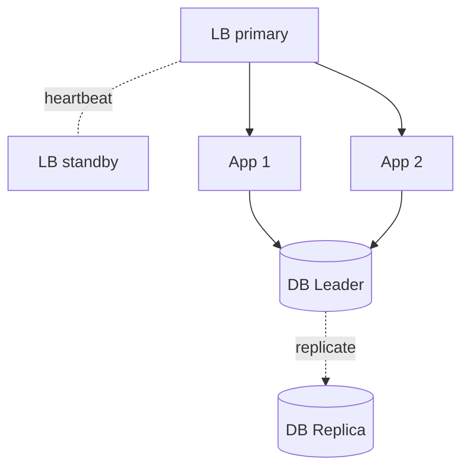

**Finding SPOFs:** trace every request and ask *"what dies if this one box vanishes?"* — the load balancer, the single DB leader, a single AZ/region, even DNS. Then add redundancy at each: multiple LBs, replicated DBs, multi-AZ/multi-region deployment, health checks driving automatic failover.

**Trade-offs.** Every nine is **exponentially more expensive** — redundancy doubles or triples cost and adds coordination complexity (split-brain, failover storms, replication lag). Buy only the availability the business actually needs; five nines for a hobby app is waste, while four-plus nines is mandatory for payments.

---

## 20. Observability

**Explanation.** **Observability** is your ability to understand a system's internal state from its outputs — essential the moment you have more than one server, and non-negotiable for microservices. It rests on **three pillars**:

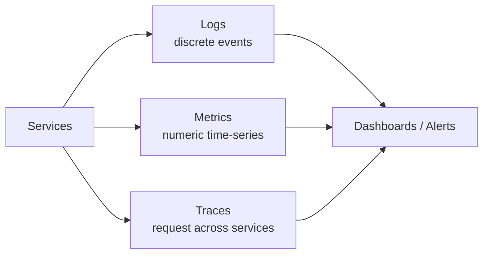

- **Logs** — timestamped records of discrete events ("user 42 logged in", "DB timeout"). Best for **debugging specifics**. Use **structured** (JSON) logs so they're searchable; centralize them (e.g. ELK/Loki).
- **Metrics** — aggregated numeric time-series (QPS, p99 latency, error rate, CPU). Cheap to store, ideal for **dashboards and alerting** on trends (e.g. Prometheus + Grafana). Watch the **golden signals**: latency, traffic, errors, saturation.
- **Traces** — follow a single request as it hops across services, showing where time is spent. Essential for finding the **slow service in a microservices chain** (e.g. OpenTelemetry + Jaeger).

**When to use.** Always — build it in from day one, not after the first outage. Logs for the "what exactly happened to this request," metrics for "is the system healthy and trending well," traces for "which service in the chain is slow."

**Trade-offs.** Observability has real cost: high-cardinality metrics and verbose logs get **expensive** and noisy fast, so **sample** traces, set **log levels**, and **alert on symptoms users feel** (latency, errors) rather than every internal blip — alert fatigue is as dangerous as no alerts.

---

## 21. Suggested Reading Order

If you're new, read in this order — each section builds on the previous ones:

1. **Foundations** → §1 What Is System Design, §2 The Framework, §3 Client–Server, §4 Networking. *Get the vocabulary and the method.*
2. **Scaling out** → §5 Scaling, §6 Load Balancing. *How one box becomes many.*
3. **Speed & delivery** → §7 Caching, §8 CDNs. *The highest-leverage latency wins.*
4. **Data layer** → §9 SQL vs NoSQL, §10 Replication, §11 Sharding, §12 Indexing. *Where state lives and how it scales.*
5. **Distributed reality** → §13 CAP & Consistency, §18 Consistent Hashing. *The trade-offs that make distributed systems hard.*
6. **Decoupling & structure** → §14 Message Queues, §15 Monolith vs Microservices, §16 API Design. *How services are split and how they talk.*
7. **Hardening** → §17 Rate Limiting, §19 Availability/Redundancy/Failover, §20 Observability. *Keeping it up, fair, and debuggable.*

Then **apply it**: pick a problem (URL shortener → rate limiter → news feed → chat → video streaming) and run the §2 framework end to end. Reading concepts builds recognition; designing systems builds skill.

---

## 22. Sources

**The framework & estimation**
- [Master System Design Interviews: A 6-Step Framework](https://engineeringatscale.substack.com/p/system-design-interview-success-six-step-framework)
- [How to Answer a System Design Interview Problem — AlgoMaster](https://blog.algomaster.io/p/how-to-answer-a-system-design-interview-problem)
- [Back-of-the-Envelope Estimation — ByteByteGo](https://bytebytego.com/courses/system-design-interview/back-of-the-envelope-estimation)
- [The 5-Step Capacity Estimation Worksheet — Design Gurus](https://designgurus.substack.com/p/the-5-step-capacity-estimation-worksheet)
- [The Complete System Design Interview Guide (2026)](https://www.systemdesignhandbook.com/guides/system-design-interview/)

**Load balancing**
- [Layer 4 vs Layer 7 Load Balancer — Contabo](https://contabo.com/blog/layer-4-vs-layer-7-load-balancer/)
- [The Architect's Guide to Load Balancing (L4 vs L7)](https://www.developers.dev/tech-talk/the-architect-s-guide-to-load-balancing-strategies-l4-vs-l7-decision-framework-for-cloud-native-microservices.html)

**Caching**
- [Caching Strategies: LRU, LFU, TTL, Write-through/around/back — Medium](https://medium.com/@priyansu011/caching-strategies-demystified-lru-lfu-ttl-write-through-write-around-and-write-back-cd6f43ad99f2)
- [LFU vs LRU: choosing a cache eviction policy — Redis](https://redis.io/blog/lfu-vs-lru-how-to-choose-the-right-cache-eviction-policy/)
- [Choosing the Right Cache Strategy — DEV](https://dev.to/nk_sk_6f24fdd730188b284bf/choosing-the-right-cache-strategy-writing-eviction-and-invalidation-based-on-your-requirements-45md)

**Databases, replication & sharding**
- [Kafka vs RabbitMQ — AWS](https://aws.amazon.com/compare/the-difference-between-rabbitmq-and-kafka/)
- [Designing Data-Intensive Applications — Martin Kleppmann (book)](https://dataintensive.net/)

**CAP & consistency**
- [CAP Theorem Explained — AlgoMaster](https://blog.algomaster.io/p/cap-theorem-explained)
- [The PACELC Theorem — Medium](https://medium.com/@albert.kapitanov.77/the-pacelc-theorem-in-a-few-words-6da0327512a5)
- [What is CAP Theorem? — ScyllaDB](https://www.scylladb.com/glossary/cap-theorem/)

**Message queues**
- [Kafka vs RabbitMQ: How to know which to use — Hello Interview](https://www.hellointerview.com/blog/kafka-vs-rabbitmq)
- [Kafka vs RabbitMQ: Key Differences — DataCamp](https://www.datacamp.com/blog/kafka-vs-rabbitmq)

**API design**
- [REST vs GraphQL vs gRPC — Baeldung](https://www.baeldung.com/rest-vs-graphql-vs-grpc)
- [REST vs GraphQL vs gRPC — Design Gurus](https://www.designgurus.io/blog/rest-graphql-grpc-system-design)

**Rate limiting**
- [Rate Limiting Algorithms: Token Bucket vs Sliding Window vs Fixed Window — Arcjet](https://blog.arcjet.com/rate-limiting-algorithms-token-bucket-vs-sliding-window-vs-fixed-window/)
- [Build 5 Rate Limiters with Redis — Redis](https://redis.io/tutorials/howtos/ratelimiting/)

**Consistent hashing**
- [Consistent Hashing Explained — AlgoMaster](https://blog.algomaster.io/p/consistent-hashing-explained)
- [Consistent Hashing for System Design Interviews — Hello Interview](https://www.hellointerview.com/learn/system-design/core-concepts/consistent-hashing)

**General references**
- [System Design Primer — GitHub (donnemartin)](https://github.com/donnemartin/system-design-primer)
- [ByteByteGo — System Design](https://bytebytego.com/)
- [Mermaid Diagram Syntax](https://mermaid.js.org/)
