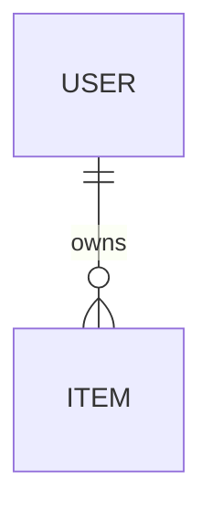
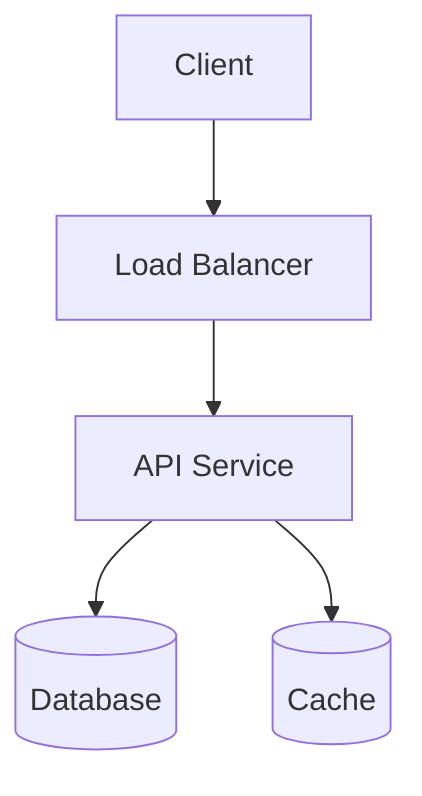

# System Design: <System Name>

> One-line description of what we're designing and why it's interesting.
> 🎥 Video: <link> · ⭐ Difficulty: Beginner / Intermediate / Advanced

## 1. Problem statement
What are we building? Frame it like a real interview/product prompt.

## 2. Requirements
**Functional** (what the system does)
- [ ] ...

**Non-functional** (how well it does it)
- [ ] Scale (users, QPS) · Latency · Availability · Consistency · Durability

## 3. Capacity estimation (back-of-the-envelope)
- Daily active users, requests/sec, read:write ratio
- Storage per year, bandwidth, cache size
- *Why it matters:* it justifies every later decision.

## 4. API design
Core endpoints / RPCs (signature + brief description).

```
POST /resource   { ... } -> { ... }
GET  /resource/:id        -> { ... }
```

## 5. Data model
Entities, relationships, and the database choice (SQL vs NoSQL) — with the reason.



## 6. High-level design
The big picture: client → gateway → services → storage. One clear architecture diagram.



## 7. Deep dives
Pick the 2–4 hardest/most interesting parts and go deep (the part that makes this system *this* system).

## 8. Bottlenecks & trade-offs
What breaks at scale, and the trade-offs behind each choice (CAP, cost, complexity).

## 9. Summary
The 30-second recap a viewer should remember.

## References / Sources
- ...
